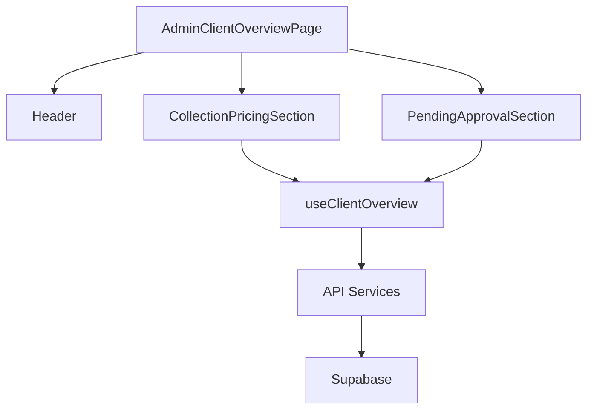
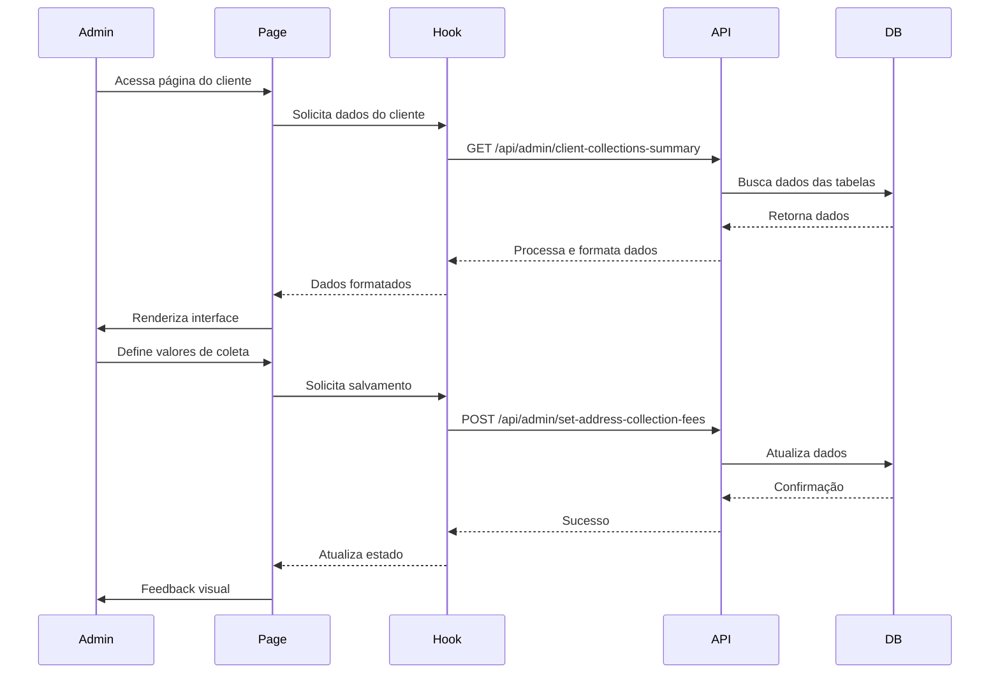

# Documentação da Página de Visão Geral do Cliente (Admin)

## 1. Objetivo

Criar uma página abrangente no painel administrativo que permita aos administradores visualizar e gerenciar todas as informações relacionadas a um cliente específico, incluindo precificação de coletas, monitoramento de coletas aprovadas, histórico de coletas e gestão de coletas pendentes de aprovação.

## 2. Requisitos Funcionais

### 2.1 Seção de Pontos de Coleta para Precificação

**Componente:** `CollectionPricingSection.tsx`

#### 2.1.1 Exibição de Pontos de Coleta
- Listar todos os pontos de coleta associados ao cliente
- Para cada ponto, exibir:
  - Endereço completo do ponto de coleta
  - Número de veículos associados a esse ponto
  - Campo para definir o valor da coleta por veículo (input numérico formatado como moeda)
  - Campo para definir a data prevista de coleta (Date Picker)
  - Total estimado (calculado automaticamente: valor x número de veículos)

#### 2.1.2 Funcionalidades
- Permitir edição em massa dos valores de coleta
- Carregar automaticamente valores já definidos anteriormente
- Validação de campos obrigatórios
- Feedback visual durante o salvamento
- Botão para salvar todas as alterações

#### 2.1.3 Regras de Negócio
- O valor da coleta deve ser um número positivo
- A data prevista de coleta deve ser igual ou posterior à data atual
- Ao salvar, todos os veículos associados ao ponto devem ser atualizados com:
  - Status: "AGUARDANDO APROVAÇÃO DA COLETA"
  - Valor da coleta por veículo
  - Data prevista de coleta
  - ID da coleta (gerado automaticamente)

### 2.2 Seção de Coletas Pendentes de Aprovação

**Componente:** `PendingApprovalSection.tsx`

#### 2.2.1 Exibição de Coletas Pendentes
- Listar todas as coletas com status "AGUARDANDO APROVAÇÃO DA COLETA"
- Para cada grupo de coleta (agrupados por endereço), exibir:
  - Endereço do ponto de coleta
  - Número de veículos
  - Valor total estimado da coleta
  - Data prevista de coleta
  - Status detalhado (ex: 3 veículos "AGUARDANDO APROVAÇÃO", 2 veículos "AGUARDANDO CHEGADA")

#### 2.2.2 Funcionalidades
- Visualizar detalhes dos veículos em cada grupo
- Quando múltiplos grupos tiverem o mesmo endereço mas datas diferentes, exibi-los em linhas diferentes
- Permitir visualização do status individual de cada veículo

#### 2.2.3 Regras de Negócio
- Grupos com mesmo endereço mas datas diferentes devem ser exibidos separadamente
- O status de cada veículo deve ser claramente visível

## 3. User Stories

### 3.1 User Story - Precificação de Coleta
```
COMO administrador do sistema ProLine Hub
QUERO definir valores de coleta para os veículos de um cliente
PARA que o cliente possa aprovar e agendar a coleta
```

**Critérios de Aceitação:**
- Deve exibir todos os pontos de coleta do cliente
- Deve permitir definir valor e data para cada ponto
- Deve calcular automaticamente o total estimado
- Deve salvar os valores e atualizar o status dos veículos
- Deve carregar valores pré-existentes quando disponíveis

### 3.2 User Story - Gestão de Coletas Pendentes
```
COMO administrador do sistema ProLine Hub
QUERO visualizar as coletas aguardando aprovação do cliente
PARA acompanhar o progresso e identificar gargalos
```

**Critérios de Aceitação:**
- Deve listar todas as coletas com status "AGUARDANDO APROVAÇÃO DA COLETA"
- Deve exibir informações detalhadas de cada grupo
- Deve mostrar status individuais quando houver divergências
- Deve agrupar corretamente por endereço e data

## 4. Especificações Técnicas

### 4.1 Estrutura de Componentes

```
modules/
└── admin/
    └── components/
        └── overview/
            ├── CollectionPricingSection.tsx
            └── PendingApprovalSection.tsx
```

### 4.2 Interfaces de Dados

```typescript
interface CollectionPricingRequest {
  addressId: string;
  address: string;
  vehicle_count: number;
  collection_fee: number | null;
  collection_date: string | null;
}

interface PendingApprovalGroup {
  addressId: string;
  address: string;
  vehicle_count: number;
  collection_fee: number | null;
  collection_date: string | null;
  statuses?: Array<{ status: string; count: number }>;
}
```

### 4.3 APIs Necessárias

#### 4.3.1 Buscar Dados de Visão Geral
```
GET /api/admin/client-collections-summary/:clientId
```

**Resposta:**
```json
{
  "success": true,
  "groups": [...], // CollectionPricingRequest[]
  "approvalGroups": [...], // PendingApprovalGroup[]
  "approvalTotal": 0,
  "clientSummary": {...},
  "statusTotals": [...]
}
```

#### 4.3.2 Salvar Valores de Coleta
```
POST /api/admin/set-address-collection-fees
```

**Payload:**
```json
{
  "clientId": "uuid",
  "fees": [
    {
      "addressId": "uuid",
      "fee": 150.00,
      "date": "2024-01-15"
    }
  ]
}
```

## 5. Regras de Negócio Detalhadas

### 5.1 Carregamento de Valores Pré-existentes
Quando um administrador acessa a página de um cliente:
1. O sistema deve verificar se já existem valores definidos para cada ponto de coleta
2. Caso existam, esses valores devem ser automaticamente preenchidos nos campos correspondentes
3. O administrador pode editar esses valores ou mantê-los

### 5.2 Agrupamento de Coletas Pendentes
Na seção "Coletas pendentes de aprovação":
1. Grupos com o mesmo endereço mas datas diferentes devem ser exibidos em linhas separadas
2. Cada linha deve mostrar claramente a data associada ao grupo
3. O valor total estimado deve ser calculado com base no número de veículos e valor por veículo

## 6. Critérios de Aceitação Técnicos

### 6.1 Performance
- Carregar todos os dados em no máximo 2 requisições
- Exibir skeleton loaders durante carregamento
- Implementar paginação para listas com mais de 50 itens

### 6.2 Segurança
- Validar todas as entradas no frontend e backend
- Proteger endpoints com autenticação e autorização
- Sanitizar dados antes de salvar no banco

## 7. Diagramas

### 7.1 Arquitetura de Componentes


### 7.2 Fluxo de Dados
