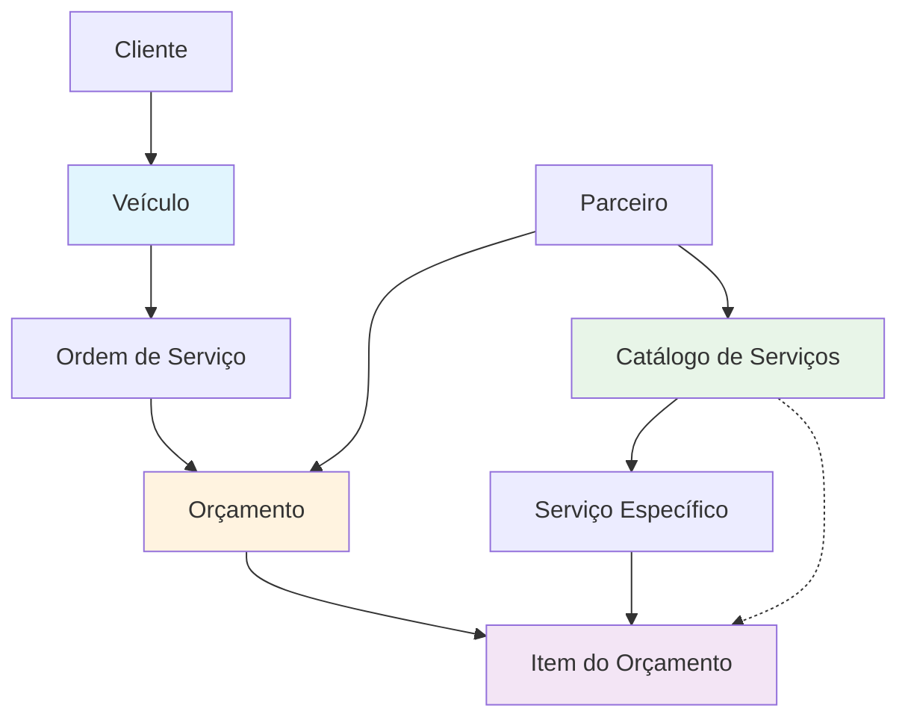

# ANÁLISE DE RELACIONAMENTOS - SISTEMA DE ORÇAMENTOS

## 🏗️ ESTRUTURA ATUAL DAS TABELAS (baseado na análise anterior)

### 📋 Tabelas Principais:
1. **vehicles** - Veículos dos clientes
2. **service_orders** - Ordens de serviço
3. **quotes** - Orçamentos dos parceiros
4. **services** - Serviços específicos de uma quote
5. **quote_items** - Itens de orçamento
6. **partner_services** - Catálogo de serviços dos parceiros
7. **partners** - Dados dos parceiros

---

## 🔗 RELACIONAMENTOS IDENTIFICADOS

```
vehicles (1) ←→ (N) service_orders
service_orders (1) ←→ (N) quotes  
quotes (1) ←→ (N) services
services (1) ←→ (N) quote_items
partner_services (catálogo) → usado para criar services
partners (1) ←→ (N) quotes
```

---

## 🎯 FLUXO ATUAL PROBLEMÁTICO

### ❌ Problema Identificado:
A tabela `services` está sendo usada como **específica por quote** (tem quote_id obrigatório), 
mas o sistema tenta usar `partner_services.id` diretamente em `quote_items.service_id`.

### 🔍 Conflito de Arquitetura:
- `quote_items.service_id` → FK para `services.id`
- Mas `services` precisa de `quote_id` (não é catálogo)
- `partner_services` é o catálogo real, mas não pode ser referenciado diretamente

---

## 💡 SOLUÇÕES POSSÍVEIS

### Opção A: Manter Arquitetura Atual (Implementada)
```
1. partner_services (catálogo)
2. Para cada orçamento: partner_service → cria service (específico da quote)
3. quote_item → referencia service criado
```

### Opção B: Simplificar Arquitetura
```
1. quote_items.service_id → diretamente para partner_services.id
2. Remover necessidade de criar services intermediários
3. services vira opcional/para outros fins
```

### Opção C: Híbrida
```
1. Manter services como catálogo global (sem quote_id)
2. partner_services → popula services (uma vez)
3. quote_items → referencia services global
```

---

## 🎨 DIAGRAMA CONCEITUAL RECOMENDADO



---

## 📝 FLUXO IDEAL PARA ORÇAMENTO

### 1. **Contexto Inicial**
- Veículo já existe (ABC561S8 Ford Palio 2021)
- Service Order já existe para este veículo
- Partner tem catálogo de serviços em partner_services

### 2. **Processo de Criação de Orçamento**
```
┌─────────────────────────────────────────────────┐
│ 1. Partner acessa página de orçamento          │
│    com ?quoteId=existing_quote_id               │
└─────────────────────────────────────────────────┘
                    │
┌─────────────────────────────────────────────────┐
│ 2. Sistema carrega:                             │
│    - Dados do veículo (plate=ABC561S8)         │
│    - Service Order relacionada                 │
│    - Quote existente (se houver)               │
│    - Catálogo de partner_services              │
└─────────────────────────────────────────────────┘
                    │
┌─────────────────────────────────────────────────┐
│ 3. Partner seleciona serviços:                 │
│    - Lista de partner_services disponíveis     │
│    - Quantidade para cada serviço              │
│    - Preços automáticos (do catálogo)          │
└─────────────────────────────────────────────────┘
                    │
┌─────────────────────────────────────────────────┐
│ 4. Sistema salva orçamento:                    │
│    - Atualiza quote existente OU cria nova     │
│    - Para cada serviço selecionado:            │
│      • Cria service específico (com quote_id)  │
│      • Cria quote_item referenciando service   │
└─────────────────────────────────────────────────┘
```

### 3. **Estrutura de Dados Final**
```
quote: {
  id: "uuid",
  service_order_id: "uuid",
  partner_id: "uuid", 
  total_value: 450.00,
  status: "pending_admin_approval"
}

services: [
  {
    id: "uuid1",
    quote_id: "quote.id",
    description: "Troca de óleo e filtros",
    value: 150.00,
    status: "pending"
  },
  {
    id: "uuid2", 
    quote_id: "quote.id",
    description: "Reparo de freios",
    value: 300.00,
    status: "pending"
  }
]

quote_items: [
  {
    quote_id: "quote.id",
    service_id: "uuid1",
    quantity: 1,
    unit_price: 150.00,
    total_price: 150.00
  },
  {
    quote_id: "quote.id", 
    service_id: "uuid2",
    quantity: 1,
    unit_price: 300.00,
    total_price: 300.00
  }
]
```

---

## 🚀 RECOMENDAÇÃO FINAL

**Manter a arquitetura atual** mas com ajustes:

1. ✅ **partner_services** como catálogo dos parceiros
2. ✅ **services** como serviços específicos por quote
3. ✅ **quote_items** referenciando services criados
4. 🔧 **Simplificar processo**: Criar services e quote_items em uma transação
5. 🔧 **Melhorar UX**: Interface mais clara sobre o fluxo de salvamento

### Vantagens desta abordagem:
- ✅ Mantém histórico detalhado por orçamento
- ✅ Permite customização de preços por quote
- ✅ Respeita constraints atuais do banco
- ✅ Facilita auditoria e rastreamento

---

## 🎯 PRÓXIMOS PASSOS

1. **Debugar implementação atual** - verificar erros específicos
2. **Adicionar logs detalhados** no processo de salvamento  
3. **Testar transação completa** com rollback em caso de erro
4. **Validar dados** antes de tentar salvar
5. **Melhorar feedback** para o usuário sobre o que está acontecendo
