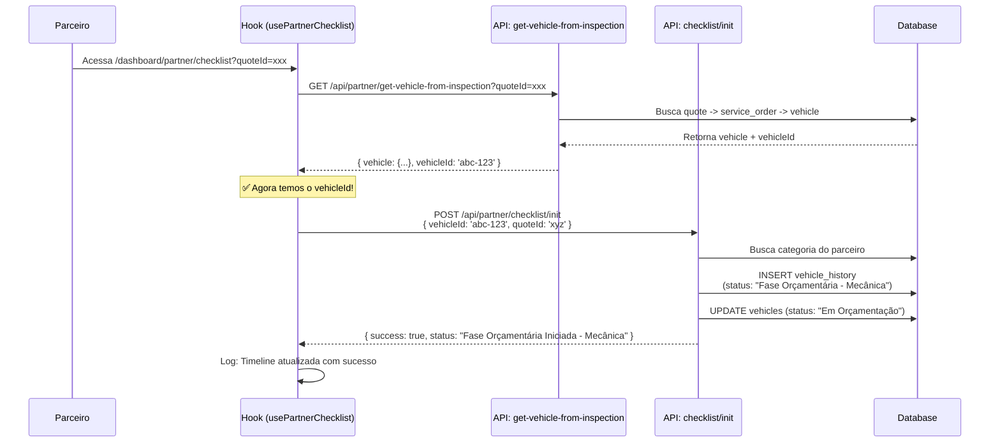

# Fix: Timeline não Atualiza ao Parceiro Iniciar Checklist

**Data**: 08/10/2025  
**Issue**: Quando o parceiro inicia o checklist, o status não aparece na timeline do veículo

## Problema Identificado

A timeline do veículo não estava sendo atualizada com "Fase Orçamentária Iniciada - {Categoria}" quando o parceiro acessava o checklist.

### Causa Raiz

**Ordem incorreta de execução**: O endpoint `/api/partner/checklist/init` estava sendo chamado **ANTES** de obter o `vehicleId` da API.

```typescript
// ❌ ANTES - Chamada prematura
if (vehicleId || quoteId) {
  await post('/api/partner/checklist/init', { vehicleId, quoteId });
}

// Buscar dados do veículo...
const response = await get('/api/partner/get-vehicle-from-inspection');
const vehicleData = response.data.vehicle;
```

**Problema**: Quando o parceiro acessa via `quoteId`, o `vehicleId` ainda não estava disponível, então a chamada falhava silenciosamente.

## Solução Implementada

### 1. Reordenação das Chamadas

Movida a chamada do endpoint de init para **DEPOIS** de obter os dados do veículo:

```typescript
// ✅ DEPOIS - Chamada na ordem correta
const response = await get('/api/partner/get-vehicle-from-inspection');
const vehicleData = response.data.vehicle;
setVehicle(vehicleData);

// Agora sim, com vehicleId disponível
const actualVehicleId = vehicleData.id;
if (actualVehicleId) {
  await post('/api/partner/checklist/init', {
    vehicleId: actualVehicleId,
    quoteId
  });
}
```

### 2. Logs Adicionados

Para facilitar o debug, foram adicionados logs detalhados:

```typescript
logger.info('Registrando início do checklist', {
  vehicleId: actualVehicleId.slice(0, 8),
  quoteId: quoteId?.slice(0, 8),
});

if (initResponse.ok && initResponse.data) {
  logger.info('Timeline atualizada com sucesso', {
    status: initResponse.data.status,
  });
} else {
  logger.warn('Falha ao atualizar timeline', {
    error: initResponse.error,
    status: initResponse.status,
  });
}
```

### 3. Tipagem da Resposta

Adicionada tipagem correta para a resposta do endpoint:

```typescript
const initResponse = await post<{
  success: boolean;
  message?: string;
  status?: string;
  error?: string;
}>('/api/partner/checklist/init', { vehicleId: actualVehicleId, quoteId });
```

## Fluxo Corrigido



## Arquivos Modificados

### `/modules/partner/hooks/usePartnerChecklist.ts`

**Mudanças**:
1. Adicionado import do logger
2. Movida chamada do endpoint de init para depois de obter vehicleId
3. Adicionados logs detalhados
4. Adicionada tipagem da resposta

## Como Testar

### Preparação

1. Certifique-se de que o banco está populado:
```bash
supabase db reset
node scripts/db_scripts/populate-partner-services.js
```

2. Criar um parceiro com categoria específica (ex: Mecânica)

3. Criar um veículo em análise

4. Criar um quote associado ao veículo

### Teste 1: Acesso via quoteId

1. Faça login como parceiro
2. Acesse: `/dashboard/partner/checklist?quoteId={id-do-quote}`
3. Verifique nos logs do navegador:
   ```
   [INFO][partner:checklist] Registrando início do checklist
   [INFO][partner:checklist] Timeline atualizada com sucesso
   ```
4. Acesse a página do veículo como cliente
5. Verifique se aparece na timeline: **"Fase Orçamentária Iniciada - Mecânica"**

### Teste 2: Acesso via vehicleId

1. Faça login como parceiro
2. Acesse: `/dashboard/partner/checklist?vehicleId={id-do-veiculo}`
3. Verifique os mesmos logs e timeline

### Teste 3: Idempotência

1. Acesse o checklist múltiplas vezes
2. Verifique que apenas UM registro é criado na timeline
3. Nos logs, deve aparecer: `"history_already_exists"`

## Logs Esperados

### No Navegador (Frontend)
```
[INFO][partner:checklist] Registrando início do checklist {
  vehicleId: "abc12345",
  quoteId: "xyz67890"
}
[INFO][partner:checklist] Timeline atualizada com sucesso {
  status: "Fase Orçamentária Iniciada - Mecânica"
}
```

### No Terminal (Backend - Next.js)
```
[INFO][api:partner:checklist:init] init_checklist_start {
  vehicleId: "abc12345",
  partnerId: "def45678",
  quoteId: "xyz67890"
}
[INFO][api:partner:checklist:init] history_created {
  vehicleId: "abc12345",
  status: "Fase Orçamentária Iniciada - Mecânica"
}
[INFO][api:partner:checklist:init] vehicle_status_updated {
  vehicleId: "abc12345",
  from: "Análise Finalizada",
  to: "Em Orçamentação"
}
```

## Verificação no Banco de Dados

### Verificar Timeline
```sql
SELECT 
  vh.*,
  v.plate,
  v.brand,
  v.model
FROM vehicle_history vh
JOIN vehicles v ON v.id = vh.vehicle_id
WHERE vh.status LIKE 'Fase Orçamentária%'
ORDER BY vh.created_at DESC;
```

### Verificar Status do Veículo
```sql
SELECT 
  id,
  plate,
  brand,
  model,
  status,
  updated_at
FROM vehicles
WHERE status = 'Em Orçamentação';
```

## Resolução de Problemas

### Problema: Timeline não atualiza

**Checklist**:
1. ✅ Banco foi resetado? Execute `supabase db reset`
2. ✅ Função RPC existe? Verifique `get_partner_categories`
3. ✅ Parceiro tem categoria? Verifique tabela `partner_services`
4. ✅ Logs aparecem no terminal? Verifique chamadas HTTP
5. ✅ Políticas RLS corretas? Verifique `vehicle_history`

### Problema: Erro ao buscar categoria

```sql
-- Verificar se a função existe
SELECT routine_name 
FROM information_schema.routines 
WHERE routine_name = 'get_partner_categories';

-- Testar a função
SELECT get_partner_categories('{id-do-parceiro}'::uuid);
```

### Problema: Erro de RLS

```sql
-- Verificar políticas da tabela vehicle_history
SELECT * FROM pg_policies 
WHERE tablename = 'vehicle_history';

-- Garantir que service_role pode inserir
ALTER TABLE vehicle_history ENABLE ROW LEVEL SECURITY;

CREATE POLICY IF NOT EXISTS "Allow service_role all" 
ON vehicle_history 
FOR ALL 
TO service_role 
USING (true);
```

## Impacto

✅ **Rastreabilidade**: Cada categoria de parceiro tem seu início registrado  
✅ **Transparência**: Cliente vê quando parceiro iniciou trabalho  
✅ **Histórico**: Registro permanente na tabela `vehicle_history`  
✅ **Status**: Veículo muda para "Em Orçamentação" automaticamente  
✅ **Logs**: Debug facilitado com logs detalhados  

## Próximos Passos

1. **Monitorar logs** após deploy em produção
2. **Adicionar métricas** de tempo entre fases
3. **Dashboard** mostrando tempo médio por categoria
4. **Notificações** quando novo evento é registrado na timeline
