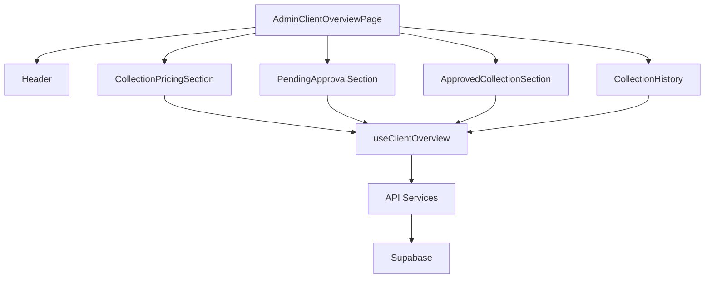
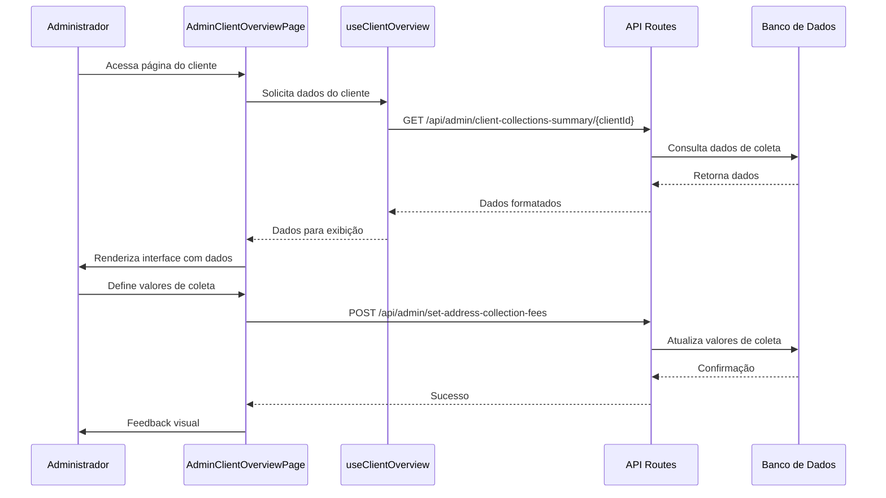

# Visão Geral do Cliente - Painel Administrativo

## 1. Objetivo

Desenvolver uma página abrangente no painel administrativo que permita aos administradores visualizar e gerenciar todas as informações relacionadas a um cliente específico, incluindo:

- Definição de valores de coleta (precificação)
- Monitoramento de coletas aprovadas
- Histórico de coletas
- Gestão de coletas pendentes de aprovação

## 2. Requisitos Funcionais

### 2.1 Seção de Precificação de Coleta

**Componente:** `CollectionPricingSection.tsx`

#### 2.1.1 Exibição de Pontos de Coleta
- Listar todos os pontos de coleta associados ao cliente
- Para cada ponto, exibir:
  - Endereço completo do ponto de coleta
  - Número de veículos associados a esse ponto
  - Campo para definir o valor da coleta por veículo (input numérico formatado como moeda)
  - Campo para definir a data prevista de coleta (Date Picker)
  - Total estimado (calculado automaticamente: valor x número de veículos)

#### 2.1.2 Funcionalidades
- Permitir edição em massa dos valores de coleta
- Carregar automaticamente valores já definidos anteriormente
- Validação de campos obrigatórios
- Feedback visual durante o salvamento
- Botão para salvar todas as alterações

#### 2.1.3 Regras de Negócio
- O valor da coleta deve ser um número positivo
- A data prevista de coleta deve ser igual ou posterior à data atual
- Ao salvar, todos os veículos associados ao ponto devem ser atualizados com:
  - Status: "AGUARDANDO APROVAÇÃO DA COLETA"
  - Valor da coleta por veículo
  - Data prevista de coleta
  - ID da coleta (gerado automaticamente)

### 2.2 Seção de Coletas Aprovadas

**Componente:** `ApprovedCollectionSection.tsx`

#### 2.2.1 Exibição de Coletas
- Listar todas as coletas com status "COLETA APROVADA"
- Para cada coleta, exibir:
  - Endereço do ponto de coleta
  - Número de veículos
  - Valor total da coleta
  - Data prevista de coleta

#### 2.2.2 Funcionalidades
- Visualizar detalhes dos veículos associados a cada coleta
- Filtrar coletas por período

#### 2.2.3 Regras de Negócio
- Após aprovação da coleta pelo cliente, o status da coleta muda para "AGUARDANDO COLETA"

### 2.3 Seção de Histórico de Coletas

**Componente:** `CollectionHistory.tsx`

#### 2.3.1 Exibição do Histórico
- Listar todas as coletas finalizadas (com status "ENTREGA CONFIRMADA" ou equivalentes)
- Para cada coleta, exibir:
  - Endereço do ponto de coleta
  - Número de veículos
  - Valor total da coleta
  - Data de coleta realizada
  - Data de confirmação de entrega

#### 2.3.2 Funcionalidades
- Filtrar histórico por período
- Ordenar por data (mais recente primeiro)
- Visualizar detalhes das coletas

### 2.4 Seção de Coletas Pendentes de Aprovação

**Componente:** `PendingApprovalSection.tsx`

#### 2.4.1 Exibição de Coletas Pendentes
- Listar todas as coletas com status "AGUARDANDO APROVAÇÃO DA COLETA"
- Para cada grupo de coleta (agrupados por endereço), exibir:
  - Endereço do ponto de coleta
  - Número de veículos
  - Valor total estimado da coleta
  - Data prevista de coleta
  - Status detalhado (ex: 3 veículos "AGUARDANDO APROVAÇÃO", 2 veículos "AGUARDANDO CHEGADA")

#### 2.4.2 Funcionalidades
- Visualizar detalhes dos veículos em cada grupo
- Quando múltiplos grupos tiverem o mesmo endereço mas datas diferentes, exibi-los em linhas diferentes
- Permitir visualização do status individual de cada veículo

#### 2.4.3 Regras de Negócio
- Grupos com mesmo endereço mas datas diferentes devem ser exibidos separadamente
- O status de cada veículo deve ser claramente visível

## 3. User Stories

### 3.1 User Story - Precificação de Coleta
```
COMO administrador do sistema ProLine Hub
QUERO definir valores de coleta para os veículos de um cliente
PARA que o cliente possa aprovar e agendar a coleta
```

**Critérios de Aceitação:**
- Deve exibir todos os pontos de coleta do cliente
- Deve permitir definir valor e data para cada ponto
- Deve calcular automaticamente o total estimado
- Deve salvar os valores e atualizar o status dos veículos
- Deve carregar valores pré-existentes quando disponíveis

### 3.2 User Story - Monitoramento de Coletas Aprovadas
```
COMO administrador do sistema ProLine Hub
QUERO visualizar as coletas aprovadas por um cliente
PARA preparar a coleta
```

**Critérios de Aceitação:**
- Deve listar todas as coletas com status "COLETA APROVADA"
- Deve exibir detalhes dos veículos em cada coleta

### 3.3 User Story - Histórico de Coletas
```
COMO administrador do sistema ProLine Hub
QUERO consultar o histórico de coletas de um cliente
PARA fins de auditoria e acompanhamento
```

**Critérios de Aceitação:**
- Deve listar todas as coletas finalizadas
- Deve permitir filtrar por período
- Deve exibir todas as informações relevantes de cada coleta

### 3.4 User Story - Gestão de Coletas Pendentes
```
COMO administrador do sistema ProLine Hub
QUERO visualizar as coletas aguardando aprovação do cliente
PARA acompanhar o progresso e identificar gargalos
```

**Critérios de Aceitação:**
- Deve listar todas as coletas com status "AGUARDANDO APROVAÇÃO DA COLETA"
- Deve exibir informações detalhadas de cada grupo
- Deve mostrar status individuais quando houver divergências
- Deve agrupar corretamente por endereço e data

## 4. Especificações Técnicas

### 4.1 Estrutura de Componentes

```
modules/
└── admin/
    └── components/
        └── overview/
            ├── CollectionPricingSection.tsx
            ├── ApprovedCollectionSection.tsx
            ├── CollectionHistory.tsx
            └── PendingApprovalSection.tsx
```

### 4.2 Interfaces de Dados

```typescript
interface CollectionPricingRequest {
  addressId: string;
  address: string;
  vehicle_count: number;
  collection_fee: number | null;
  collection_date: string | null;
}

interface ApprovedCollectionGroup {
  addressId: string;
  address: string;
  vehicle_count: number;
  collection_fee: number | null;
  collection_date: string | null;
}

interface CollectionHistoryItem {
  addressId: string;
  address: string;
  vehicle_count: number;
  collection_fee: number | null;
  collection_date: string | null;
  delivery_date: string | null;
  status: string;
}

interface PendingApprovalGroup {
  addressId: string;
  address: string;
  vehicle_count: number;
  collection_fee: number | null;
  collection_date: string | null;
  statuses?: Array<{ status: string; count: number }>;
}
```

### 4.3 Hooks Customizados

```typescript
// modules/admin/hooks/useClientOverview.ts
const useClientOverview = (clientId: string) => {
  const [data, setData] = useState<OverviewData | null>(null);
  const [loading, setLoading] = useState(true);
  const [error, setError] = useState<string | null>(null);
  
  // Funções para buscar dados de cada seção
  const fetchPricingRequests = useCallback(async () => {...}, [clientId]);
  const fetchApprovedCollections = useCallback(async () => {...}, [clientId]);
  const fetchCollectionHistory = useCallback(async () => {...}, [clientId]);
  const fetchPendingApprovals = useCallback(async () => {...}, [clientId]);
  
  // Função para salvar valores de coleta
  const saveCollectionFees = useCallback(async (fees: CollectionFee[]) => {...}, [clientId]);
  
  return {
    data,
    loading,
    error,
    refetch: () => {
      fetchPricingRequests();
      fetchApprovedCollections();
      fetchCollectionHistory();
      fetchPendingApprovals();
    },
    saveCollectionFees
  };
};
```

### 4.4 APIs Necessárias

#### 4.4.1 Buscar Dados de Visão Geral
```
GET /api/admin/client-collections-summary/:clientId
```

**Resposta:**
```json
{
  "success": true,
  "groups": [...], // CollectionPricingRequest[]
  "approvalGroups": [...], // PendingApprovalGroup[]
  "approvedGroups": [...], // ApprovedCollectionGroup[]
  "approvalTotal": 0,
  "approvedTotal": 0,
  "clientSummary": {...},
  "statusTotals": [...],
  "collectionHistory": [...] // CollectionHistoryItem[]
}
```

#### 4.4.2 Salvar Valores de Coleta
```
POST /api/admin/set-address-collection-fees
```

**Payload:**
```json
{
  "clientId": "uuid",
  "fees": [
    {
      "addressId": "uuid",
      "fee": 150.00,
      "date": "2024-01-15"
    }
  ]
}
```

## 5. Regras de Negócio Detalhadas

### 5.1 Fluxo de Status dos Veículos

1. **AGUARDANDO DEFINIÇÃO DE COLETA** → Status inicial após cadastro do veículo
2. **PONTO DE COLETA SELECIONADO** → Cliente definiu ponto de coleta
3. **AGUARDANDO APROVAÇÃO DA COLETA** → Admin definiu valor, aguardando aprovação do cliente
4. **COLETA APROVADA** → Cliente aprovou a coleta
5. **AGUARDANDO COLETA** → Coleta aprovada pelo cliente, aguardando coleta
6. **AGUARDANDO CHEGADA DO CLIENTE** → Notificação enviada para o cliente
7. **AGUARDANDO CHEGADA DO VEÍCULO** → Cliente confirmou que está a caminho
8. **CHEGADA CONFIRMADA** → Especialista confirmou chegada do veículo
9. **EM ANÁLISE** → Veículo em processo de análise
10. **ANÁLISE FINALIZADA** → Análise concluída

### 5.2 Tratamento de Grupos com Mesmo Endereço

Quando múltiplos grupos de veículos tiverem o mesmo endereço mas datas de coleta diferentes:
- Devem ser exibidos em linhas separadas na seção "Coletas Pendentes de Aprovação"
- Cada linha deve mostrar claramente a data associada
- O agrupamento deve considerar endereço + data como chave única

## 6. Considerações de UX/UI

### 6.1 Layout Responsivo
- Adaptar layout para diferentes tamanhos de tela
- Em dispositivos móveis, usar accordion para seções
- Garantir boa legibilidade em telas menores

### 6.2 Feedback Visual
- Indicador de loading durante requisições
- Mensagens de sucesso/erro após operações
- Destacar visualmente linhas com ações pendentes

### 6.3 Acessibilidade
- Labels apropriados para todos os elementos
- Navegação por teclado
- Contraste adequado de cores
- Suporte a leitores de tela

## 7. Critérios de Aceitação Técnicos

### 7.1 Performance
- Carregar todos os dados em no máximo 2 requisições
- Exibir skeleton loaders durante carregamento
- Implementar paginação para listas com mais de 50 itens

### 7.2 Segurança
- Validar todas as entradas no frontend e backend
- Proteger endpoints com autenticação e autorização
- Sanitizar dados antes de salvar no banco

### 7.3 Testes
- Cobrir 80%+ do código com testes unitários
- Implementar testes de integração para fluxos críticos
- Realizar testes E2E para principais user stories

## 8. Diagramas

### 8.1 Arquitetura de Componentes


### 8.2 Fluxo de Dados
