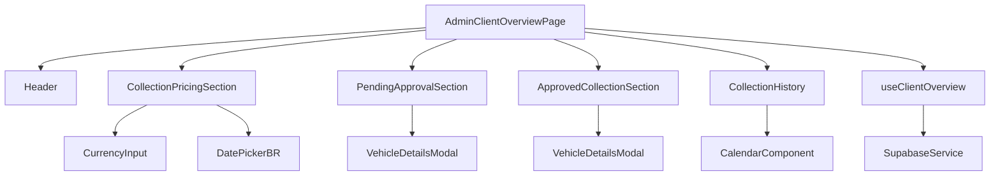
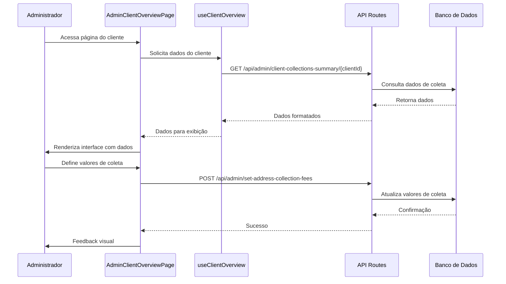
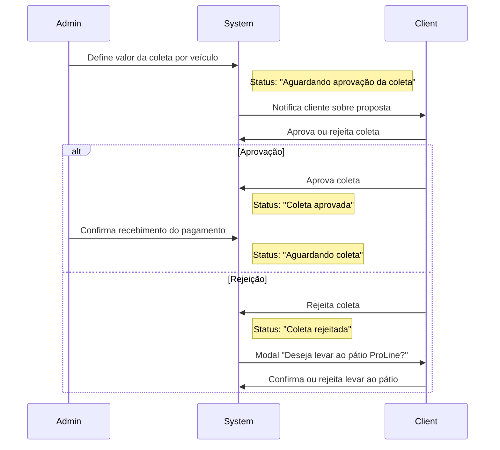

# Documentação: Página de Visão Geral do Cliente (Admin Dashboard)

## 1. Visão Geral

Esta documentação descreve a implementação da página de Visão Geral do Cliente no painel administrativo da aplicação ProLine Hub. A página permite que administradores monitorem e gerenciem todas as informações relacionadas a um cliente específico, incluindo precificação de coletas, coletas aprovadas, histórico de coletas e coletas pendentes de aprovação.

## 2. Objetivo

Desenvolver uma página abrangente no painel administrativo que permita aos administradores:

- Visualizar e gerenciar pontos de coleta para definição de precificação
- Monitorar coletas aprovadas
- Consultar histórico de coletas finalizadas
- Gerenciar coletas pendentes de aprovação do cliente

## 3. User Story

**Como** administrador do sistema ProLine Hub,
**Quero** ter uma visão completa de cada cliente cadastrado,
**Para** poder gerenciar suas coletas, definir valores de precificação e acompanhar o status de aprovação das coletas.

### 3.1 Critérios de Aceitação

1. A página deve exibir as seguintes seções:
   - Pontos de coleta para precificação
   - Coletas aprovadas
   - Histórico de coletas
   - Coletas pendentes de aprovação

2. Na seção "Pontos de coleta para precificação":
   - Deve exibir endereço do ponto de coleta
   - Deve exibir número de veículos associados ao ponto
   - Deve permitir definir valor da coleta por veículo
   - Deve calcular e exibir total estimado para o ponto
   - Deve permitir definir data de coleta
   - Deve carregar valores previamente definidos para pontos com valores já cadastrados

3. Na seção "Coletas pendentes de aprovação":
   - Deve exibir endereço da coleta
   - Deve exibir número de veículos
   - Deve exibir valor da coleta total estimado
   - Deve exibir data de coleta definida
   - Quando houver múltiplos grupos com mesmo endereço mas datas diferentes, devem ser exibidos em linhas separadas

4. As seções já existentes devem manter sua funcionalidade:
   - Coletas aprovadas
   - Histórico de coletas

## 4. Diagramas

### 4.1 Diagrama de Componentes



### 4.2 Fluxo de Dados



### 4.3 Fluxo de Aprovação de Coleta



## 5. Especificações Técnicas

### 5.1 Estrutura de Componentes

#### 5.1.1 AdminClientOverviewPage
Componente principal que orquestra todas as seções da página.

Responsabilidades:
- Carregar dados do cliente usando `useClientOverview`
- Renderizar todas as seções
- Gerenciar estados globais da página

#### 5.1.2 CollectionPricingSection (Atualizado)
Seção responsável por exibir e gerenciar os pontos de coleta para definição de precificação.

Novas funcionalidades:
- Carregar valores pré-existentes para pontos já precificados
- Permitir edição em massa de valores e datas
- Calcular totais estimados por ponto

Props:
```typescript
interface CollectionPricingSectionProps {
  clientId: string;
  requests: CollectionPricingRequest[];
  onSave: (rows: CollectionFeeRow[]) => Promise<void>;
  loading?: boolean;
}

interface CollectionPricingRequest {
  addressId: string;
  address: string;
  vehicle_count: number;
  collection_fee: number | null;
}
```

#### 5.1.3 PendingApprovalSection (Novo)
Nova seção que exibe as coletas pendentes de aprovação pelo cliente.

Responsabilidades:
- Exibir grupos de coletas aguardando aprovação
- Mostrar detalhes de endereço, veículos, valores e datas
- Permitir visualização de detalhes dos veículos

Props:
```typescript
interface PendingApprovalSectionProps {
  groups: PendingApprovalGroup[];
  loading?: boolean;
}

interface PendingApprovalGroup {
  addressId: string;
  address: string;
  vehicle_count: number;
  collection_fee: number | null;
  collection_date: string | null;
  statuses?: { status: string; count: number }[];
}
```

#### 5.1.4 ApprovedCollectionSection
Seção que exibe as coletas já aprovadas pelo cliente.

#### 5.1.5 CollectionHistory
Seção que mostra o histórico de coletas finalizadas.

### 5.2 Hooks

#### 5.2.1 useClientOverview
Hook customizado para gerenciar os dados da visão geral do cliente.

Responsabilidades:
- Buscar dados de todas as seções em uma única chamada
- Gerenciar estados de loading e erro
- Fornecer função de refetch para atualização dos dados

```typescript
interface OverviewData {
  pricingRequests: CollectionPricingRequest[];
  approvalGroups: PendingApprovalGroup[];
  approvedGroups: ApprovedCollectionGroup[];
  approvalTotal: number;
  approvedTotal: number;
  clientSummary: ClientSummary;
  statusTotals: StatusTotal[];
  collectionHistory: CollectionHistoryItem[];
}

const { data, loading, error, refetch } = useClientOverview(clientId);
```

### 5.3 APIs

#### 5.3.1 GET /api/admin/client-collections-summary/{clientId}
Endpoint para buscar todos os dados necessários para a página de visão geral.

Retorno:
```json
{
  "success": true,
  "groups": [...], // Dados para CollectionPricingSection
  "approvalGroups": [...], // Dados para PendingApprovalSection
  "approvedGroups": [...], // Dados para ApprovedCollectionSection
  "approvalTotal": 0,
  "approvedTotal": 0,
  "clientSummary": {},
  "statusTotals": [],
  "collectionHistory": []
}
```

#### 5.3.2 POST /api/admin/set-address-collection-fees
Endpoint para salvar os valores de coleta definidos pelo administrador.

Payload:
```json
{
  "clientId": "uuid",
  "fees": [
    {
      "addressId": "uuid",
      "fee": 150.00,
      "date": "2024-01-15"
    }
  ]
}
```

## 6. Regras de Negócio

### 6.1 Exibição de Valores Pré-existentes
Quando um administrador acessa a página de um cliente:
1. O sistema deve verificar se já existem valores definidos para cada ponto de coleta
2. Caso existam, esses valores devem ser automaticamente preenchidos nos campos correspondentes
3. O administrador pode editar esses valores ou mantê-los

### 6.2 Agrupamento de Coletas Pendentes
Na seção "Coletas pendentes de aprovação":
1. Grupos com o mesmo endereço mas datas diferentes devem ser exibidos em linhas separadas
2. Cada linha deve mostrar claramente a data associada ao grupo
3. O valor total estimado deve ser calculado com base no número de veículos e valor por veículo

### 6.3 Estados dos Veículos
Os veículos podem estar nos seguintes estados durante o fluxo de coleta:
- AGUARDANDO DEFINIÇÃO DE COLETA
- PONTO DE COLETA SELECIONADO
- AGUARDANDO APROVAÇÃO DA COLETA
- COLETA APROVADA
- AGUARDANDO COLETA
- AGUARDANDO CHEGADA DO CLIENTE
- AGUARDANDO CHEGADA DO VEÍCULO
- CHEGADA CONFIRMADA
- EM ANÁLISE
- ANÁLISE FINALIZADA

## 7. Considerações de UX/UI

### 7.1 Layout Responsivo
A página deve ser totalmente responsiva, adaptando-se a diferentes tamanhos de tela:
- Desktop: Layout em grade com múltiplas colunas
- Tablet: Layout adaptado com reorganização de elementos
- Mobile: Layout em coluna única com scroll vertical

### 7.2 Feedback Visual
O sistema deve fornecer feedback visual claro para todas as ações do usuário:
- Indicador de loading durante requisições
- Mensagens de sucesso/erro após operações
- Estados visuais para botões (ativo, hover, desabilitado)

### 7.3 Acessibilidade
A página deve seguir boas práticas de acessibilidade:
- Labels apropriados para todos os elementos interativos
- Navegação por teclado funcional
- Contraste adequado de cores
- Leitura de tela compatível

## 8. Testes

### 8.1 Testes Unitários
- Testar hook `useClientOverview` com diferentes cenários de dados
- Testar componentes individuais com mocks de dados
- Testar funções de formatação e cálculo

### 8.2 Testes de Integração
- Testar fluxo completo de definição de valores de coleta
- Testar exibição correta de dados pré-existentes
- Testar agrupamento de coletas pendentes

### 8.3 Testes E2E
- Testar navegação até a página de visão geral do cliente
- Testar definição e salvamento de valores de coleta
- Testar exibição de diferentes estados de coleta
- Testar responsividade em diferentes dispositivos

## 9. Segurança

### 9.1 Autorização
- Apenas usuários com role "admin" podem acessar esta página
- Todas as operações devem ser validadas no backend
- Proteção contra CSRF em todas as operações de escrita

### 9.2 Validação de Dados
- Todos os dados de entrada devem ser validados e sanitizados
- Validação de valores monetários para evitar injeção
- Proteção contra ataques de injeção SQL (via ORM)

## 10. Performance

### 10.1 Otimizações
- Carregar todos os dados em uma única requisição
- Implementar paginação para listas extensas
- Usar memoização para cálculos repetitivos
- Lazy loading para componentes pesados

### 10.2 Monitoramento
- Registrar tempos de carregamento das requisições
- Monitorar erros de API
- Coletar métricas de uso das funcionalidades