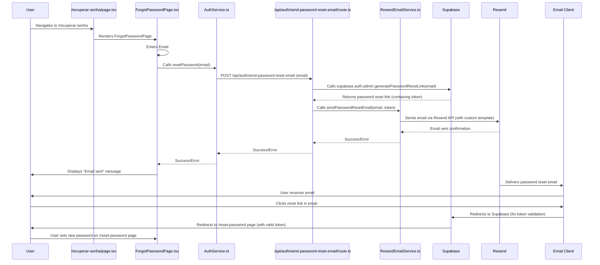

### Fluxo de Recuperação de Senha com Resend

Este diagrama detalha o fluxo de recuperação de senha, utilizando o serviço de e-mail Resend para envio de e-mails personalizados, enquanto o Supabase é utilizado para a geração e validação segura dos tokens de redefinição.

1.  **Início do Fluxo (Usuário):** O usuário navega até a página `/recuperar-senha` (`app/recuperar-senha/page.tsx`), que renderiza o componente `ForgotPasswordPage.tsx`. O usuário insere seu endereço de e-mail no formulário.

2.  **Chamada ao Serviço de Autenticação (Cliente):** O `ForgotPasswordPage.tsx` invoca o método `resetPassword` do `AuthService.ts`, passando o e-mail fornecido pelo usuário.

3.  **Invocação da Rota de API (Cliente para Servidor):** O `AuthService.ts` faz uma requisição `POST` para a nova rota de API server-side `/api/auth/send-password-reset-email/route.ts`, enviando o e-mail no corpo da requisição.

4.  **Geração de Token Supabase (Servidor):** A rota de API, executando no servidor, utiliza o cliente Admin do Supabase (`supabase.auth.admin.generatePasswordResetLink(email)`) para gerar um link de redefinição de senha. É importante notar que esta função gera o link/token sem enviar o e-mail, permitindo que o controle do envio seja feito pela aplicação.

5.  **Extração do Token (Servidor):** A rota de API recebe o link completo do Supabase e extrai o `token` de redefinição de senha dos parâmetros da URL.

6.  **Envio de E-mail Personalizado (Servidor via Resend):** A rota de API então chama o `ResendEmailService.sendPasswordResetEmail(email, token)`. Este serviço é responsável por construir o conteúdo do e-mail com um template personalizado (utilizando o `resetToken` para criar o link de redefinição único) e enviá-lo através da API do Resend.

7.  **Entrega do E-mail:** O serviço Resend entrega o e-mail de redefinição de senha para a caixa de entrada do usuário.

8.  **Interação do Usuário com o E-mail:** O usuário recebe o e-mail e clica no link de redefinição de senha.

9.  **Validação do Token e Redirecionamento (Supabase):** O link direciona o usuário primeiramente ao Supabase, que valida a autenticidade e a validade do token. Se o token for válido, o Supabase redireciona o usuário para a página `/reset-password` da aplicação (conforme configurado no `redirectTo` quando o link foi gerado).

10. **Redefinição da Senha (Usuário):** Na página `/reset-password`, o usuário pode então definir e confirmar sua nova senha.

Este fluxo garante que a aplicação tenha controle total sobre o template e o processo de envio do e-mail (via Resend), enquanto ainda se beneficia da segurança e da robustez do Supabase para a geração e validação dos tokens de redefinição de senha, mantendo as operações sensíveis no lado do servidor.