# System Context Diagram

This document provides a high-level view of the ProLine Hub system architecture and its relationships with external entities.

## System Overview

```mermaid
graph TB
    subgraph "External Entities"
        Client[🚗 Client<br/>Vehicle Owner]
        Partner[🔧 Partner<br/>Service Provider]
        Specialist[🔍 Specialist<br/>Inspection Expert]
        Admin[👑 Administrator<br/>System Operator]
        Supplier[📦 Supplier<br/>Parts Vendor]
        Insurance[🛡️ Insurance<br/>Insurance Company]
    end

    subgraph "ProLine Hub System"
        API[🌐 API Layer<br/>RESTful Services]
        Auth[🔑 Authentication<br/>Identity Management]
        Storage[💾 Storage<br/>File Management]
        Database[🗄️ Database<br/>Data Persistence]
        BusinessLogic[🧠 Business Logic<br/>Domain Services]
        Notification[📧 Notification<br/>Messaging Service]
    end

    Client <-- "📱 Web/App" --> API
    Partner <-- "💻 Dashboard" --> API
    Specialist <-- "📋 Inspection Tools" --> API
    Admin <-- "⚙️ Admin Panel" --> API
    Supplier -. "🛒 API Integration" .-> API
    Insurance -. "📄 Claims Data" .-> API

    API --> Auth
    API --> BusinessLogic
    API --> Notification
    BusinessLogic --> Database
    BusinessLogic --> Storage
    Notification --> Client
    Notification --> Partner
    Notification --> Specialist
    Notification --> Admin
```



## Key System Components

### API Layer
The primary interface for all system interactions:
- **RESTful endpoints** for all business operations
- **Authentication gateway** validating all requests
- **Rate limiting** to prevent abuse
- **Request/response logging** for audit trails

### Authentication Service
Handles all identity and access management:
- **User authentication** via email/password or OAuth
- **Role-based access control** (RBAC) for authorization
- **Session management** with JWT tokens
- **Multi-factor authentication** support

### Business Logic Layer
Core domain services implementing business rules:
- **Vehicle management** services
- **Partner services** orchestration
- **Checklist processing** engines
- **Quote management** workflows
- **Collection scheduling** algorithms

### Data Persistence
Reliable storage for all system data:
- **Relational database** for structured data
- **Object storage** for files and media
- **Caching layer** for performance optimization
- **Backup and recovery** mechanisms

### Notification Service
Real-time communication with stakeholders:
- **Email notifications** for status updates
- **SMS alerts** for critical events
- **Push notifications** for mobile users
- **Webhook integrations** for external systems

## External Integrations

### Parts Suppliers
Integration with supplier systems for:
- **Inventory lookup** and availability checking
- **Order placement** and tracking
- **Pricing updates** and promotions
- **Delivery status** synchronization

### Insurance Companies
Data exchange with insurance providers:
- **Claims processing** automation
- **Vehicle history** sharing
- **Damage assessment** collaboration
- **Repair authorization** workflows

### Government Systems
Compliance with regulatory requirements:
- **Vehicle registration** verification
- **Safety inspection** reporting
- **Environmental compliance** tracking
- **Tax and fee** calculation

## Data Flow Patterns

### Client Journey
```
1. Client Registration → Vehicle Setup → Service Request
2. Collection Scheduling → Vehicle Delivery → Inspection
3. Quote Review → Service Approval → Execution
4. Completion → Payment → Feedback
```

### Partner Workflow
```
1. Quote Reception → Checklist Creation → Evidence Collection
2. Part Requests → Service Planning → Execution Updates
3. Status Reporting → Completion Notification → Billing
```

### Specialist Process
```
1. Inspection Assignment → Vehicle Analysis → Findings Documentation
2. Recommendations → Timeline Estimation → Report Generation
3. Review Process → Client Presentation → Approval Tracking
```

### Administrative Operations
```
1. System Monitoring → User Management → Partner Onboarding
2. Data Analytics → Performance Reports → Business Insights
3. Compliance Auditing → Regulatory Reporting → Policy Updates
```

## Security Architecture

### Identity and Access Management
- **Multi-tenant isolation** with role-based permissions
- **End-to-end encryption** for sensitive data
- **Audit logging** for all system activities
- **Compliance monitoring** for regulatory requirements

### Network Security
- **Firewall protection** at perimeter boundaries
- **Intrusion detection** systems monitoring traffic
- **DDoS protection** for service availability
- **Secure API gateways** with rate limiting

### Data Protection
- **Database encryption** at rest and in transit
- **PII anonymization** for analytics processing
- **Regular security audits** and penetration testing
- **Incident response** procedures for breaches

## Scalability Architecture

### Horizontal Scaling
- **Load-balanced API** endpoints for request distribution
- **Database sharding** for data distribution
- **Microservices architecture** for independent scaling
- **Auto-scaling groups** for variable demand

### Performance Optimization
- **Content delivery networks** for static assets
- **Database indexing** for query optimization
- **Caching strategies** at multiple layers
- **Asynchronous processing** for heavy operations

### Fault Tolerance
- **Redundant infrastructure** across availability zones
- **Automated failover** for critical services
- **Data replication** for disaster recovery
- **Health monitoring** with alerting systems

## Deployment Architecture

### Cloud Infrastructure
- **Containerized services** using Docker/Kubernetes
- **Infrastructure as Code** for consistent deployment
- **Continuous integration/deployment** pipelines
- **Environment parity** across dev/staging/production

### Monitoring and Observability
- **Application performance monitoring** (APM)
- **Infrastructure monitoring** with metrics and alerts
- **Distributed tracing** for request tracking
- **Centralized logging** for debugging and audit

## Evolution Roadmap

### Current State
- **Monolithic core** with microservices extensions
- **Single-region deployment** with backup capabilities
- **Manual scaling** with basic monitoring
- **Hybrid authentication** (session and token-based)

### Near Term Goals (6-12 months)
- **Full microservices migration**
- **Multi-region deployment** for high availability
- **Advanced monitoring** with AI-powered insights
- **Enhanced security** with zero-trust architecture

### Long Term Vision (1-2 years)
- **Serverless functions** for event-driven processing
- **Global edge computing** for reduced latency
- **Self-healing systems** with automated remediation
- **Predictive analytics** for proactive service management

## Conclusion

The ProLine Hub system context diagram illustrates a comprehensive platform that connects vehicle owners, service providers, inspection specialists, and administrators through a robust set of services and integrations. The architecture emphasizes security, scalability, and reliability while providing flexibility for future growth and evolution. This context serves as the foundation for all detailed architectural decisions and implementation efforts.