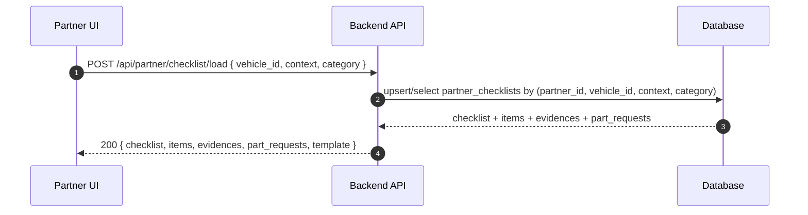
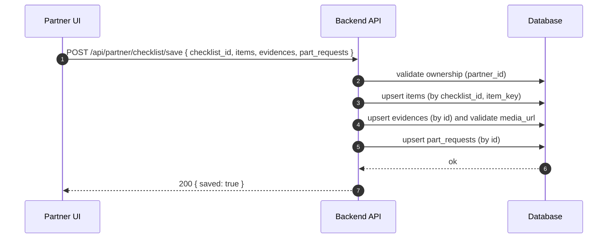
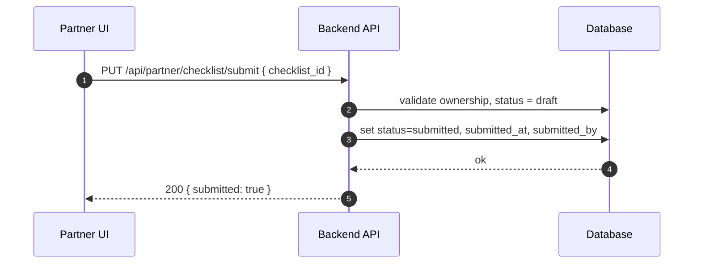
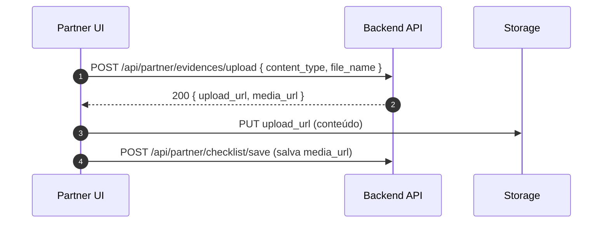
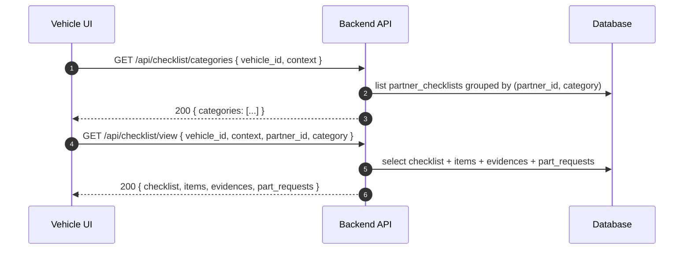
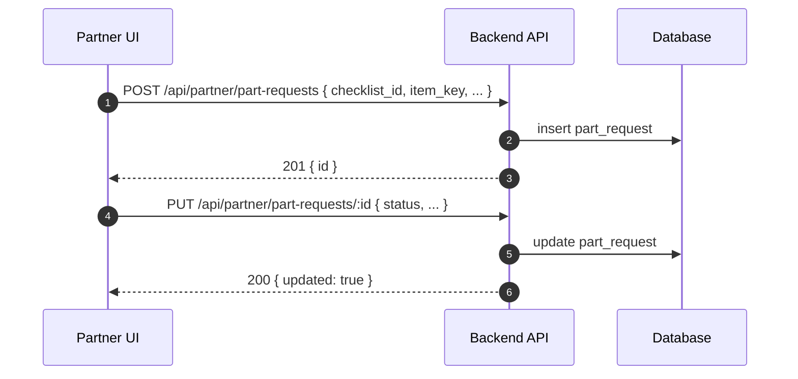

# Fluxos e Diagramas — Checklist/Vistoria por Parceiro

Status: proposta (alvo de implementação)

## Fluxo: Parceiro carrega checklist

## Fluxo: Salvar rascunho (itens, evidências, solicitações)

## Fluxo: Submeter checklist

## Fluxo: Upload de evidência (assinado)

## Fluxo: Visualização (PartnerEvidencesSection ➜ Viewer)

## Fluxo: Solicitação de Peças por item

git add @docs/ docs/ scripts/ git commit -m "docs: complete documentation overhaul

- Add @docs/as-is/CURRENT_STATE.md (450 lines) documenting actual implementation
- Add @docs/MIGRATION_STATUS.md (550 lines) tracking 60% migration progress
- Add scripts/validate-docs-vs-schema.js validation automation
- Document 4 architectural decisions (ADRs) in MIGRATION_STATUS.md
- Create ER and sequence diagrams for current state
- Update DOCUMENTATION_REALITY_GAP_ANALYSIS.md checklist

Benefits:

- Clear separation between target (@docs/) and current (@docs/as-is/) state
- Automated validation of docs vs. schema alignment
- Complete roadmap for remaining 40% migration
- Better onboarding for new developers

Closes #documentation-gap"
