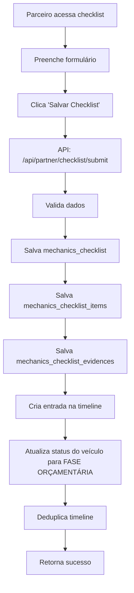

# Atualização de Status do Veículo ao Salvar Checklist

## 📋 Resumo

Quando o parceiro salva o checklist de mecânica, o sistema agora atualiza automaticamente o status do veículo para **"FASE ORÇAMENTÁRIA"**.

## 🎯 Objetivo

Garantir que o status do veículo reflita corretamente a fase atual do processo, permitindo:
- Melhor rastreamento do progresso do veículo
- Atualização automática da timeline
- Sincronização entre checklist e status do veículo

## 🔧 Implementação

### Arquivo Modificado
- `app/api/partner/checklist/submit/route.ts`

### Lógica Implementada

```typescript
// Atualizar status do veículo para 'FASE ORÇAMENTÁRIA'
const { error: statusUpdateError } = await supabase
  .from('vehicles')
  .update({ vehicle_status: 'FASE ORÇAMENTÁRIA' })
  .eq('id', checklistData.vehicle_id);

if (statusUpdateError) {
  logger.error('vehicle_status_update_error', { error: statusUpdateError.message });
} else {
  logger.info('vehicle_status_updated', {
    vehicle_id: checklistData.vehicle_id.slice(0, 8),
    new_status: 'FASE ORÇAMENTÁRIA',
  });
}
```

### Ordem de Execução

1. ✅ Salvar checklist principal (`mechanics_checklist`)
2. ✅ Salvar itens do checklist (`mechanics_checklist_items`)
3. ✅ Salvar evidências (`mechanics_checklist_evidences`)
4. ✅ Criar entrada na timeline (`vehicle_history`)
5. ✅ **Atualizar status do veículo** → `FASE ORÇAMENTÁRIA`
6. ✅ Deduplicar entradas da timeline

## 📊 Status Possíveis

De acordo com `modules/vehicles/constants/vehicleStatus.ts`:

```typescript
export const VehicleStatus = {
  AGUARDANDO_COLETA: 'AGUARDANDO COLETA',
  AGUARDANDO_CHEGADA: 'AGUARDANDO CHEGADA DO VEÍCULO',
  CHEGADA_CONFIRMADA: 'CHEGADA CONFIRMADA',
  EM_ANALISE: 'EM ANÁLISE',
  FASE_ORCAMENTARIA: 'FASE ORÇAMENTÁRIA',  // ← Status aplicado ao salvar checklist
  ANALISE_FINALIZADA: 'ANALISE FINALIZADA',
  ORCAMENTO_APROVADO: 'Orçamento Aprovado',
  FASE_EXECUCAO_INICIADA: 'FASE DE EXECUÇÃO INICIADA',
}
```

## 🧪 Testes

### Script de Teste
Execute: `./scripts/test-vehicle-status-update.sh`

### Teste Manual

1. **Verificar status antes:**
   ```sql
   SELECT vehicle_status FROM vehicles WHERE id = '<vehicle_id>';
   ```

2. **Acessar checklist:**
   ```
   http://localhost:3000/dashboard/partner/checklist?quoteId=<quote_id>
   ```

3. **Preencher e salvar checklist**

4. **Verificar status depois:**
   ```sql
   SELECT vehicle_status FROM vehicles WHERE id = '<vehicle_id>';
   -- Deve retornar: 'FASE ORÇAMENTÁRIA'
   ```

5. **Verificar timeline:**
   ```sql
   SELECT status, created_at 
   FROM vehicle_history 
   WHERE vehicle_id = '<vehicle_id>' 
   ORDER BY created_at DESC 
   LIMIT 5;
   -- Deve ter: 'Fase Orçamentária Iniciada - <categoria>'
   ```

## 📝 Logs

Os logs gerados incluem:

- ✅ `vehicle_status_updated`: Status atualizado com sucesso
- ❌ `vehicle_status_update_error`: Erro ao atualizar status

### Exemplo de Log de Sucesso

```json
{
  "level": "info",
  "message": "vehicle_status_updated",
  "vehicle_id": "ceb85fb1",
  "new_status": "FASE ORÇAMENTÁRIA"
}
```

## ⚠️ Tratamento de Erros

- Se a atualização do status falhar, **NÃO interrompe** o salvamento do checklist
- O erro é logado mas a resposta continua sendo success
- Garante que o checklist seja sempre salvo, mesmo se houver falha no status

## 🔄 Fluxo Completo



## 🔗 Arquivos Relacionados

- `app/api/partner/checklist/submit/route.ts` - Endpoint de salvamento
- `modules/vehicles/constants/vehicleStatus.ts` - Constantes de status
- `modules/common/constants/status.ts` - Status globais
- `scripts/test-vehicle-status-update.sh` - Script de teste

## 📅 Data de Implementação

14 de Outubro de 2025

## ✅ Checklist de Validação

- [x] Status atualizado após salvar checklist
- [x] Logs adequados implementados
- [x] Tratamento de erros não interrompe fluxo principal
- [x] Timeline criada corretamente
- [x] Script de teste criado
- [x] Documentação criada
