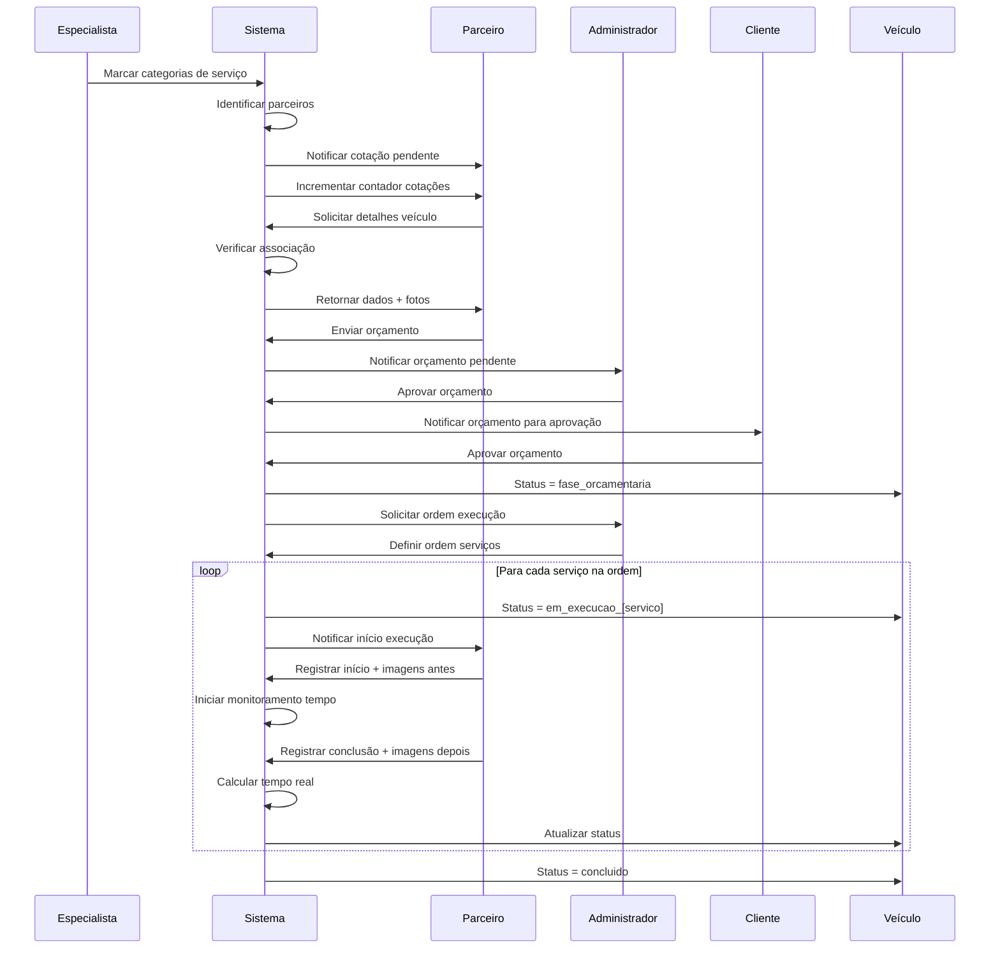
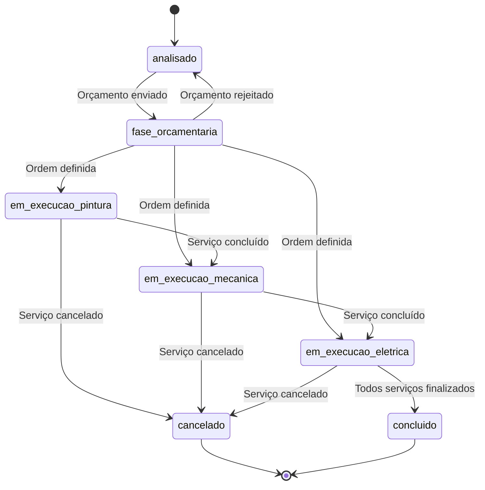
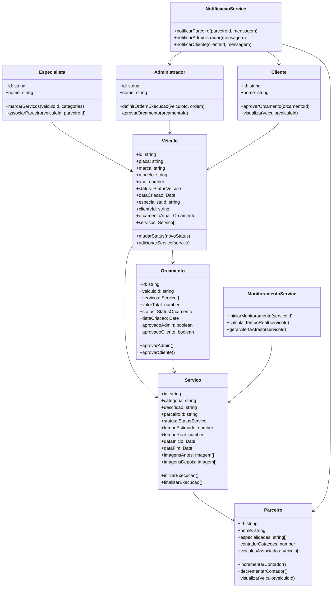
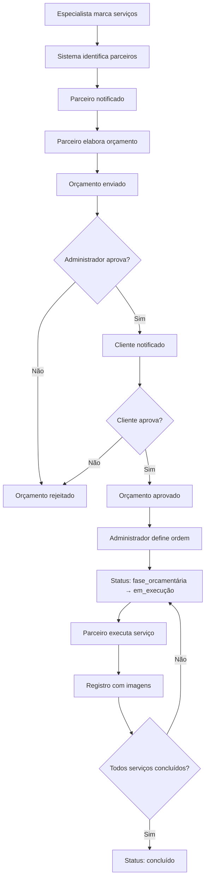

# Fluxo Orçamentário e Execução de Serviços

## Visão Geral

Este documento descreve o fluxo completo de orçamento e execução de serviços para veículos após análise especializada. O processo envolve especialistas, parceiros, administradores e clientes, com foco em notificações, aprovações sequenciais, controle de status e monitoramento de tempo.

## Principais Entidades

### Veículo
- **Atributos**: ID, placa, marca, modelo, ano, status atual, data de criação
- **Status possíveis**:
  - `analisado` (após análise do especialista)
  - `fase_orcamentaria` (durante aprovação do orçamento)
  - `em_execucao_[servico]` (durante execução específica)
  - `concluido` (todos os serviços finalizados)

### Serviço
- **Atributos**: ID, categoria, descrição, parceiro responsável, status, tempo estimado (dias), data início, data fim
- **Status possíveis**: `pendente`, `em_execucao`, `concluido`, `cancelado`

### Parceiro
- **Atributos**: ID, nome, especialidades (categorias), contador de cotações pendentes
- **Permissões**: Visualizar apenas veículos associados por especialistas

### Orçamento
- **Atributos**: ID, veículo, serviços incluídos, valor total, status de aprovação
- **Status possíveis**: `pendente_aprovacao_admin`, `aprovado_admin`, `aprovado_cliente`, `rejeitado`

## Fluxo Detalhado

### 1. Pós-Análise - Marcação de Serviços
Após completar a análise do veículo, o especialista marca as categorias de serviço necessárias.

### 2. Notificação aos Parceiros
- Sistema identifica parceiros correspondentes às categorias marcadas
- Parceiros recebem notificação sobre nova cotação
- Contador de cotações do parceiro é incrementado

### 3. Acesso Restrito do Parceiro
Parceiro pode visualizar:
- Apenas veículos associados a ele por especialistas
- Detalhes básicos do veículo
- Fotos da inspeção
- Cotações pendentes

### 4. Processo de Orçamento
Parceiro elabora orçamento baseado nos serviços necessários.

### 5. Aprovação Sequencial
- **Primeira aprovação**: Administrador
- **Segunda aprovação**: Cliente
- Durante este período: Status do veículo = `fase_orcamentaria`

### 6. Seleção de Ordem de Execução
Após aprovação completa:
- Administrador define ordem de execução dos serviços
- Status do veículo muda para refletir serviço atual: `em_execucao_[categoria_servico]`

### 7. Execução e Registro
Para cada serviço:
- Parceiro registra início da execução
- Sistema inicia monitoramento de tempo (dias)
- Parceiro registra imagens "antes" e "depois"
- Parceiro marca serviço como concluído
- Sistema registra data fim e calcula tempo real

### 8. Monitoramento de Tempo
- Tempo estimado vs. tempo real por serviço
- Alertas para atrasos
- Relatórios de performance por parceiro

## Diagramas

### Diagrama de Sequência - Processo Completo

### Diagrama de Estados - Veículo

### Diagrama de Classes

### Diagrama de Fluxo - Processo de Aprovação

## Requisitos Técnicos

### Notificações
- Sistema de notificações em tempo real
- Contadores visuais no dashboard do parceiro
- Histórico de notificações

### Controle de Acesso
- Parceiros só visualizam veículos associados
- Clientes só visualizam seus próprios veículos
- Administradores têm acesso completo

### Monitoramento
- Cronômetro automático por serviço
- Alertas configuráveis para atrasos
- Relatórios de performance

### Persistência
- Histórico completo de mudanças de status
- Registro de todas as imagens por serviço
- Logs de aprovação e rejeição

## Próximos Passos

1. **Validação da documentação** - Revisar diagramas e fluxo
2. **Implementação da base de dados** - Novas tabelas e relacionamentos
3. **Desenvolvimento das APIs** - Endpoints para CRUD das entidades
4. **Implementação das regras de negócio** - Lógica de status e notificações
5. **Desenvolvimento da UI** - Dashboards atualizados para cada perfil
6. **Testes** - Validação completa do fluxo

---

**Data de criação**: 02/09/2025
**Versão**: 1.0
**Autor**: Sistema de Documentação Automática
