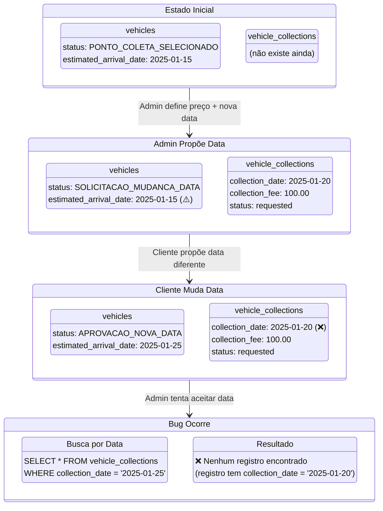
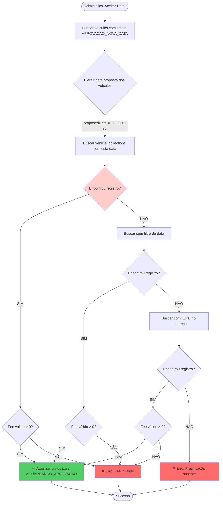
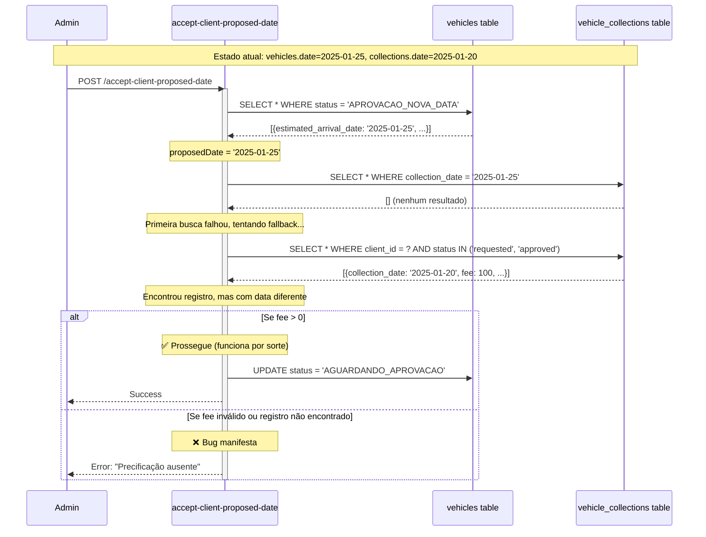
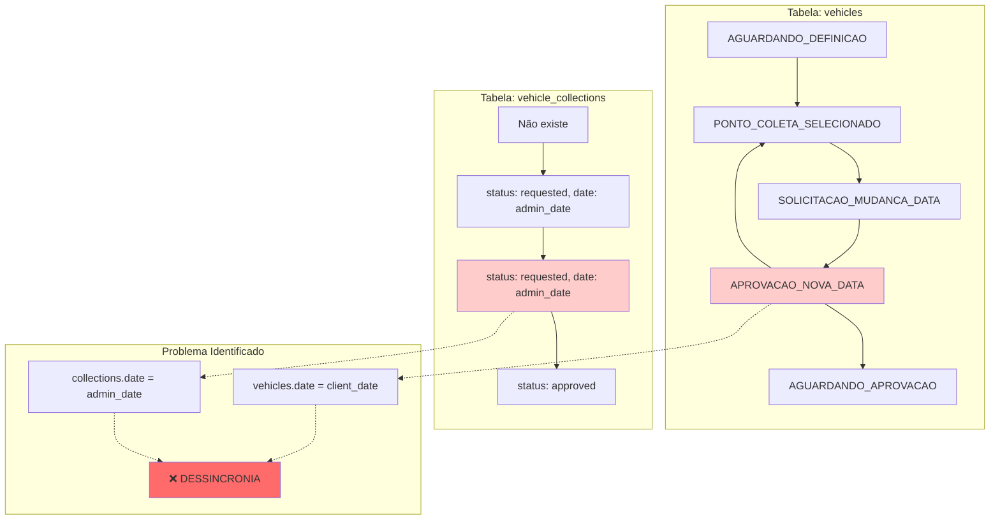
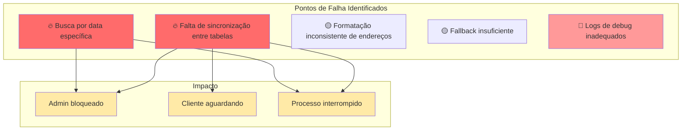

# Diagramas Técnicos - Estados e Transições do Sistema de Coleta

Este documento apresenta diagramas técnicos que detalham o comportamento interno do sistema durante mudanças de data de coleta, incluindo o cenário que causa o bug identificado.

## 1. Diagrama de Estados das Tabelas



## 2. Fluxograma de Decisão da API `accept-client-proposed-date`



## 3. Diagrama de Sequência - Análise Detalhada do Bug



## 4. Matriz de Estados e Transições



## 5. Diagrama de Componentes e APIs Envolvidas

```mermaid
graph TB
    subgraph "Frontend - Admin Dashboard"
        UI[DatePendingUnifiedSection.tsx]
        HOOK[useClientOverview.ts]
    end
    
    subgraph "APIs Backend"
        API1[/api/admin/propose-collection-date]
        API2[/api/admin/accept-client-proposed-date]
        API3[/api/admin/reject-client-proposed-date]
        API4[/api/client/reschedule-collection]
    end
    
    subgraph "Base de Dados"
        DB1[(vehicles)]
        DB2[(vehicle_collections)]
        DB3[(addresses)]
    end
    
    subgraph "Serviços"
        SERVICE1[buildRescheduleGroups]
        SERVICE2[getClientCollectionsSummary]
    end
    
    UI --> HOOK
    HOOK --> SERVICE2
    SERVICE2 --> SERVICE1
    
    UI --> API2
    UI --> API3
    
    API1 --> DB1
    API1 --> DB2
    
    API2 --> DB1
    API2 --> DB2
    API2 --> DB3
    
    API4 --> DB1
    
    SERVICE1 --> DB1
    SERVICE1 --> DB2
    SERVICE1 --> DB3
    
    style API2 fill:#ffcccc
    style DB1 fill:#fff2cc
    style DB2 fill:#fff2cc
```

## 6. Cronograma de Inconsistências

```mermaid
gantt
    title Timeline do Bug - Inconsistências de Estado
    dateFormat X
    axisFormat %s
    
    section vehicles table
    PONTO_COLETA_SELECIONADO (date: 2025-01-15) :done, v1, 0, 1
    SOLICITACAO_MUDANCA_DATA (date: 2025-01-15) :done, v2, 1, 2
    APROVACAO_NOVA_DATA (date: 2025-01-25) :done, v3, 2, 3
    
    section vehicle_collections table
    Não existe :done, vc0, 0, 1
    requested (date: 2025-01-20) :done, vc1, 1, 3
    
    section Estado de Sincronia
    ✅ Sincronizado :done, sync1, 0, 1
    ⚠️ Primeira inconsistência :done, warn, 1, 2
    ❌ Bug crítico :crit, bug, 2, 3
```

## 7. Mapa de Calor - Pontos de Falha


````
