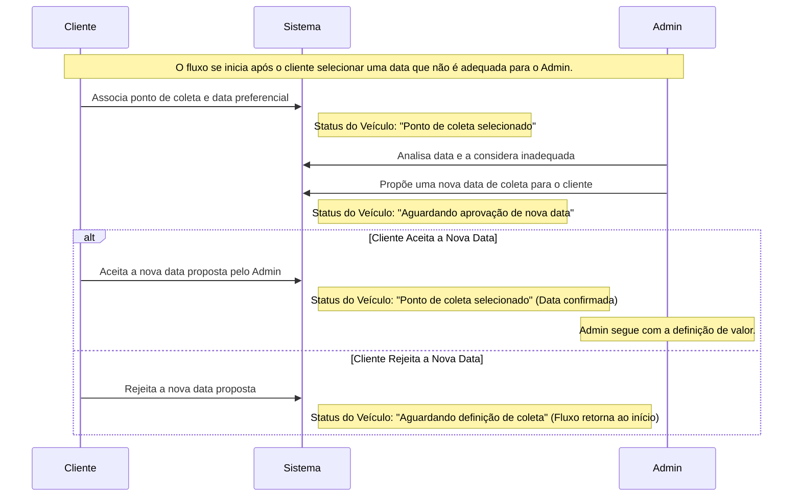

# Fluxo de Mudança de Data da Coleta

```mermaid
sequenceDiagram
    participant Cliente
    participant Sistema
    participant Admin

    note over Cliente, Admin: O fluxo se inicia após o cliente selecionar uma data que não é adequada para o Admin.

    Cliente->>Sistema: Associa ponto de coleta e data preferencial
    note right of Sistema: Status do Veículo: "Ponto de coleta selecionado"

    Admin->>Sistema: Analisa data e a considera inadequada
    Admin->>Sistema: Propõe uma nova data de coleta para o cliente
    note right of Sistema: Status do Veículo: "Aguardando aprovação de nova data"

    alt Cliente Aceita a Nova Data
        Cliente->>Sistema: Aceita a nova data proposta pelo Admin
        note right of Sistema: Status do Veículo: "Ponto de coleta selecionado" (Data confirmada)
        note over Admin: Admin segue com a definição de valor.
    else Cliente Rejeita a Nova Data
        Cliente->>Sistema: Rejeita a nova data proposta
        note right of Sistema: Status do Veículo: "Aguardando definição de coleta" (Fluxo retorna ao início)
    end
```
