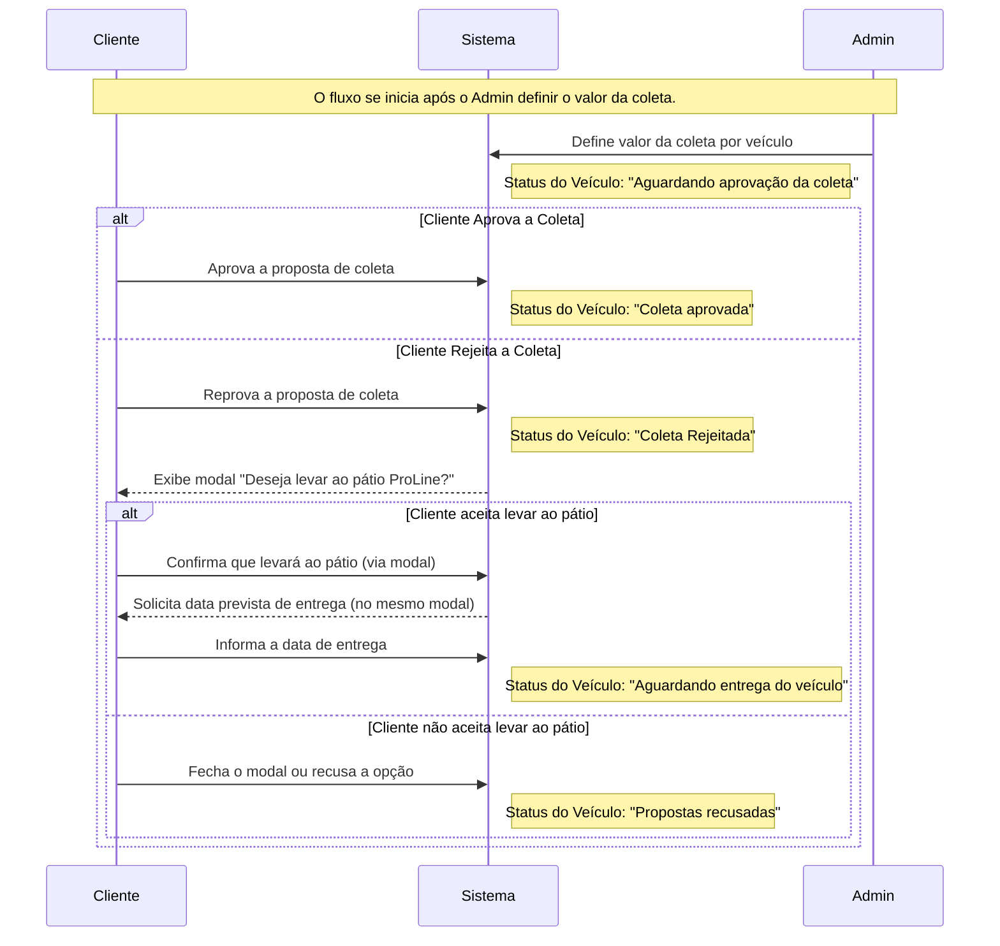

# Fluxo de Rejeição de Coleta

```mermaid
sequenceDiagram
    participant Cliente
    participant Sistema
    participant Admin

    note over Cliente, Admin: O fluxo se inicia após o Admin definir o valor da coleta.

    Admin->>Sistema: Define valor da coleta por veículo
    note right of Sistema: Status do Veículo: "Aguardando aprovação da coleta"

    alt Cliente Aprova a Coleta
        Cliente->>Sistema: Aprova a proposta de coleta
        note right of Sistema: Status do Veículo: "Coleta aprovada"
    else Cliente Rejeita a Coleta
        Cliente->>Sistema: Reprova a proposta de coleta
        note right of Sistema: Status do Veículo: "Coleta Rejeitada"
        
        Sistema-->>Cliente: Exibe modal "Deseja levar ao pátio ProLine?"
        
        alt Cliente aceita levar ao pátio
            Cliente->>Sistema: Confirma que levará ao pátio (via modal)
            Sistema-->>Cliente: Solicita data prevista de entrega (no mesmo modal)
            Cliente->>Sistema: Informa a data de entrega
            note right of Sistema: Status do Veículo: "Aguardando entrega do veículo"
        else Cliente não aceita levar ao pátio
            Cliente->>Sistema: Fecha o modal ou recusa a opção
            note right of Sistema: Status do Veículo: "Propostas recusadas"
        end
    end
```
