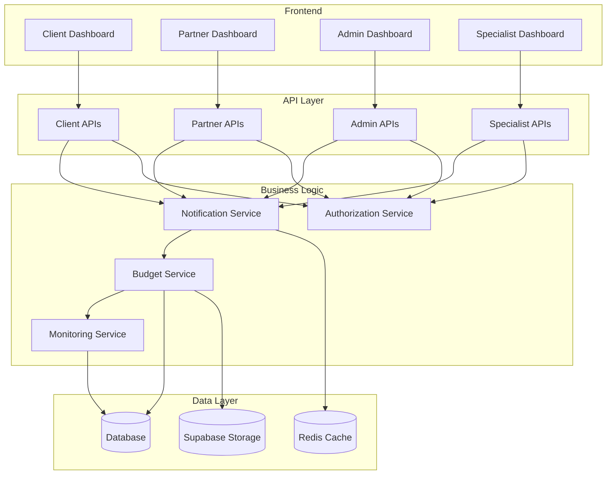
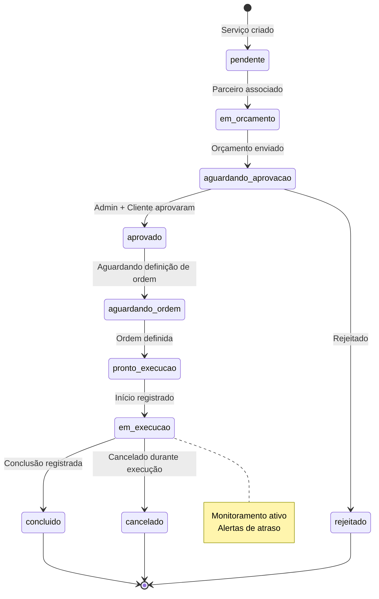
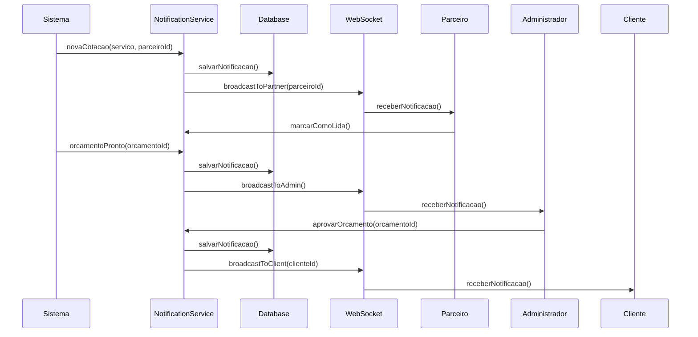
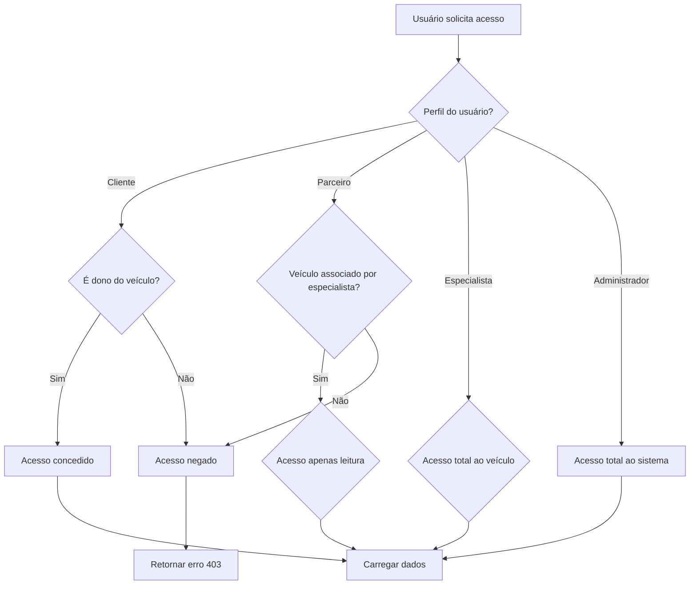
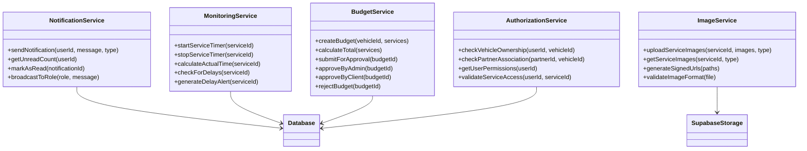
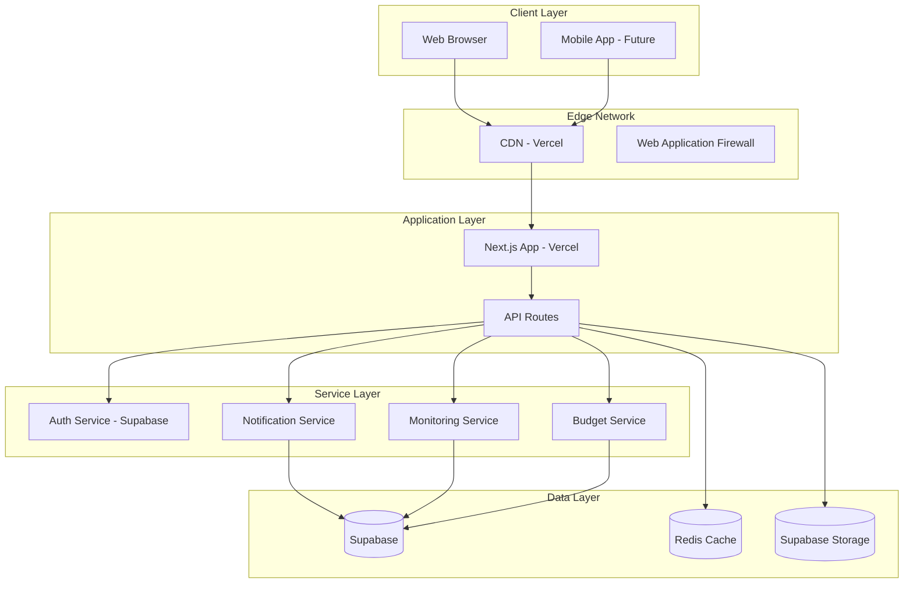

# Diagramas Técnicos - Fluxo Orçamentário

Este documento contém diagramas técnicos detalhados para o fluxo orçamentário e execução de serviços.

## Diagrama de Componentes do Sistema

## Diagrama de Estados Detalhado - Serviço

## Diagrama de Sequência - Notificações

## Diagrama de Fluxo - Controle de Acesso

## Diagrama de Classes - Serviços Técnicos

## Diagrama de Implantação

## Métricas e Monitoramento

### KPIs Principais
- Tempo médio de resposta às cotações
- Taxa de aprovação de orçamentos
- Tempo médio de execução por serviço
- Taxa de atrasos por parceiro
- Satisfação do cliente (NPS)

### Alertas do Sistema
- Orçamento pendente há mais de 48h
- Serviço em execução há mais tempo que o estimado
- Parceiro sem resposta há 24h
- Cliente sem aprovar orçamento há 72h

---

**Data de criação**: 02/09/2025
**Versão**: 1.0
**Autor**: Sistema de Documentação Automática
