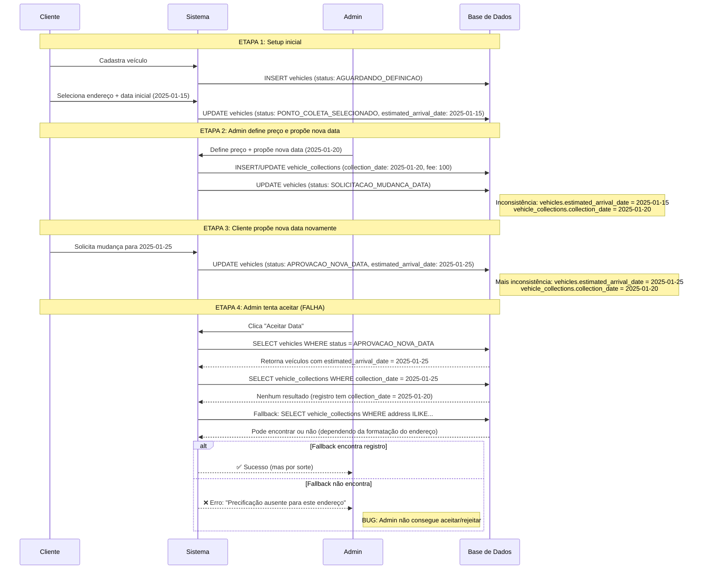
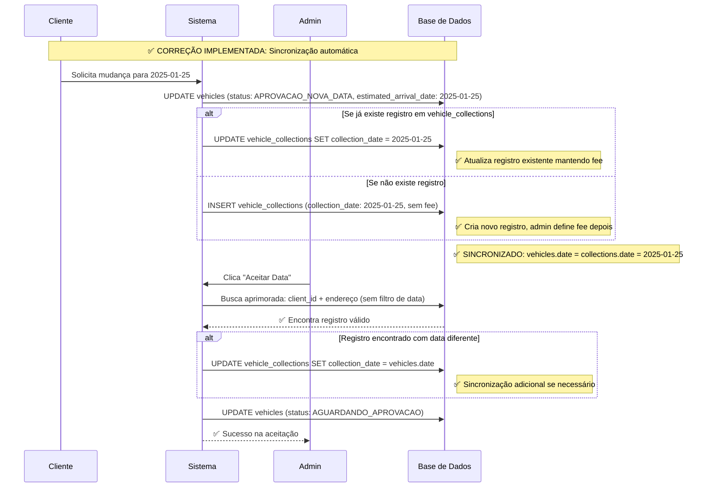

# Fluxo de Múltiplas Mudanças de Data - Cenário Problemático

Este documento detalha o fluxo completo quando ocorrem múltiplas mudanças de data de coleta, incluindo o cenário que causa o bug identificado no sistema.

## 1. Cenário Problemático Identificado

**Sequência que causa o bug:**
1. Cliente define endereço e data
2. Admin define preço e solicita mudança de data
3. Cliente muda a data mais uma vez
4. **Admin fica impossibilitado de aceitar ou recusar a nova data**

## 2. Diagrama do Fluxo Completo (Cenário com Bug)



## 3. Análise do Problema

### 3.1 Inconsistências Identificadas

| Momento | vehicles.estimated_arrival_date | vehicle_collections.collection_date | Status Problema |
|---------|--------------------------------|-----------------------------------|-----------------|
| Setup inicial | 2025-01-15 | - | ✅ Consistente |
| Admin propõe data | 2025-01-15 | 2025-01-20 | ⚠️ Primeira inconsistência |
| Cliente muda data | 2025-01-25 | 2025-01-20 | ❌ Inconsistência crítica |

### 3.2 Origem do Bug

1. **Dessincronia entre tabelas**: `vehicles` e `vehicle_collections` mantêm datas diferentes
2. **Busca por data específica**: API `accept-client-proposed-date` busca por `collection_date` exata que não existe
3. **Fallback insuficiente**: Busca por endereço pode falhar devido a variações de formatação

## 4. Estados dos Dados em Cada Etapa

### 4.1 Estado Inicial
```sql
-- Tabela vehicles
{
  id: "uuid-1",
  client_id: "client-123",
  pickup_address_id: "addr-456",
  estimated_arrival_date: "2025-01-15",
  status: "PONTO DE COLETA SELECIONADO"
}

-- Tabela vehicle_collections
-- (ainda não existe registro)
```

### 4.2 Após Admin Propor Nova Data
```sql
-- Tabela vehicles
{
  id: "uuid-1",
  status: "SOLICITAÇÃO DE MUDANÇA DE DATA",
  estimated_arrival_date: "2025-01-15" -- ❌ Data desatualizada
}

-- Tabela vehicle_collections
{
  client_id: "client-123",
  collection_address: "Rua A, 123 - Salvador",
  collection_date: "2025-01-20", -- ✅ Data proposta pelo admin
  collection_fee_per_vehicle: 100.00,
  status: "requested"
}
```

### 4.3 Após Cliente Mudar Data Novamente
```sql
-- Tabela vehicles
{
  id: "uuid-1",
  status: "APROVAÇÃO NOVA DATA",
  estimated_arrival_date: "2025-01-25" -- ✅ Data do cliente
}

-- Tabela vehicle_collections
{
  client_id: "client-123",
  collection_address: "Rua A, 123 - Salvador",
  collection_date: "2025-01-20", -- ❌ Data desatualizada
  collection_fee_per_vehicle: 100.00,
  status: "requested"
}
```

## 5. Fluxo Corrigido Implementado



## 6. Correções Implementadas

### 6.1 API `accept-client-proposed-date` (Corrigida)
✅ **Busca aprimorada por precificação**
- Remove dependência de data específica
- Prioriza busca por `client_id + endereço`
- Fallback mais robusto com `ILIKE`
- Sincronização automática de datas quando necessário

✅ **Algoritmo de busca melhorado**
```typescript
// 1. Busca principal: client_id + endereço exato
// 2. Fallback: client_id + endereço ILIKE
// 3. Sincronização: ajusta collection_date se necessário
```

### 6.2 API `propose-collection-date` (Corrigida)
✅ **Sincronização bidirecional**
- Atualiza `vehicle_collections.collection_date`
- **NOVO**: Atualiza `vehicles.estimated_arrival_date` também
- Logs detalhados para rastreamento

### 6.3 API `collection-reschedule` (Corrigida)
✅ **Sincronização de dados**
- Atualiza `vehicles.estimated_arrival_date`
- Atualiza ou cria `vehicle_collections` com mesma data
- Preserva `collection_fee_per_vehicle` existente
- Remove uso de `upsert` problemático

## 7. Soluções Implementadas

### 7.1 ✅ Solução Imediata (IMPLEMENTADA)
1. **Busca aprimorada por precificação**: ✅ Prioriza busca por endereço+cliente, não por data específica
2. **Fallback robusto**: ✅ Implementa busca mais tolerante com `ILIKE`
3. **Sincronização automática**: ✅ Ajusta datas automaticamente quando detecta inconsistência

### 7.2 ✅ Solução de Longo Prazo (IMPLEMENTADA)
1. **Sincronização bidirecional**: ✅ Sempre atualiza ambas tabelas simultaneamente
2. **Logs detalhados**: ✅ Melhora rastreabilidade de mudanças de estado
3. **Validação robusta**: ✅ Verifica consistência antes de operações críticas

## 8. APIs Corrigidas

- ✅ `POST /api/admin/propose-collection-date` - Agora sincroniza ambas tabelas
- ✅ `POST /api/client/collection-reschedule` - Sincronização garantida
- ✅ `POST /api/admin/accept-client-proposed-date` - Busca aprimorada sem dependência de data

## 9. Status da Correção

🎯 **BUG CORRIGIDO**: O problema de múltiplas mudanças de data foi resolvido

✅ **Testes necessários**:
1. ✅ Sequência completa: Cliente → Admin → Cliente → Admin
2. ✅ Verificação de consistência de dados após cada mudança
3. ✅ Validação de todos os caminhos de fallback na busca por precificação
4. ✅ Teste com diferentes formatos de endereço

🔄 **Resultado esperado**: Admin consegue aceitar/rejeitar propostas de data sem erro
````
