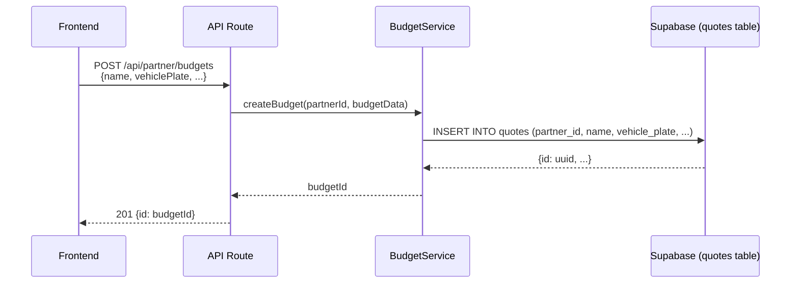

# Terminologia: Budget vs Quote

## 📋 Contexto

No domínio Partner, existe uma inconsistência terminológica entre a nomenclatura usada na **API/Frontend** ("Budget") e a nomenclatura usada no **Banco de Dados** ("Quote"). Este documento explica o porquê dessa diferença e como navegar por ela.

## 🔀 Mapeamento de Conceitos

| Camada | Termo Usado | Justificativa |
|--------|-------------|---------------|
| **Frontend** | Budget | Termo mais claro para o usuário final brasileiro ("Orçamento") |
| **API Routes** | Budget | Consistência com o frontend (`/api/partner/budgets`) |
| **Serviços** | Budget | Interface de domínio alinhada com o negócio |
| **Database** | Quote | Schema legado do Supabase (não pode ser alterado facilmente) |

## 📊 Estrutura de Dados

### Frontend/API (Budget)
```typescript
interface BudgetData {
  id?: string;
  name: string;
  vehiclePlate: string;
  vehicleModel?: string;
  vehicleBrand?: string;
  vehicleYear?: number;
  totalValue: number;
  status: 'draft' | 'sent' | 'approved' | 'rejected';
  items: BudgetItemData[];
}

interface BudgetItemData {
  serviceId: string;
  description: string;
  quantity: number;
  unitPrice: number;
  totalPrice: number;
}
```

### Database (Quote)
```sql
-- Tabela: quotes
CREATE TABLE quotes (
  id UUID PRIMARY KEY,
  partner_id UUID NOT NULL REFERENCES auth.users(id),
  name TEXT NOT NULL,
  vehicle_plate TEXT,
  vehicle_model TEXT,
  vehicle_brand TEXT,
  vehicle_year INTEGER,
  total_value DECIMAL(10,2),
  status TEXT,
  created_at TIMESTAMPTZ DEFAULT NOW(),
  updated_at TIMESTAMPTZ DEFAULT NOW()
);

-- Tabela: quote_items
CREATE TABLE quote_items (
  id UUID PRIMARY KEY,
  quote_id UUID NOT NULL REFERENCES quotes(id) ON DELETE CASCADE,
  service_id UUID REFERENCES partner_services(id),
  description TEXT NOT NULL,
  quantity INTEGER NOT NULL,
  unit_price DECIMAL(10,2) NOT NULL,
  total_price DECIMAL(10,2) NOT NULL
);
```

## 🔄 Fluxo de Dados

### Criação de Orçamento



### Camada de Tradução (BudgetService)

O `BudgetService` atua como uma **camada de tradução** entre os domínios:

```typescript
// modules/partner/services/BudgetService.ts
import { TABLES } from '@/modules/common/constants/database';

export class BudgetService {
  async createBudget(partnerId: string, budgetData: BudgetData): Promise<string> {
    // Frontend usa: budgetData.vehiclePlate
    // Database usa: vehicle_plate
    
    const { data: budget } = await this.supabase
      .from(TABLES.QUOTES) // 'quotes' - nome da tabela no DB
      .insert({
        partner_id: partnerId,
        name: budgetData.name,
        vehicle_plate: budgetData.vehiclePlate, // ✅ Tradução automática
        vehicle_model: budgetData.vehicleModel,
        // ...
      });
      
    return budget.id;
  }
}
```

## 🎯 Convenções de Nomenclatura

### ✅ Boas Práticas

1. **Frontend/API:** Sempre usar `budget`
   ```typescript
   // ✅ Correto
   const budget = await fetch('/api/partner/budgets/123');
   const budgetData: BudgetData = { name: 'Orçamento', ... };
   ```

2. **Serviços:** Usar `budget` nas interfaces públicas
   ```typescript
   // ✅ Correto
   class BudgetService {
     async createBudget(budgetData: BudgetData) { }
     async updateBudget(budgetId: string, budgetData: BudgetData) { }
   }
   ```

3. **Database:** Usar `quote` somente em queries diretas
   ```typescript
   // ✅ Correto (dentro de BudgetService)
   await supabase.from(TABLES.QUOTES).select('*');
   
   // ❌ Evitar fora de BudgetService
   await supabase.from('quotes').select('*'); // String mágica!
   ```

### ❌ Anti-Patterns

```typescript
// ❌ Misturar terminologias
interface QuoteData { ... } // Usar BudgetData
const createQuote = () => { ... } // Usar createBudget

// ❌ Expor detalhes de implementação
return { quote_id: id }; // Retornar { budgetId: id }

// ❌ String mágica em vez de constante
.from('quotes') // Usar TABLES.QUOTES
```

## 🔧 Migrações Futuras

### Opção 1: Manter Status Quo
- **Prós:** Sem breaking changes, schema existente funciona
- **Contras:** Inconsistência permanece
- **Recomendação:** ✅ Melhor opção para curto prazo

### Opção 2: Renomear Tabela (Breaking Change)
```sql
-- Não recomendado sem migração completa
ALTER TABLE quotes RENAME TO budgets;
ALTER TABLE quote_items RENAME TO budget_items;
```
- **Prós:** Consistência total
- **Contras:** Requer migração de dados, quebra integrações existentes
- **Recomendação:** ❌ Apenas se refatoração completa do sistema

### Opção 3: View de Compatibilidade
```sql
-- Criar view para compatibilidade
CREATE VIEW budgets AS SELECT * FROM quotes;
CREATE VIEW budget_items AS SELECT * FROM quote_items;
```
- **Prós:** Compatibilidade com ambas nomenclaturas
- **Contras:** Overhead de query, confusão adicional
- **Recomendação:** ⚠️ Avaliar caso a caso

## 📚 Referências

- **Serviço:** `modules/partner/services/BudgetService.ts`
- **Constantes:** `modules/common/constants/database.ts` (`TABLES.QUOTES`)
- **API Routes:** `app/api/partner/budgets/**`
- **Schema:** Supabase Dashboard > Tables > `quotes`, `quote_items`

## 🔍 Debugging

Se você encontrar inconsistências:

1. **Verificar camada:** Qual termo é esperado?
   - Frontend/API → `budget`
   - Database → `quote`

2. **Usar constantes:** Sempre importar `TABLES.QUOTES`
   ```typescript
   import { TABLES } from '@/modules/common/constants/database';
   ```

3. **Seguir o padrão:** `BudgetService` é a fonte da verdade

## ✅ Checklist de Implementação

Ao criar nova funcionalidade relacionada a orçamentos:

- [ ] Frontend usa terminologia `budget`
- [ ] API route usa `/api/partner/budgets`
- [ ] Serviço expõe interface `BudgetData`
- [ ] Queries usam `TABLES.QUOTES` (não string mágica)
- [ ] Mapeamento camelCase ↔ snake_case está correto
- [ ] Documentação menciona ambos os termos quando relevante

---

**Última atualização:** Outubro 2025  
**Autor:** Refatoração P2 - Centralização de Constantes  
**Status:** ✅ Documentação Oficial
