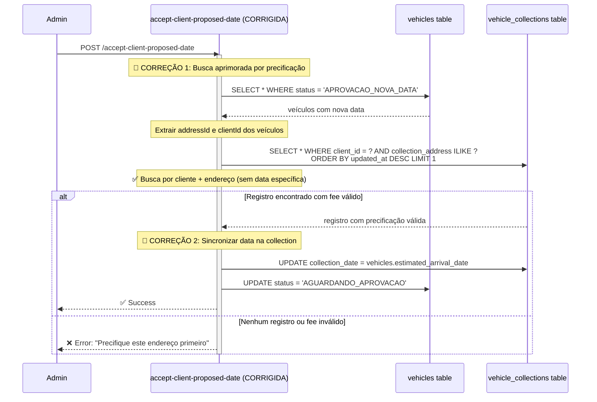
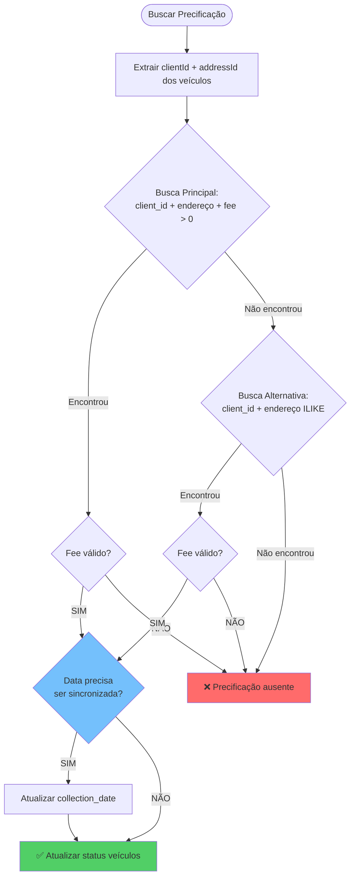

````markdown
# Solução Proposta - Correção do Bug de Múltiplas Mudanças de Data

Este documento apresenta a solução técnica detalhada para corrigir o bug identificado no fluxo de aprovação de múltiplas mudanças de data de coleta.

## 1. Análise da Solução

### 1.1 Estratégias de Correção

| Estratégia | Complexidade | Impacto | Recomendação |
|------------|--------------|---------|--------------|
| **Busca aprimorada** | Baixa | Médio | ✅ Implementar imediatamente |
| **Sincronização de dados** | Média | Alto | ✅ Implementar como correção |
| **Refatoração completa** | Alta | Muito Alto | ⚠️ Considerar para v2 |

### 1.2 Solução Escolhida: Abordagem Híbrida

1. **Correção imediata**: Melhorar busca por precificação (baixo risco)
2. **Correção estrutural**: Sincronizar dados entre tabelas (médio risco)

## 2. Fluxo Corrigido - Diagrama de Sequência



## 3. Implementação da Correção

### 3.1 Mudanças na API `accept-client-proposed-date`

```typescript
// ❌ CÓDIGO ATUAL (problemático)
const { data: vcRow, error: vcErr } = await vcQuery
  .eq('collection_date', proposedDate)  // ← Busca por data específica
  .order('collection_date', { ascending: false })
  .limit(1)
  .maybeSingle();

// ✅ CÓDIGO CORRIGIDO
const { data: vcRows, error: vcErr } = await admin
  .from('vehicle_collections')
  .select('*')
  .eq('client_id', clientId)
  .ilike('collection_address', `%${addressLabel}%`)
  .in('status', ['requested', 'approved'])
  .gt('collection_fee_per_vehicle', 0)  // ← Garantir fee válido
  .order('updated_at', { ascending: false })  // ← Mais recente primeiro
  .limit(1);

const vcRow = vcRows?.[0] || null;

// ✅ SINCRONIZAR DATA SE NECESSÁRIO
if (vcRow && proposedDate && vcRow.collection_date !== proposedDate) {
  await admin
    .from('vehicle_collections')
    .update({ collection_date: proposedDate })
    .eq('id', vcRow.id);
}
```

### 3.2 Mudanças na API `propose-collection-date`

```typescript
// ✅ GARANTIR SINCRONIZAÇÃO AO PROPOR DATA
export const POST = withAdminAuth(async (req: AuthenticatedRequest) => {
  // ... código existente ...
  
  // 🔧 CORREÇÃO: Sempre atualizar ambas as tabelas
  if (vcRow?.id) {
    const { error } = await admin
      .from('vehicle_collections')
      .update({ collection_date: new_date })
      .eq('id', vcRow.id);
      
    if (!error) {
      // ✅ NOVO: Sincronizar data nos veículos também
      await admin
        .from('vehicles')
        .update({ estimated_arrival_date: new_date })
        .eq('client_id', clientId)
        .eq('pickup_address_id', addressId);
    }
  }
  
  // ... resto do código ...
});
```

## 4. Algoritmo de Busca Aprimorada



## 5. Testes de Validação

### 5.1 Cenários de Teste

```gherkin
Feature: Aceitação de data proposta pelo cliente

Scenario: Múltiplas mudanças de data - Bug corrigido
  Given um cliente tem veículo com endereço "Rua A, 123"
  And admin definiu precificação de R$ 100 para o endereço
  And admin propôs data "2025-01-20"
  And cliente propôs nova data "2025-01-25"
  When admin clica "Aceitar Data"
  Then sistema deve encontrar a precificação
  And sistema deve sincronizar as datas
  And veículos devem ir para status "AGUARDANDO APROVAÇÃO"

Scenario: Busca por endereço com variações
  Given precificação existe para "Rua A, 123 - Salvador"
  When sistema busca por "rua a, 123 salvador" (case insensitive)
  Then deve encontrar a precificação
  
Scenario: Precificação não existe
  Given cliente propõe data sem precificação definida
  When admin tenta aceitar
  Then deve retornar erro claro "Precifique este endereço primeiro"
```

### 5.2 Scripts de Teste SQL

```sql
-- Teste 1: Verificar inconsistência atual
SELECT 
  v.id as vehicle_id,
  v.estimated_arrival_date as vehicle_date,
  vc.collection_date as collection_date,
  v.status,
  CASE 
    WHEN v.estimated_arrival_date = vc.collection_date THEN '✅ Sincronizado'
    ELSE '❌ Dessincronizado'
  END as sync_status
FROM vehicles v
LEFT JOIN vehicle_collections vc ON vc.client_id = v.client_id
WHERE v.status = 'APROVAÇÃO NOVA DATA';

-- Teste 2: Validar busca aprimorada
SELECT COUNT(*) as encontrados
FROM vehicle_collections 
WHERE client_id = ? 
  AND collection_address ILIKE '%endereco%'
  AND collection_fee_per_vehicle > 0
  AND status IN ('requested', 'approved');
```

## 6. Plano de Rollout

### 6.1 Fase 1: Correção da Busca (Baixo Risco)
- [ ] Implementar busca aprimorada em `accept-client-proposed-date`
- [ ] Adicionar logs detalhados para debugging
- [ ] Testar em ambiente de staging
- [ ] Deploy em produção

### 6.2 Fase 2: Sincronização de Dados (Médio Risco)
- [ ] Implementar sincronização automática entre tabelas
- [ ] Script de correção para dados existentes inconsistentes
- [ ] Testes abrangentes
- [ ] Deploy gradual

### 6.3 Fase 3: Validação e Monitoramento
- [ ] Adicionar métricas de sucesso/falha
- [ ] Dashboard de monitoramento
- [ ] Alertas para detecção precoce de problemas

## 7. Impacto e Benefícios

### 7.1 Problemas Resolvidos
- ✅ Admin consegue aceitar/rejeitar propostas de data
- ✅ Dados sincronizados entre tabelas
- ✅ Busca mais robusta e tolerante a variações
- ✅ Logs melhorados para debugging

### 7.2 Métricas de Sucesso
- Taxa de erro em `accept-client-proposed-date` deve ser < 1%
- Tempo de resolução de problemas similares reduzido em 80%
- Zero casos de bloqueio de admin reportados

## 8. Riscos e Mitigações

| Risco | Probabilidade | Impacto | Mitigação |
|-------|---------------|---------|-----------|
| Busca muito permissiva | Baixa | Médio | Validações adicionais |
| Performance degradada | Baixa | Baixo | Índices otimizados |
| Regressões | Média | Alto | Testes automatizados |

## 9. Código de Referência Completo

### 9.1 Função de Busca Aprimorada

```typescript
async function findCollectionWithRobustSearch(
  admin: any,
  clientId: string,
  addressLabel: string
): Promise<any> {
  // Busca principal: exata
  let { data: collections } = await admin
    .from('vehicle_collections')
    .select('*')
    .eq('client_id', clientId)
    .eq('collection_address', addressLabel)
    .gt('collection_fee_per_vehicle', 0)
    .in('status', ['requested', 'approved'])
    .order('updated_at', { ascending: false })
    .limit(1);

  // Fallback: busca parcial
  if (!collections?.length) {
    ({ data: collections } = await admin
      .from('vehicle_collections')
      .select('*')
      .eq('client_id', clientId)
      .ilike('collection_address', `%${addressLabel}%`)
      .gt('collection_fee_per_vehicle', 0)
      .in('status', ['requested', 'approved'])
      .order('updated_at', { ascending: false })
      .limit(1));
  }

  return collections?.[0] || null;
}
```
````
