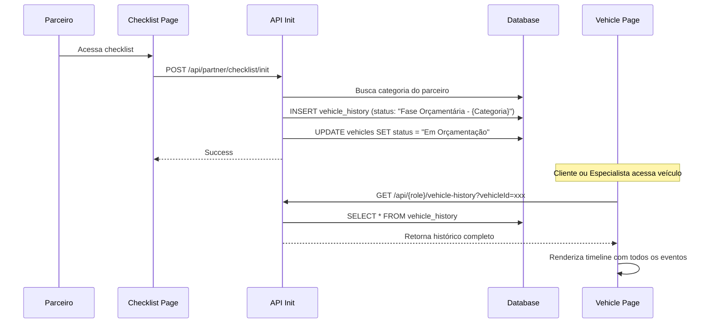

# Correção: Timeline do Veículo e Fase Orçamentária

**Data**: 08/10/2025  
**Objetivo**: Implementar registro de início da fase orçamentária na timeline do veículo quando parceiro acessa o checklist

## Problema Identificado

1. **Timeline incompleta**: A página de detalhes do veículo mostrava apenas:
   - Veículo Cadastrado
   - Previsão de Chegada  
   - Análise Iniciada
   - Análise Finalizada

2. **Falta de registro**: Quando o parceiro iniciava o checklist, não havia registro na timeline de que a fase orçamentária havia sido iniciada para aquela categoria específica

3. **Fonte de dados**: A timeline estava usando dados estáticos da inspeção, não consultando o histórico completo do veículo na tabela `vehicle_history`

## Solução Implementada

### 1. Novo Endpoint: Registro de Início da Fase Orçamentária

**Arquivo**: `/app/api/partner/checklist/init/route.ts`

- **Método**: POST
- **Autenticação**: Requer autenticação de parceiro
- **Funcionalidade**:
  - Busca a categoria do parceiro autenticado
  - Cria registro na timeline com status `"Fase Orçamentária Iniciada - {Categoria}"`
  - Atualiza status do veículo para `"Em Orçamentação"` (se ainda estiver em análise)
  - Previne duplicação de registros (idempotente)

**Parâmetros**:
```json
{
  "vehicleId": "uuid",
  "quoteId": "uuid" (opcional)
}
```

**Resposta**:
```json
{
  "success": true,
  "message": "Fase orçamentária iniciada com sucesso",
  "status": "Fase Orçamentária Iniciada - Mecânica"
}
```

### 2. Atualização do Hook do Parceiro

**Arquivo**: `/modules/partner/hooks/usePartnerChecklist.ts`

**Alteração**: No `useEffect` que carrega dados do veículo, foi adicionada chamada ao endpoint `/api/partner/checklist/init` quando o parceiro acessa a página do checklist

```typescript
// Registrar início da fase orçamentária quando parceiro acessa o checklist
if (vehicleId || quoteId) {
  try {
    await post(
      '/api/partner/checklist/init',
      { vehicleId, quoteId },
      { requireAuth: true }
    );
  } catch {
    // Não falhar a request principal por causa deste registro
  }
}
```

### 3. Novos Endpoints de Histórico

**Arquivos**:
- `/app/api/client/vehicle-history/route.ts`
- `/app/api/specialist/vehicle-history/route.ts`

**Funcionalidade**: Buscar histórico completo do veículo da tabela `vehicle_history`

**Método**: GET  
**Parâmetros**: `vehicleId` (query string)

**Resposta**:
```json
{
  "success": true,
  "history": [
    {
      "id": "uuid",
      "vehicle_id": "uuid",
      "status": "Fase Orçamentária Iniciada - Mecânica",
      "prevision_date": null,
      "end_date": null,
      "created_at": "2025-10-08T10:30:00Z"
    }
  ]
}
```

### 4. Atualização do Hook useVehicleDetails

**Arquivo**: `/modules/vehicles/hooks/useVehicleDetails.ts`

**Alterações**:
- Adicionado estado `vehicleHistory` para armazenar histórico completo
- Adicionada chamada ao endpoint de histórico durante carregamento
- Retorno inclui `vehicleHistory` para ser usado no componente

### 5. Atualização do Componente VehicleDetails

**Arquivo**: `/modules/vehicles/components/VehicleDetails.tsx`

**Alterações**:
- Recebe prop `vehicleHistory`
- Renderiza timeline completa incluindo todos os registros do histórico
- Aplica cores diferentes baseadas no tipo de status:
  - **Azul** (#3498db): Inícios de processo
  - **Laranja** (#f39c12): Fase orçamentária
  - **Verde** (#27ae60): Finalizações
  - **Roxo** (#9b59b6): Outros eventos

### 6. Atualização da Página do Veículo

**Arquivo**: `/app/dashboard/vehicle/[vehicleId]/page.tsx`

**Alteração**: Passa `vehicleHistory` do hook para o componente

### 7. Migration de Banco de Dados

**Arquivo**: `/supabase/migrations/20251008191801_add_em_orcamentacao_status.sql`

- Documenta o novo status `"Em Orçamentação"`
- Migration idempotente (pode ser executada múltiplas vezes)
- Adiciona comentário na coluna `vehicles.status` documentando os status disponíveis

## Fluxo Completo



## Tabelas Afetadas

### `vehicle_history`
- **INSERT**: Novo registro criado quando parceiro inicia checklist
- **Campos**:
  - `vehicle_id`: ID do veículo
  - `status`: "Fase Orçamentária Iniciada - {Categoria}"
  - `created_at`: Data/hora do início

### `vehicles`
- **UPDATE**: Status atualizado para "Em Orçamentação" quando aplicável
- **Condições**: Status atual deve ser "Em Análise" ou "Análise Finalizada"

## Benefícios

1. **Rastreabilidade Completa**: Cada fase do processo do veículo é registrada na timeline
2. **Transparência**: Cliente e especialista veem quando cada parceiro iniciou sua análise
3. **Categorização**: Timeline mostra qual categoria de parceiro iniciou o processo
4. **Idempotência**: Sistema previne duplicação de registros
5. **Não-invasivo**: Falhas no registro não impedem o fluxo principal

## Princípios Aplicados

- ✅ **DRY**: Reutilização do sistema de histórico existente
- ✅ **SOLID**: Single Responsibility - cada endpoint tem uma responsabilidade clara
- ✅ **Arquitetura Modular**: Separação clara entre API, hooks e componentes
- ✅ **Idempotência**: Migration pode ser executada múltiplas vezes
- ✅ **Composition Pattern**: Componente VehicleDetails recebe dados via props

## Testes Recomendados

1. **Teste de Integração**: Parceiro acessa checklist e verifica criação de registro na timeline
2. **Teste de Timeline**: Cliente visualiza página do veículo e vê histórico completo
3. **Teste de Idempotência**: Parceiro acessa checklist múltiplas vezes, verifica que não duplica registros
4. **Teste de Múltiplas Categorias**: Diferentes parceiros (Mecânica, Funilaria, etc) iniciam checklists, verificar registros separados
5. **Teste de Performance**: Verificar tempo de carregamento da página com múltiplos registros no histórico

## Próximos Passos (Sugestões)

1. Adicionar eventos adicionais à timeline:
   - Orçamento enviado
   - Orçamento aprovado/rejeitado
   - Serviço iniciado
   - Serviço concluído

2. Implementar filtros na timeline (por categoria, tipo de evento)

3. Adicionar notificações quando novo evento é registrado na timeline

4. Dashboard com estatísticas de tempo médio por fase
