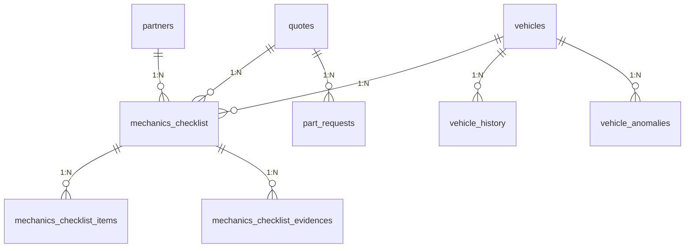
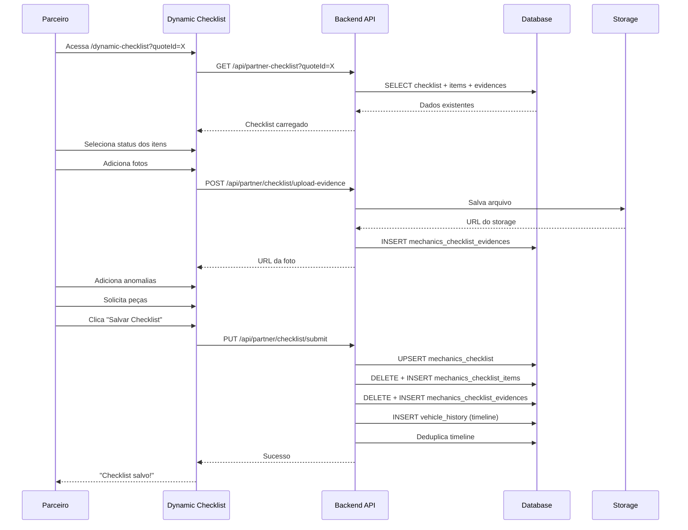

# Estado Atual da Implementação (AS-IS)

**Data:** 14 de Outubro de 2025  
**Objetivo:** Documentar o estado REAL da implementação atual do sistema de checklists

---

## 📋 Visão Geral

O sistema atual implementa **checklist dinâmico para parceiros** com as seguintes características:

- ✅ Múltiplos parceiros podem trabalhar no mesmo veículo
- ✅ Cada parceiro tem seu checklist isolado
- ✅ Suporte a múltiplas evidências (fotos) por item
- ✅ Solicitações de peças por item
- ✅ Timeline de status por parceiro
- 🟡 Em transição de `inspection_id` para `quote_id`

---

## 🗄️ Modelo de Dados Atual

### Tabelas Principais

#### mechanics_checklist

Armazena o checklist principal de cada parceiro.

```sql
CREATE TABLE mechanics_checklist (
  id UUID PRIMARY KEY DEFAULT gen_random_uuid(),
  vehicle_id UUID NOT NULL REFERENCES vehicles(id),
  partner_id UUID NOT NULL,

  -- Contexto (TRANSIÇÃO: ambos campos presentes)
  inspection_id UUID REFERENCES inspections(id),  -- LEGACY
  quote_id UUID REFERENCES quotes(id),            -- NOVO

  status TEXT DEFAULT 'in_progress',
  created_at TIMESTAMPTZ DEFAULT NOW(),
  updated_at TIMESTAMPTZ DEFAULT NOW(),

  -- Constraints
  CONSTRAINT unique_partner_quote UNIQUE (partner_id, quote_id),
  CONSTRAINT unique_partner_vehicle_inspection UNIQUE (partner_id, vehicle_id, inspection_id)
);
```

**Índices:**

- `idx_mechanics_checklist_vehicle_id` on `vehicle_id`
- `idx_mechanics_checklist_partner_id` on `partner_id`
- `idx_mechanics_checklist_quote_id` on `quote_id`

#### mechanics_checklist_items

Armazena as respostas por item do checklist.

```sql
CREATE TABLE mechanics_checklist_items (
  id UUID PRIMARY KEY DEFAULT gen_random_uuid(),
  vehicle_id UUID NOT NULL,
  partner_id UUID NOT NULL,

  inspection_id UUID,  -- LEGACY
  quote_id UUID,       -- NOVO

  item_key TEXT NOT NULL,
  item_status TEXT CHECK (item_status IN ('OK', 'NOK', 'NA')),
  item_notes TEXT,

  created_at TIMESTAMPTZ DEFAULT NOW(),
  updated_at TIMESTAMPTZ DEFAULT NOW()
);
```

**Sem constraint única** - permite múltiplas respostas (histórico).

#### mechanics_checklist_evidences

Armazena as evidências (fotos/vídeos) por item.

```sql
CREATE TABLE mechanics_checklist_evidences (
  id UUID PRIMARY KEY DEFAULT gen_random_uuid(),
  vehicle_id UUID NOT NULL,
  partner_id UUID NOT NULL,

  inspection_id UUID,  -- LEGACY
  quote_id UUID,       -- NOVO

  item_key TEXT NOT NULL,
  storage_path TEXT NOT NULL,

  created_at TIMESTAMPTZ DEFAULT NOW()
);
```

**Importante:**

- ✅ Sem constraint UNIQUE - permite múltiplas evidências por item
- Migration `20251014172305_allow_multiple_evidences_per_item.sql` removeu a constraint única

#### part_requests

Solicitações de peças vinculadas a itens do checklist.

```sql
CREATE TABLE part_requests (
  id UUID PRIMARY KEY DEFAULT gen_random_uuid(),
  quote_id UUID NOT NULL REFERENCES quotes(id),
  item_key TEXT NOT NULL,
  partner_id UUID NOT NULL,

  title TEXT NOT NULL,
  description TEXT,
  quantity NUMERIC,
  status TEXT DEFAULT 'pending',

  created_at TIMESTAMPTZ DEFAULT NOW(),
  updated_at TIMESTAMPTZ DEFAULT NOW()
);
```

#### vehicle_anomalies

Anomalias detectadas pelos parceiros.

```sql
CREATE TABLE vehicle_anomalies (
  id UUID PRIMARY KEY DEFAULT gen_random_uuid(),
  vehicle_id UUID NOT NULL,
  partner_id UUID NOT NULL,

  inspection_id UUID,  -- LEGACY
  quote_id UUID,       -- NOVO

  item_key TEXT,
  severity TEXT,
  description TEXT,
  photos TEXT[],

  created_at TIMESTAMPTZ DEFAULT NOW()
);
```

#### vehicle_history

Timeline de status do veículo.

```sql
CREATE TABLE vehicle_history (
  id UUID PRIMARY KEY DEFAULT gen_random_uuid(),
  vehicle_id UUID NOT NULL,
  status TEXT NOT NULL,
  partner_service_id UUID REFERENCES partner_services(id),
  notes TEXT,
  prevision_date TIMESTAMPTZ,
  end_date TIMESTAMPTZ,
  created_at TIMESTAMPTZ DEFAULT NOW()
);
```

**Formato de status:** `"Fase Orçamentária Iniciada - {CategoriaNormalizada}"`

---

## 🔗 Relacionamentos



---

## 🌐 APIs Implementadas

### GET /api/partner-checklist

Carrega o checklist do parceiro para um veículo.

**Query Params:**

- `quoteId` (UUID) - ID do orçamento
- `vehicleId` (UUID) - ID do veículo (opcional, inferido do quote)

**Resposta:**

```json
{
  "checklistItems": { "item_key": "OK|NOK|NA", ... },
  "evidences": { "item_key": [{ "url": "...", "id": "..." }], ... },
  "anomalies": [{ "item_key": "...", "description": "...", "photos": [...] }],
  "partRequests": [{ "item_key": "...", "title": "...", "status": "..." }]
}
```

### PUT /api/partner/checklist/submit

Salva o checklist completo do parceiro.

**Body:**

```json
{
  "vehicle_id": "uuid",
  "quote_id": "uuid",
  "inspection_id": "uuid",  // opcional (legacy)
  "item_key": "OK|NOK|NA",
  "item_keyNotes": "texto",
  "evidences": { "item_key": "storage_path", ... }
}
```

### PUT /api/partner/checklist/save-anomalies

Salva anomalias detectadas.

**Body:**

```json
{
  "quoteId": "uuid",
  "vehicleId": "uuid",
  "anomalies": [
    {
      "item_key": "string",
      "severity": "low|medium|high",
      "description": "string",
      "photos": ["url1", "url2"]
    }
  ]
}
```

### POST /api/partner/checklist/upload-evidence

Upload de evidências (fotos).

**Body:** `multipart/form-data`

- `file`: arquivo de imagem
- `quoteId`: UUID
- `vehicleId`: UUID
- `itemKey`: string

**Resposta:**

```json
{
  "success": true,
  "url": "storage_path"
}
```

### POST /api/partner/checklist/init

Inicializa o checklist (primeiro acesso).

**Body:**

```json
{
  "vehicle_id": "uuid",
  "quote_id": "uuid"
}
```

**Ação:** Atualiza status do veículo para "Em Orçamentação" (sem criar timeline).

---

## 🎨 Componentes Frontend

### Dynamic Checklist Page

**Caminho:** `app/dashboard/partner/dynamic-checklist/page.tsx`

**Responsabilidades:**

- Carregar checklist do parceiro via `quoteId`
- Gerenciar estado de itens, evidências, anomalias
- Upload de múltiplas fotos por item
- Submissão do checklist

**Componentes principais:**

- `VehicleInfoCard` - Informações do veículo
- `DynamicChecklistHeader` - Cabeçalho com instruções
- `PartnerChecklistGroups` - Grupos de itens do checklist
- `AnomaliesSection` - Seção de anomalias
- `PhotoGallery` - Galeria de fotos com lightbox
- `PartRequestModal` - Modal de solicitação de peças

### Hooks Customizados

#### useDynamicChecklistSave

Gerencia salvamento do checklist.

```typescript
const { saveChecklist, isSaving, lastSaved } = useDynamicChecklistSave({
  vehicleId,
  quoteId,
  checklistState,
  evidences,
  anomalies,
});
```

#### useAnomaliesManager

Gerencia estado das anomalias.

```typescript
const { anomalies, addAnomaly, updateAnomaly, removeAnomaly, loadAnomalies } = useAnomaliesManager({
  quoteId,
  vehicleId,
});
```

#### usePartRequestModal

Gerencia modal de solicitação de peças.

```typescript
const { isOpen, openModal, closeModal, savePartRequest } = usePartRequestModal({
  quoteId,
  itemKey,
});
```

---

## 🔐 Segurança e Permissões

### RLS Policies

**mechanics_checklist:**

```sql
-- Parceiros veem apenas seus checklists
CREATE POLICY "Partners can manage their own checklists"
  ON mechanics_checklist
  FOR ALL USING (auth.uid()::text = partner_id::text);
```

**mechanics_checklist_items:**

```sql
-- Parceiros acessam apenas seus itens
CREATE POLICY "Partners manage their items"
  ON mechanics_checklist_items
  FOR ALL USING (partner_id = auth.uid());
```

**mechanics_checklist_evidences:**

```sql
-- Parceiros acessam apenas suas evidências
CREATE POLICY "Partners manage their evidences"
  ON mechanics_checklist_evidences
  FOR ALL USING (partner_id = auth.uid());
```

### Middleware de Autenticação

**Caminho:** `modules/common/utils/authMiddleware.ts`

- `withPartnerAuth()` - Valida token JWT e `partner_id`
- Verifica acesso ao veículo via relacionamento `quotes`

---

## 📊 Fluxo Completo



---

## 🔄 Estado de Transição

### Campos Legados vs. Novos

| Campo                         | Status        | Uso Atual                     |
| ----------------------------- | ------------- | ----------------------------- |
| `inspection_id`               | 🟡 LEGACY     | Especialistas (não parceiros) |
| `quote_id`                    | ✅ NOVO       | Parceiros (todas categorias)  |
| `context_type` + `context_id` | ❌ NÃO EXISTE | Proposto na documentação alvo |

### Categorias de Parceiros

**Implementação Atual:**

- Categoria inferida via tabela `partner_categories`
- Nomes em português: "Mecânica", "Funilaria/Pintura", "Lavagem", "Pneus", "Loja"
- Função `normalizePartnerCategoryName()` converte para formato padronizado

**Parceiros de teste:**

```
mecanica@parceiro.com      - Mecânica
pintura@parceiro.com       - Funilaria/Pintura
lavagem@parceiro.com       - Lavagem
pneus@parceiro.com         - Pneus
loja@parceiro.com          - Loja
```

Todos com senha: `123qwe`

---

## ✅ Funcionalidades Implementadas

- [x] Isolamento por parceiro (`partner_id`)
- [x] Múltiplas evidências por item
- [x] Solicitações de peças por item
- [x] Timeline de status por parceiro
- [x] Anomalias com fotos
- [x] Upload de imagens com thumbnail
- [x] Galeria lightbox
- [x] Auto-save com debounce
- [x] Validação de acesso por quote
- [x] RLS policies
- [x] Deduplicação de timeline

---

## 🐛 Correções Recentes

### 14/10/2025 - Fix Constraint Única

**Problema:** Múltiplos parceiros não conseguiam salvar checklist para o mesmo veículo.

**Solução:** Migration `20251014180312_fix_mechanics_checklist_unique_constraint.sql`

- Removida: `UNIQUE (vehicle_id, inspection_id)`
- Adicionada: `UNIQUE (partner_id, quote_id)`
- Adicionada: `UNIQUE (partner_id, vehicle_id, inspection_id)` (legacy)

**Resultado:** ✅ Múltiplos parceiros podem trabalhar no mesmo veículo.

### 14/10/2025 - Múltiplas Evidências

**Problema:** Constraint UNIQUE impedia múltiplas fotos por item.

**Solução:** Migration `20251014172305_allow_multiple_evidences_per_item.sql`

- Removida: `UNIQUE (inspection_id, item_key)`
- Adicionado: índice de performance

**Resultado:** ✅ Parceiros podem adicionar múltiplas fotos por item.

### 14/10/2025 - Deduplicação Timeline

**Problema:** Duplicatas na timeline ao abrir checklist.

**Solução:**

- Removida criação de timeline do endpoint `/init`
- Removida criação de timeline do endpoint `/save-anomalies`
- Mantida apenas em `/submit` com verificação de duplicatas

**Resultado:** ✅ Apenas uma entrada de timeline por status.

---

## 📚 Migrations Importantes

Ordem cronológica das migrations principais:

1. `20250925091601_create_mechanics_checklist_table.sql` - Tabela inicial
2. `20250929213308_update_mechanics_checklist_add_inspection_and_evidences.sql` - Adiciona
   inspection_id
3. `20251013005933_add_quote_id_to_checklist_tables.sql` - Adiciona quote_id (transição)
4. `20251013143245_create_part_requests_table.sql` - Solicitações de peças
5. `20251014172305_allow_multiple_evidences_per_item.sql` - Múltiplas evidências
6. `20251014180312_fix_mechanics_checklist_unique_constraint.sql` - Fix constraint única

---

## 🎯 Limitações Conhecidas

1. **Nomes de Tabelas Legadas**
   - Prefixo `mechanics_` não reflete uso por todas categorias
   - Proposta: renomear para `partner_checklist*` no futuro

2. **Campos de Contexto Não Normalizados**
   - `inspection_id` e `quote_id` como campos separados
   - Proposta: `context_type` + `context_id` unificado

3. **Sem Templates de Checklist**
   - Itens hardcoded no frontend
   - Proposta: tabelas `checklist_templates` e `checklist_template_items`

4. **Categoria Inferida**
   - Requer JOIN com `partner_categories`
   - Proposta: campo `category` direto em `mechanics_checklist`

---

## 📖 Referências

- Documentação alvo: `@docs/`
- Análise de gaps: `/docs/DOCUMENTATION_REALITY_GAP_ANALYSIS.md`
- Correções recentes: `/docs/FIX_MECHANICS_CHECKLIST_CONSTRAINT.md`
- Migrations: `supabase/migrations/`

---

**Última atualização:** 14 de Outubro de 2025  
**Mantido por:** Equipe de Desenvolvimento
