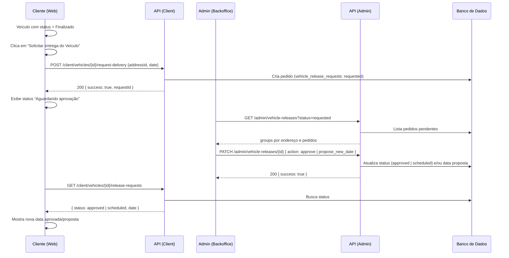
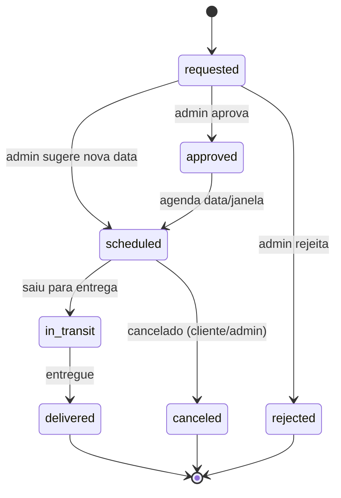
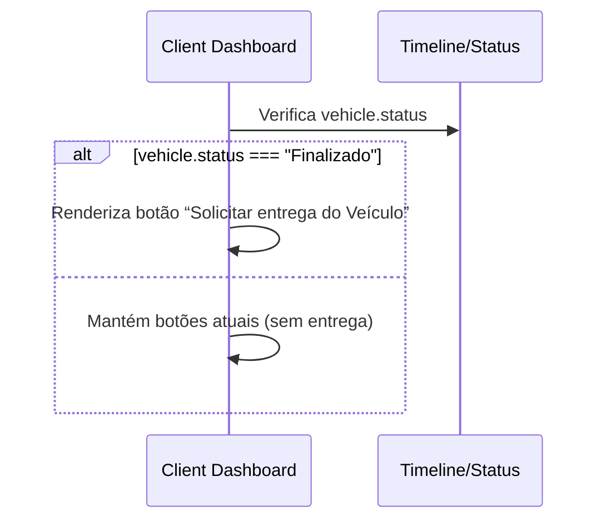

# 10) Diagramas (Sequência e Fluxo)

> Observação: Diagramas em Mermaid para facilitar entendimento do fluxo. Não é implementação.

## 10.1 Sequência — Cliente solicita entrega e Admin aprova/sugere nova data

## 10.2 Fluxo de Estados — Pedido de Entrega

## 10.3 Sequência — Ajuste do botão no Card do Veículo

