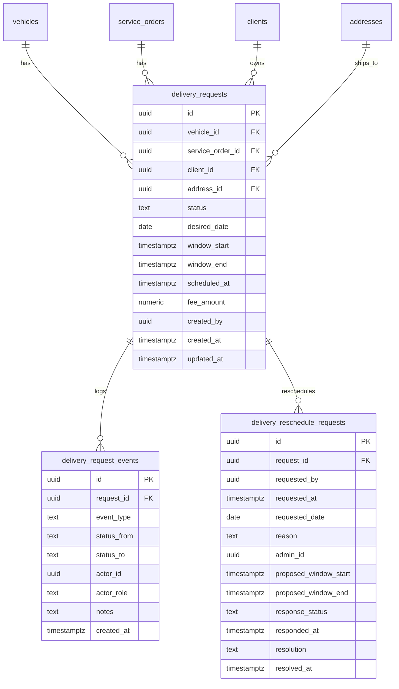

# 11) Novas Tabelas para Entrega e Reagendamento

> Planejamento de esquema de dados para a fase atual, aproveitando componentes e regras já estabelecidas (inclui “solicitação de mudança de data”). Não executar migrações agora — este é um rascunho funcional para validação.

## 11.1 Objetivos do modelo
- Separar claramente o domínio de “entrega do veículo” do domínio de “coleta”, reduzindo ambiguidade.
- Permitir fluxo de aprovação/admin análogo ao de coleta (aproveitar telas e padrões), incluindo solicitação de mudança de data.
- Rastreabilidade: histórico de eventos por pedido (aprovação, agendamento, em rota, entregue, reagendamento etc.).

## 11.2 Tabelas propostas (DDL sugerido)

### Tabela: `delivery_requests`
Pedidos de entrega (cliente solicita entrega do veículo finalizado).

```sql
create table if not exists public.delivery_requests (
  id uuid primary key default gen_random_uuid(),
  vehicle_id uuid not null references public.vehicles(id) on delete restrict,
  service_order_id uuid not null references public.service_orders(id) on delete restrict,
  client_id uuid not null references public.clients(profile_id) on delete restrict,
  address_id uuid not null references public.addresses(id) on delete restrict,

  -- Status principal do pedido
  status text not null check (status in (
    'requested',        -- cliente solicitou
    'approved',         -- admin aprovou (sem data marcada)
    'scheduled',        -- janela/data definida
    'in_transit',       -- saiu para entrega
    'delivered',        -- entregue
    'rejected',         -- admin rejeitou
    'canceled',         -- cancelado por cliente/admin
    'failed'            -- tentativa de entrega falhou
  )),

  -- Datas/agenda
  desired_date date null,           -- data desejada pelo cliente
  window_start timestamptz null,    -- janela sugerida/definida (início)
  window_end timestamptz null,      -- janela sugerida/definida (fim)
  scheduled_at timestamptz null,    -- quando de fato ficou “agendado”

  -- Custos/opcional
  fee_amount numeric(10,2) null,

  -- Auditoria
  created_by uuid not null,         -- perfil (cliente) que criou
  created_at timestamptz not null default now(),
  updated_at timestamptz not null default now()
);

create index if not exists idx_delivery_requests_vehicle on public.delivery_requests(vehicle_id);
create index if not exists idx_delivery_requests_client on public.delivery_requests(client_id);
create index if not exists idx_delivery_requests_status on public.delivery_requests(status);
```

### Tabela: `delivery_request_events`
Histórico de eventos por pedido (auditoria detalhada), semelhante a “history” de coleta.

```sql
create table if not exists public.delivery_request_events (
  id uuid primary key default gen_random_uuid(),
  request_id uuid not null references public.delivery_requests(id) on delete cascade,
  event_type text not null check (event_type in (
    'created', 'approved', 'rejected', 'scheduled', 'in_transit', 'delivered',
    'canceled', 'failed', 'reschedule_requested', 'reschedule_proposed', 'reschedule_accepted', 'reschedule_rejected'
  )),
  status_from text null,
  status_to text null,
  actor_id uuid not null,              -- quem realizou a ação
  actor_role text not null check (actor_role in ('client','admin','system','partner')),
  notes text null,
  created_at timestamptz not null default now()
);

create index if not exists idx_delivery_request_events_req on public.delivery_request_events(request_id);
create index if not exists idx_delivery_request_events_type on public.delivery_request_events(event_type);
```

### Tabela: `delivery_reschedule_requests`
Registra as solicitações de mudança de data (pedido do cliente) e as contra-propostas do admin, espelhando a regra de negócio já usada em coleta.

```sql
create table if not exists public.delivery_reschedule_requests (
  id uuid primary key default gen_random_uuid(),
  request_id uuid not null references public.delivery_requests(id) on delete cascade,

  -- Quem iniciou o pedido de mudança de data
  requested_by uuid not null,                  -- profile id (cliente)
  requested_at timestamptz not null default now(),
  requested_date date not null,                -- nova data desejada pelo cliente
  reason text null,

  -- Resposta do admin
  admin_id uuid null,                          -- profile id (admin)
  proposed_window_start timestamptz null,      -- proposta de janela (início)
  proposed_window_end timestamptz null,        -- proposta de janela (fim)
  response_status text null check (response_status in (
    'approved',          -- aceitou a data do cliente
    'proposed',          -- sugeriu outra data/janela
    'rejected'           -- rejeitou a solicitação
  )),
  responded_at timestamptz null,

  -- Estado final do pedido de reagendamento (após cliente aceitar/recusar proposta do admin)
  resolution text null check (resolution in ('accepted','declined','canceled')),
  resolved_at timestamptz null
);

create index if not exists idx_delivery_reschedule_req on public.delivery_reschedule_requests(request_id);
```

> Observação: poderíamos modelar o reagendamento somente por `delivery_request_events` (com payload em `notes`). A separação em tabela própria torna consultas e RLS mais simples, pois há ciclo de vida específico (cliente → admin → cliente).

## 11.3 RLS/Segurança (diretrizes)
- `delivery_requests`
  - Clientes: selecionar/inserir somente se `client_id == auth.uid()`.
  - Admin: total acesso (service-role ou políticas específicas).
  - Parceiro/logística (futuro): acesso somente a pedidos atribuídos (quando houver `assigned_partner_id`).
- `delivery_request_events` e `delivery_reschedule_requests`
  - Leitura: cliente pode ver apenas eventos/solicitações do seu `request_id`.
  - Escrita: cliente cria “reschedule_requested”; admin cria “reschedule_proposed/approved/rejected”.

## 11.4 Integração com timeline (vehicle_history)
- Eventos relevantes para escrever na timeline do veículo:
  - “Entrega Solicitada — {apelido do endereço}” (created)
  - “Entrega Agendada” (scheduled)
  - “Saiu para Entrega” (in_transit)
  - “Veículo Entregue” (delivered)
  - “Reagendamento Solicitado/Proposto/Aceito/Rejeitado” (reschedule_*)
- Sem PII: usar apelido/identificador de endereço, nunca endereço completo nas `notes`.

## 11.5 Reuso de componentes e regras
- Cliente (modal/fluxo): aproveitar os mesmos inputs de endereço + data (já ajustados no modo entrega) e validações.
- Admin (aprovação/agendamento): espelhar padrão do `CollectionRequestsModal` em uma tela/rota de “Entregas”, reaproveitando design e agrupamento por endereço.
- “Solicitação de mudança de data”: reaproveitar UX do fluxo de coleta (propor/aceitar/rejeitar datas) ancorando nos endpoints novos de delivery.

## 11.6 Endpoints (rascunho)
- Client
  - POST `/api/client/deliveries` { vehicleId, addressId, desiredDate }
  - GET `/api/client/deliveries/{requestId}` — status + histórico
  - POST `/api/client/deliveries/{requestId}/reschedule` { requestedDate, reason? }
  - POST `/api/client/deliveries/{requestId}/accept-proposal`
  - POST `/api/client/deliveries/{requestId}/decline-proposal`

- Admin
  - GET `/api/admin/deliveries?status=requested|scheduled|...`
  - PATCH `/api/admin/deliveries/{requestId}` actions: approve|reject|schedule|mark_in_transit|mark_delivered|cancel
  - POST `/api/admin/deliveries/{requestId}/propose-date` { windowStart, windowEnd }

## 11.7 ER (Mermaid)


## 11.8 Próximos passos
- Validar campos e nomes junto ao time (ex.: manter `fee_amount` nesta fase?).
- Revisar RLS e índices necessários para as consultas previstas.
- Especificar payloads e contratos das rotas (customer/admin) com exemplos.
- Planejar migração incremental segura (criar tabelas e rotas sem impactar coleta).

