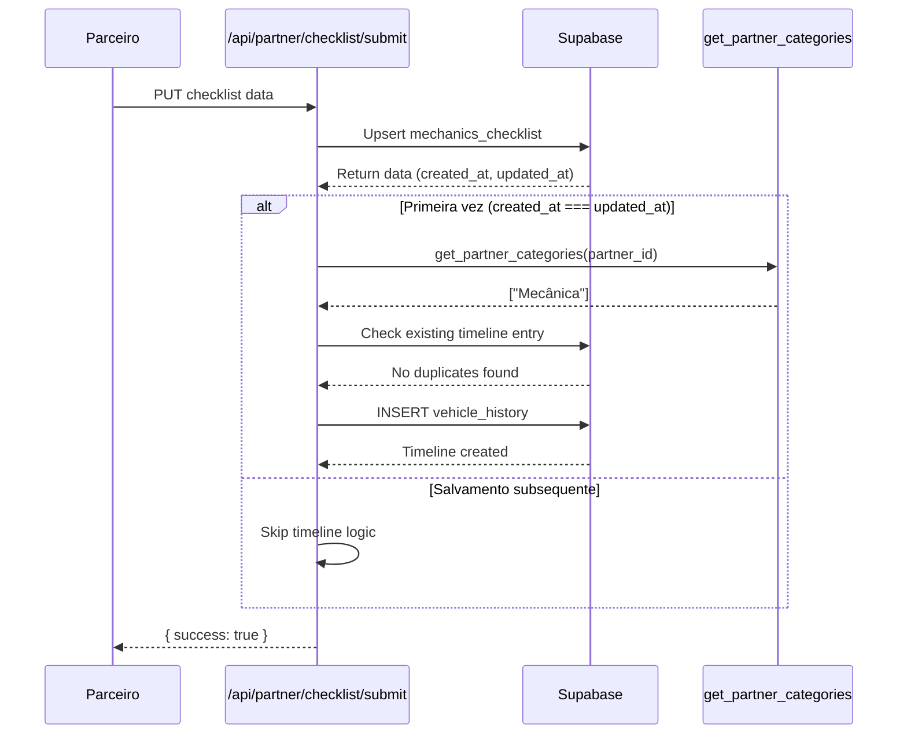

# Timeline de Fase Orçamentária - Checklist do Parceiro

## 📋 Visão Geral

Esta funcionalidade adiciona automaticamente uma entrada na timeline do veículo quando um parceiro salva um checklist pela primeira vez. A entrada mostra "Fase Orçamentária Iniciada - {Categoria do Parceiro}", permitindo rastrear quando cada tipo de parceiro começou seu trabalho.

## 🎯 Objetivo

- Registrar na timeline do veículo quando a fase orçamentária é iniciada
- Identificar qual categoria de parceiro (Mecânica, Funilaria/Pintura, etc.) iniciou o trabalho
- Evitar duplicatas (apenas na primeira vez que o parceiro salva)
- Manter histórico visível para cliente, admin e specialist

## 🔧 Implementação Técnica

### 1. Endpoint de Salvamento

**Arquivo:** `/app/api/partner/checklist/submit/route.ts`

**Fluxo:**
1. Parceiro salva checklist via `PUT /api/partner/checklist/submit`
2. Sistema faz upsert em `mechanics_checklist`
3. Verifica se é a primeira vez (comparando `created_at` === `updated_at`)
4. Se primeira vez:
   - Busca categorias do parceiro via RPC `get_partner_categories(partner_id)`
   - Cria entrada em `vehicle_history` com status formatado
   - Evita duplicatas verificando se já existe o mesmo status

**Código:**
```typescript
// Verificar se é a primeira vez
const isFirstSave = Array.isArray(data) && data[0] && data[0].created_at === data[0].updated_at;

if (isFirstSave) {
  // Buscar categoria do parceiro
  const { data: partnerCategories } = await supabase.rpc(
    'get_partner_categories',
    { partner_id: partnerId }
  );

  const categories = partnerCategories || [];
  const categoryName = categories[0] || 'Parceiro';
  const timelineStatus = `Fase Orçamentária Iniciada - ${categoryName}`;

  // Verificar duplicatas
  const { data: existingHistory } = await supabase
    .from('vehicle_history')
    .select('id')
    .eq('vehicle_id', checklistData.vehicle_id)
    .eq('status', timelineStatus)
    .maybeSingle();

  // Inserir se não existe
  if (!existingHistory) {
    await supabase.from('vehicle_history').insert({
      vehicle_id: checklistData.vehicle_id,
      status: timelineStatus,
      prevision_date: null,
      end_date: null,
    });
  }
}
```

### 2. Estrutura da Tabela

**Tabela:** `vehicle_history`

```sql
CREATE TABLE vehicle_history (
    id UUID PRIMARY KEY DEFAULT gen_random_uuid(),
    vehicle_id UUID NOT NULL REFERENCES vehicles(id) ON DELETE CASCADE,
    status VARCHAR(255) NOT NULL,
    prevision_date DATE,
    end_date DATE,
    created_at TIMESTAMPTZ NOT NULL DEFAULT NOW()
);
```

### 3. Função RPC

**Função:** `get_partner_categories(partner_id uuid)`

```sql
CREATE OR REPLACE FUNCTION get_partner_categories(partner_id uuid)
RETURNS json AS $$
BEGIN
    RETURN (
        SELECT COALESCE(json_agg(sc.name), '[]'::json)
        FROM partners_service_categories psc
        JOIN service_categories sc ON psc.category_id = sc.id
        WHERE psc.partner_id = $1
    );
END;
$$ LANGUAGE plpgsql SECURITY DEFINER;
```

**Retorno:** Array JSON de strings com nomes das categorias
```json
["Mecânica"]
["Funilaria/Pintura"]
["Lavagem"]
```

### 4. Categorias Disponíveis

Definidas em `service_categories`:
- `mechanics` → "Mecânica"
- `body_paint` → "Funilaria/Pintura"
- `washing` → "Lavagem"
- `tires` → "Pneus"

## 📊 Visualização na Timeline

A entrada aparece na página de **Detalhes do Veículo** (`/dashboard/vehicle/[vehicleId]`):

```tsx
{/* Timeline do Veículo */}
{vehicleHistory.map(historyEntry => {
  let color = '#9b59b6';
  if (historyEntry.status.includes('Orçament')) {
    color = '#f39c12'; // Laranja para fase orçamentária
  }
  
  return (
    <div key={historyEntry.id}>
      <div style={{ background: color }} />
      <div>
        <div>{historyEntry.status}</div>
        <div>{formatDate(historyEntry.created_at)}</div>
      </div>
    </div>
  );
})}
```

## 🔒 Segurança e RLS

### Políticas de Acesso

**Tabela:** `vehicle_history`

```sql
-- Admins e Specialists têm acesso total
CREATE POLICY "Allow individual read access"
ON vehicle_history
FOR SELECT
USING (
  (get_my_claim('role')::text = ANY (ARRAY['admin'::text, 'specialist'::text])) OR
  (
    get_my_claim('role')::text = 'client' AND
    vehicle_id IN (
      SELECT id FROM vehicles WHERE client_id = auth.uid()
    )
  )
);
```

**Permissões:**
- ✅ **Admin:** Leitura total
- ✅ **Specialist:** Leitura total
- ✅ **Client:** Leitura apenas de seus veículos
- ✅ **Partner:** Escrita via service_role (backend)

## 🧪 Testes

### Cenário 1: Primeira Salvamento
```typescript
// Given: Parceiro de Mecânica salva checklist pela primeira vez
const partnerId = 'uuid-do-parceiro';
const vehicleId = 'uuid-do-veiculo';

// When: PUT /api/partner/checklist/submit
await submitChecklist({ vehicle_id: vehicleId, ... });

// Then: Nova entrada na timeline
const history = await getVehicleHistory(vehicleId);
expect(history).toContainEqual({
  status: 'Fase Orçamentária Iniciada - Mecânica',
  vehicle_id: vehicleId
});
```

### Cenário 2: Salvamentos Subsequentes
```typescript
// Given: Parceiro já salvou checklist anteriormente
await submitChecklist({ vehicle_id: vehicleId, ... }); // 1ª vez
await submitChecklist({ vehicle_id: vehicleId, ... }); // 2ª vez

// Then: Apenas UMA entrada na timeline
const history = await getVehicleHistory(vehicleId);
const matchingEntries = history.filter(h => 
  h.status === 'Fase Orçamentária Iniciada - Mecânica'
);
expect(matchingEntries).toHaveLength(1);
```

### Cenário 3: Múltiplos Parceiros
```typescript
// Given: Parceiro de Mecânica e Funilaria salvam checklists
await submitChecklistAs(mechanicsPartnerId, vehicleId);
await submitChecklistAs(bodyPaintPartnerId, vehicleId);

// Then: Duas entradas distintas
const history = await getVehicleHistory(vehicleId);
expect(history).toContainEqual({
  status: 'Fase Orçamentária Iniciada - Mecânica'
});
expect(history).toContainEqual({
  status: 'Fase Orçamentária Iniciada - Funilaria/Pintura'
});
```

## 📝 Logs

### Sucesso
```
[api:partner:checklist:submit] timeline_created {
  vehicle_id: "08b9e50e",
  status: "Fase Orçamentária Iniciada - Mecânica",
  partner_id: "7b497d89"
}
```

### Duplicata Detectada
```
[api:partner:checklist:submit] timeline_already_exists {
  vehicle_id: "08b9e50e"
}
```

### Erro (não-bloqueante)
```
[api:partner:checklist:submit] timeline_insert_error {
  error: "duplicate key value violates unique constraint"
}
```

## 🚨 Tratamento de Erros

**Princípio:** Falhas na timeline **NÃO** devem bloquear o salvamento do checklist.

```typescript
try {
  // Lógica de timeline
} catch (timelineError) {
  logger.error('timeline_update_error', { error });
  // Continua a execução normalmente
}

// Checklist é salvo independentemente do resultado da timeline
return NextResponse.json({ success: true });
```

## 📈 Casos de Uso

### 1. Rastreamento de Progresso
Cliente visualiza quando cada parceiro iniciou seu trabalho:
```
Timeline do Veículo:
✓ Veículo Cadastrado - 01/10/2025
✓ Análise Iniciada - 02/10/2025
✓ Análise Finalizada - 03/10/2025
🔶 Fase Orçamentária Iniciada - Mecânica - 04/10/2025
🔶 Fase Orçamentária Iniciada - Funilaria/Pintura - 05/10/2025
```

### 2. Auditoria
Admin identifica quando parceiros começaram a trabalhar:
```sql
SELECT 
  vh.status,
  vh.created_at,
  v.plate,
  p.company_name
FROM vehicle_history vh
JOIN vehicles v ON vh.vehicle_id = v.id
JOIN partners p ON p.profile_id = (
  SELECT partner_id FROM mechanics_checklist mc
  WHERE mc.vehicle_id = vh.vehicle_id
  LIMIT 1
)
WHERE vh.status LIKE 'Fase Orçamentária Iniciada%'
ORDER BY vh.created_at DESC;
```

### 3. Métricas de SLA
Calcular tempo entre análise finalizada e início de orçamentação:
```sql
SELECT 
  v.plate,
  (SELECT created_at FROM vehicle_history 
   WHERE vehicle_id = v.id AND status LIKE '%Orçamentária Iniciada%'
   LIMIT 1) 
  - 
  (SELECT created_at FROM vehicle_history 
   WHERE vehicle_id = v.id AND status = 'Análise Finalizada'
   LIMIT 1) AS sla_delay
FROM vehicles v;
```

## 🔄 Fluxo Completo



## 📚 Referências

### Arquivos Relacionados
- `/app/api/partner/checklist/submit/route.ts` - Endpoint de salvamento
- `/modules/vehicles/components/VehicleDetails.tsx` - Visualização da timeline
- `/supabase/migrations/20250929120000_create_vehicle_history_table.sql` - Schema
- `/supabase/migrations/20250929160316_create_get_partner_categories_rpc.sql` - RPC function

### Tabelas Envolvidas
- `vehicle_history` - Registros da timeline
- `mechanics_checklist` - Dados do checklist
- `partners_service_categories` - Categorias do parceiro
- `service_categories` - Definições de categorias

---

**Última atualização:** 2025-10-09  
**Versão:** 1.0.0  
**Autor:** Sistema de Desenvolvimento Proline
