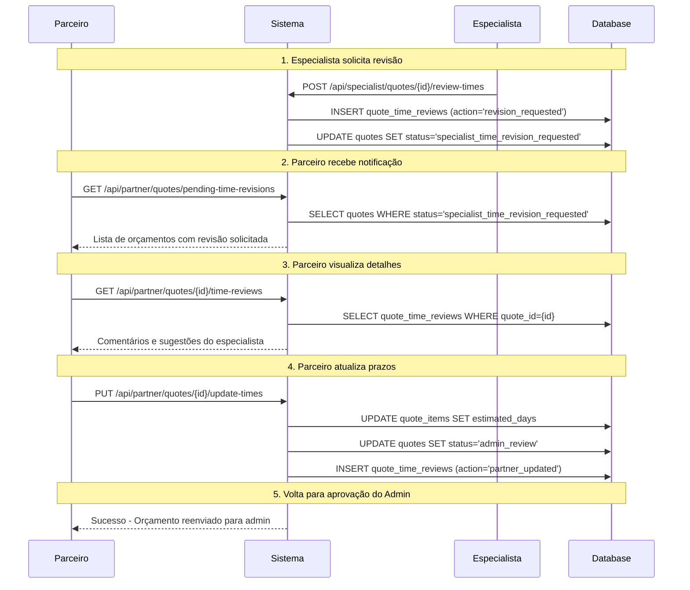

# Fluxo de Revisão de Prazos - Parceiro

## 📋 Visão Geral

Documento de planejamento para implementar a funcionalidade que permite ao **Parceiro** visualizar solicitações de revisão de prazos feitas pelo **Especialista** e atualizar os prazos do orçamento.

---

## 🔄 Fluxo Completo



---

## 📊 Estados do Orçamento

### Estados Relevantes para o Fluxo

| Status | Descrição | Quem Pode Agir |
|--------|-----------|----------------|
| `approved` | Aprovado pelo admin, aguardando aprovação de prazo do especialista | Especialista |
| `specialist_time_revision_requested` | Especialista solicitou revisão dos prazos | Parceiro |
| `admin_review` | Reenviado para revisão do admin após ajuste | Admin |
| `specialist_time_approved` | Prazos aprovados pelo especialista (fluxo completo) | - |

---

## 🎨 Interface do Parceiro

### 1. Dashboard - Card de Solicitações Pendentes

**Componente**: `PendingTimeRevisionsCard.tsx`

```tsx
// Localização: /modules/partner/components/PendingTimeRevisionsCard.tsx

// Features:
// - Card integrado no dashboard (não é uma página separada)
// - Lista compacta de orçamentos com revisão solicitada
// - Botões de ação diretos em cada item
// - Auto-refresh automático quando dados mudam
```

**Visual no Dashboard**:
```
┌─────────────────────────────────────────────────────────────────────┐
│  Dashboard do Parceiro                                              │
├─────────────────────────────────────────────────────────────────────┤
│                                                                     │
│  📊 Resumo                                                          │
│  ┌──────────────┬──────────────┬──────────────┐                   │
│  │ Pendentes: 5 │ Aprovados:12 │ Rejeitados:2 │                   │
│  └──────────────┴──────────────┴──────────────┘                   │
│                                                                     │
│  ⏱️  Solicitações de Ajuste de Prazo (2) 🔴  ← NOVO               │
│  ┌─────────────────────────────────────────────────────────────┐  │
│  │ 🚗 ABC-1234 | Cliente Teste                                 │  │
│  │ Orçamento #12345 | Solicitado: 15/10 14:30                 │  │
│  │ Especialista: João Silva | 3 itens para revisar            │  │
│  │                                                              │  │
│  │ [Revisar Prazos] [Ver Detalhes]                            │  │
│  ├─────────────────────────────────────────────────────────────┤  │
│  │ � XYZ-5678 | Cliente ABC Ltda                             │  │
│  │ Orçamento #12346 | Solicitado: 14/10 10:15                 │  │
│  │ Especialista: Maria Santos | 2 itens para revisar          │  │
│  │                                                              │  │
│  │ [Revisar Prazos] [Ver Detalhes]                            │  │
│  └─────────────────────────────────────────────────────────────┘  │
│                                                                     │
│  📋 Outros Orçamentos Pendentes                                    │
│  ┌─────────────────────────────────────────────────────────────┐  │
│  │ ...                                                          │  │
│  └─────────────────────────────────────────────────────────────┘  │
│                                                                     │
└─────────────────────────────────────────────────────────────────────┘
```

**Fluxo de Interação**:
1. Usuário vê o card no dashboard
2. Clica em **"Revisar Prazos"** → Abre modal de edição
3. Ou clica em **"Ver Detalhes"** → Navega para página de detalhes do orçamento

---

### 2. Modal de Revisão de Prazos

**Componente**: `TimeRevisionModal.tsx`

```tsx
// Localização: /modules/partner/components/TimeRevisionModal/TimeRevisionModal.tsx

interface Props {
  isOpen: boolean;
  onClose: () => void;
  quoteId: string;
  onSuccess: () => void;
}

// Features:
// - Modal fullscreen ou large
// - 3 seções: Info, Solicitação, Edição
// - Botões de salvar/cancelar fixos no rodapé
// - Validação inline de campos
```

**Layout do Modal**:

```
┌──────────────────────────────────────────────────────────────────────┐
│  Revisar Prazos - Orçamento #12345                           [X]     │
├──────────────────────────────────────────────────────────────────────┤
│                                                                      │
│  ℹ️ Informações do Orçamento                                        │
│  ┌────────────────────────────────────────────────────────────────┐ │
│  │ Cliente: Cliente Teste 12345                                   │ │
│  │ Veículo: Toyota Corolla - ABC-1234                            │ │
│  │ Data de Envio Original: 10/10/2025                            │ │
│  └────────────────────────────────────────────────────────────────┘ │
│                                                                      │
│  📝 Solicitação do Especialista                                     │
│  ┌────────────────────────────────────────────────────────────────┐ │
│  │ 👤 Especialista: João Silva                                    │ │
│  │ 📅 Solicitado em: 15/10/2025 às 14:30                        │ │
│  │                                                                │ │
│  │ 💬 Comentário:                                                 │ │
│  │ "Os prazos estão muito curtos para a complexidade dos         │ │
│  │  serviços solicitados. Por favor, revisar considerando        │ │
│  │  possíveis imprevistos."                                      │ │
│  └────────────────────────────────────────────────────────────────┘ │
│                                                                      │
│  ✏️ Editar Prazos dos Itens                                         │
│  ┌────────────────────────────────────────────────────────────────┐ │
│  │                                                                │ │
│  │ 1. Troca de óleo e filtros                                    │ │
│  │ ┌──────────────────────────────────────────────────────────┐  │ │
│  │ │ Prazo Atual: 5 dias                                       │  │ │
│  │ │ 💡 Sugestão: 7 dias                                       │  │ │
│  │ │ 📝 Motivo: "Considerar tempo de espera de peças"         │  │ │
│  │ │                                                            │  │ │
│  │ │ Novo Prazo: [7] dias  [Aplicar Sugestão]                 │  │ │
│  │ └──────────────────────────────────────────────────────────┘  │ │
│  │                                                                │ │
│  │ 2. Reparo de suspensão                                        │ │
│  │ ┌──────────────────────────────────────────────────────────┐  │ │
│  │ │ Prazo Atual: 10 dias                                      │  │ │
│  │ │ 💡 Sugestão: 15 dias                                      │  │ │
│  │ │ � Motivo: "Serviço complexo, pode haver imprevistos"    │  │ │
│  │ │                                                            │  │ │
│  │ │ Novo Prazo: [10] dias  [Aplicar Sugestão]                │  │ │
│  │ └──────────────────────────────────────────────────────────┘  │ │
│  │                                                                │ │
│  │ 3. Alinhamento e balanceamento                                │ │
│  │ ┌──────────────────────────────────────────────────────────┐  │ │
│  │ │ Prazo Atual: 2 dias                                       │  │ │
│  │ │ ℹ️ Sem sugestão do especialista                           │  │ │
│  │ │                                                            │  │ │
│  │ │ Novo Prazo: [2] dias                                      │  │ │
│  │ └──────────────────────────────────────────────────────────┘  │ │
│  │                                                                │ │
│  └────────────────────────────────────────────────────────────────┘ │
│                                                                      │
│  💬 Comentário da Revisão (opcional)                                │
│  ┌────────────────────────────────────────────────────────────────┐ │
│  │ Explique as alterações feitas nos prazos...                   │ │
│  │                                                                │ │
│  └────────────────────────────────────────────────────────────────┘ │
│                                                                      │
├──────────────────────────────────────────────────────────────────────┤
│                                    [Cancelar] [Salvar e Reenviar]   │
└──────────────────────────────────────────────────────────────────────┘
```

---

### 3. Página de Detalhes do Orçamento (Opcional)

**Rota**: `/dashboard/partner/quotes/[quoteId]` (página existente)

**Componente**: Página já existente, mas com seção adicional

**Features**:
- Exibe timeline de revisões (quem solicitou, quando, o que foi alterado)
- Permite visualizar histórico completo
- Botão para abrir modal de revisão se houver solicitação pendente

**Visual**:
```
┌────────────────────────────────────────────────────────────────┐
│  Detalhes do Orçamento #12345                                  │
├────────────────────────────────────────────────────────────────┤
│  ... (conteúdo existente) ...                                  │
│                                                                │
│  ⏱️ Histórico de Revisões de Prazo                             │
│  ┌────────────────────────────────────────────────────────┐   │
│  │ 📅 15/10/2025 14:30 - Revisão Solicitada              │   │
│  │ 👤 Especialista João Silva                             │   │
│  │ 💬 "Os prazos estão muito curtos..."                   │   │
│  │ • Item 1: 5 dias → sugestão 7 dias                    │   │
│  │ • Item 2: 10 dias → sugestão 15 dias                  │   │
│  │                                                         │   │
│  │ [Revisar Prazos Agora]                                 │   │
│  ├────────────────────────────────────────────────────────┤   │
│  │ 📅 10/10/2025 09:00 - Orçamento Enviado               │   │
│  │ � Parceiro                                            │   │
│  └────────────────────────────────────────────────────────┘   │
│                                                                │
└────────────────────────────────────────────────────────────────┘
```

---

## 🔌 APIs Necessárias

### 1. ✅ APIs já Criadas

#### `GET /api/partner/quotes/[quoteId]/time-reviews`
**Status**: ✅ Criada
**Função**: Buscar histórico de revisões de prazo de um orçamento

**Response**:
```json
{
  "success": true,
  "data": [
    {
      "id": "uuid",
      "quote_id": "uuid",
      "specialist_id": "uuid",
      "action": "revision_requested",
      "comments": "Os prazos estão muito curtos...",
      "revision_requests": {
        "item-uuid-1": {
          "suggested_days": 7,
          "reason": "Considerar tempo de espera de peças"
        },
        "item-uuid-2": {
          "suggested_days": 15,
          "reason": "Serviço complexo"
        }
      },
      "created_at": "2025-10-15T14:30:00Z",
      "specialist": {
        "full_name": "João Silva"
      }
    }
  ]
}
```

#### `PUT /api/partner/quotes/[quoteId]/update-times`
**Status**: ✅ Criada
**Função**: Atualizar prazos dos itens do orçamento

**Request**:
```json
{
  "items": [
    {
      "item_id": "uuid",
      "estimated_days": 7
    },
    {
      "item_id": "uuid",
      "estimated_days": 15
    }
  ],
  "comments": "Prazos ajustados conforme sugerido"
}
```

---

### 2. 🆕 APIs a Criar

#### `GET /api/partner/quotes/pending-time-revisions`
**Status**: 🆕 A criar
**Função**: Listar orçamentos com revisão de prazo solicitada (para o card no dashboard)

**Response**:
```json
{
  "success": true,
  "data": [
    {
      "quote_id": "uuid",
      "quote_number": "12345",
      "client_name": "Cliente Teste",
      "vehicle_plate": "ABC-1234",
      "vehicle_model": "Toyota Corolla",
      "requested_at": "2025-10-15T14:30:00Z",
      "specialist_name": "João Silva",
      "specialist_comments": "Os prazos estão muito curtos...",
      "items_count": 5,
      "revision_items_count": 3
    }
  ]
}
```

**Query SQL**:
```sql
SELECT 
  q.id as quote_id,
  p.full_name as client_name,
  v.plate as vehicle_plate,
  v.model as vehicle_model,
  qtr.created_at as requested_at,
  sp.full_name as specialist_name,
  COUNT(qi.id) as items_count,
  jsonb_object_keys(qtr.revision_requests) as revision_items_count
FROM quotes q
JOIN service_orders so ON q.service_order_id = so.id
JOIN vehicles v ON so.vehicle_id = v.id
JOIN clients c ON v.client_id = c.profile_id
JOIN profiles p ON c.profile_id = p.id
JOIN quote_time_reviews qtr ON qtr.quote_id = q.id
JOIN profiles sp ON qtr.specialist_id = sp.id
LEFT JOIN quote_items qi ON qi.quote_id = q.id
WHERE q.status = 'specialist_time_revision_requested'
  AND q.partner_id = $1
  AND qtr.action = 'revision_requested'
GROUP BY q.id, p.full_name, v.plate, v.model, qtr.created_at, sp.full_name
ORDER BY qtr.created_at ASC;
```

#### `GET /api/partner/quotes/[quoteId]/revision-details`
**Status**: 🆕 A criar
**Função**: Buscar detalhes completos para o modal de revisão (quote + items + revision)

**Response**:
```json
{
  "success": true,
  "data": {
    "quote": {
      "id": "uuid",
      "quote_number": "12345",
      "client_name": "Cliente Teste",
      "vehicle_plate": "ABC-1234",
      "vehicle_model": "Toyota Corolla",
      "created_at": "2025-10-10T09:00:00Z"
    },
    "revision": {
      "specialist_name": "João Silva",
      "requested_at": "2025-10-15T14:30:00Z",
      "comments": "Os prazos estão muito curtos...",
      "revision_requests": {
        "item-uuid-1": {
          "suggested_days": 7,
          "reason": "Considerar tempo de espera de peças"
        },
        "item-uuid-2": {
          "suggested_days": 15,
          "reason": "Serviço complexo"
        }
      }
    },
    "items": [
      {
        "id": "item-uuid-1",
        "description": "Troca de óleo e filtros",
        "estimated_days": 5,
        "has_suggestion": true,
        "suggested_days": 7,
        "suggestion_reason": "Considerar tempo de espera de peças"
      },
      {
        "id": "item-uuid-2",
        "description": "Reparo de suspensão",
        "estimated_days": 10,
        "has_suggestion": true,
        "suggested_days": 15,
        "suggestion_reason": "Serviço complexo"
      },
      {
        "id": "item-uuid-3",
        "description": "Alinhamento e balanceamento",
        "estimated_days": 2,
        "has_suggestion": false
      }
    ]
  }
}
```

---

## 🗄️ Estrutura de Dados

### Tabela: `quote_time_reviews` (já criada)

```sql
CREATE TABLE quote_time_reviews (
  id UUID PRIMARY KEY DEFAULT gen_random_uuid(),
  quote_id UUID NOT NULL REFERENCES quotes(id) ON DELETE CASCADE,
  specialist_id UUID REFERENCES profiles(id),
  action TEXT NOT NULL CHECK (action IN ('approved', 'revision_requested', 'partner_updated')),
  comments TEXT,
  reviewed_item_ids UUID[],
  revision_requests JSONB, -- { "item_id": { "suggested_days": 7, "reason": "..." } }
  created_at TIMESTAMPTZ DEFAULT now(),
  created_by UUID REFERENCES profiles(id)
);
```

**Novo action**: `partner_updated`
- Será usado quando o parceiro atualizar os prazos após revisão

---

## 📝 Modelo de Dados: `revision_requests`

### Estrutura JSONB

```typescript
interface RevisionRequests {
  [itemId: string]: {
    suggested_days: number;
    reason: string;
  };
}

// Exemplo:
const revisionRequests: RevisionRequests = {
  "550e8400-e29b-41d4-a716-446655440000": {
    suggested_days: 7,
    reason: "Considerar tempo de espera de peças"
  },
  "6ba7b810-9dad-11d1-80b4-00c04fd430c8": {
    suggested_days: 15,
    reason: "Serviço complexo, pode haver imprevistos"
  }
};
```

---

## 🔔 Sistema de Notificações (Futuro)

### Estratégias de Notificação

1. **In-App (Prioridade Alta - Implementar Agora)**
   - Contador no dashboard
   - Badge vermelho quando há revisões pendentes
   - Lista de notificações (futuro)

2. **Email (Prioridade Média)**
   - Enviar email quando especialista solicita revisão
   - Template: "Revisão de Prazo Solicitada - Orçamento #12345"

3. **Push Notifications (Prioridade Baixa)**
   - Notificações no navegador
   - Requer service worker

### Implementação Inicial (MVP)

```typescript
// Apenas contador visual no dashboard
// Sem emails ou push notifications inicialmente
```

---

## 🧪 Casos de Teste

### Cenário 1: Fluxo Completo de Revisão
```gherkin
Dado que um orçamento está aprovado pelo admin
Quando o especialista solicita revisão de prazos
Então o status do orçamento muda para 'specialist_time_revision_requested'
E o parceiro vê o orçamento na lista de revisões pendentes
Quando o parceiro atualiza os prazos
Então o status volta para 'admin_review'
E um novo registro é criado em quote_time_reviews com action='partner_updated'
```

### Cenário 2: Parceiro Aplica Todas as Sugestões
```gherkin
Dado que há 3 itens com revisão solicitada
Quando o parceiro clica em "Aplicar Sugestão" em todos
Então todos os campos são preenchidos com os valores sugeridos
E o parceiro pode ajustar manualmente se necessário
```

### Cenário 3: Parceiro Ignora Sugestões
```gherkin
Dado que há sugestões do especialista
Quando o parceiro mantém os prazos originais
E salva sem alterações
Então o sistema deve alertar "Nenhuma alteração detectada"
E perguntar "Deseja realmente reenviar sem alterações?"
```

---

## 🎯 Checklist de Implementação

### Backend

- [ ] Criar API `GET /api/partner/quotes/pending-time-revisions`
- [ ] Criar API `GET /api/partner/quotes/pending-time-revisions/count`
- [ ] Atualizar API `PUT /api/partner/quotes/[quoteId]/update-times`
  - [ ] Adicionar validação de status
  - [ ] Criar registro com action='partner_updated'
  - [ ] Atualizar status do quote para 'admin_review'
- [ ] Adicionar testes unitários para novas APIs

### Frontend - Componentes

- [ ] Criar `PendingTimeRevisionsCard.tsx` (card no dashboard)
  - [ ] Lista compacta de orçamentos pendentes
  - [ ] Botões de ação em cada item
  - [ ] Auto-refresh quando dados mudam
- [ ] Criar `TimeRevisionModal.tsx` (modal de edição)
  - [ ] Seção de informações do orçamento
  - [ ] Seção de solicitação do especialista
  - [ ] Seção de edição de prazos
  - [ ] Botão "Aplicar Sugestão" por item
  - [ ] Validação de formulário
- [ ] Criar `TimeRevisionItemEditor.tsx` (editor individual de item)
  - [ ] Exibir prazo atual
  - [ ] Exibir sugestão (se houver)
  - [ ] Input para novo prazo
  - [ ] Botão para aplicar sugestão
- [ ] Criar hook `usePartnerTimeRevisions.ts`
  - [ ] Fetch de orçamentos pendentes
  - [ ] Fetch de detalhes de revisão
  - [ ] Submit de prazos atualizados
- [ ] Criar `TimeRevisionHistorySection.tsx` (opcional)
  - [ ] Timeline de revisões
  - [ ] Integrar na página de detalhes do orçamento

### Frontend - Integração

- [ ] Integrar `PendingTimeRevisionsCard` no `PartnerDashboard`
  - [ ] Posicionar no topo, acima de "Orçamentos Pendentes"
  - [ ] Ocultar quando não há revisões pendentes
- [ ] Adicionar validações de formulário
  - [ ] Prazo deve ser número positivo
  - [ ] Alertar se nenhum prazo foi alterado
- [ ] Adicionar loading states
  - [ ] Loading ao carregar lista
  - [ ] Loading ao salvar alterações
- [ ] Adicionar error handling
  - [ ] Toasts de erro/sucesso
  - [ ] Mensagens de validação
- [ ] Adicionar confirmação antes de salvar
  - [ ] Modal "Tem certeza que deseja salvar?"
  - [ ] Resumo das alterações

### Testes E2E

- [ ] Teste: Especialista solicita revisão → Parceiro vê notificação
- [ ] Teste: Parceiro atualiza prazos → Status muda corretamente
- [ ] Teste: Aplicar sugestões automaticamente
- [ ] Teste: Validação de campos obrigatórios

### Documentação

- [ ] Atualizar `SPECIALIST_TIME_APPROVAL.md` com fluxo completo
- [ ] Criar screenshots da interface
- [ ] Documentar casos de uso
- [ ] Atualizar diagramas de fluxo

---

## 🚀 Plano de Rollout

### Fase 1: MVP (1-2 dias)
**Backend**:
- [ ] API `GET /api/partner/quotes/pending-time-revisions`
- [ ] API `GET /api/partner/quotes/[quoteId]/revision-details`
- [ ] Atualizar API `PUT /api/partner/quotes/[quoteId]/update-times`

**Frontend**:
- [ ] Componente `PendingTimeRevisionsCard` no dashboard
- [ ] Modal `TimeRevisionModal` básico
- [ ] Edição de prazos com botão "Aplicar Sugestão"

### Fase 2: Melhorias (1 dia)
**UX**:
- [ ] Loading states e animações
- [ ] Toasts de feedback
- [ ] Confirmação antes de salvar
- [ ] Validações robustas

**Features Extras**:
- [ ] Histórico de revisões na página de detalhes
- [ ] Filtros e busca no card

### Fase 3: Notificações (Futuro)
- [ ] Sistema de notificações por email
- [ ] Push notifications
- [ ] Alertas no menu lateral

---

## 🔐 Segurança

### Validações Necessárias

1. **Verificar Propriedade do Orçamento**
   ```typescript
   // O parceiro só pode editar seus próprios orçamentos
   const { data: quote } = await supabase
     .from('quotes')
     .select('partner_id')
     .eq('id', quoteId)
     .single();
   
   if (quote.partner_id !== req.user.id) {
     return 403; // Forbidden
   }
   ```

2. **Verificar Status Correto**
   ```typescript
   // Só pode editar se status for 'specialist_time_revision_requested'
   if (quote.status !== 'specialist_time_revision_requested') {
     return 400; // Bad Request
   }
   ```

3. **Validar Prazos**
   ```typescript
   // Prazos devem ser números positivos
   if (estimated_days <= 0) {
     return 400; // Bad Request
   }
   ```

---

## 📊 Métricas de Sucesso

- **Tempo médio de resposta do parceiro** < 24 horas
- **Taxa de aplicação de sugestões** > 70%
- **Redução de idas e vindas** (objetivo: máximo 1 revisão por orçamento)

---

## 🎨 Design System

### Cores

- **Revisão Pendente**: `#FFA500` (Laranja) - Atenção
- **Sugestão**: `#4A90E2` (Azul) - Informação
- **Sucesso**: `#28A745` (Verde) - Confirmação

### Ícones

- 📋 Lista de revisões
- ⏱️ Prazos/Tempos
- 💡 Sugestões
- 📝 Comentários
- ✏️ Editar
- 💾 Salvar

---

## 📚 Referências

- [Documento Principal: SPECIALIST_TIME_APPROVAL.md](./SPECIALIST_TIME_APPROVAL.md)
- [Revisão Técnica: SPECIALIST_TIME_APPROVAL_REVIEW.md](../refactoring/SPECIALIST_TIME_APPROVAL_REVIEW.md)
- [Sumário Executivo: SPECIALIST_TIME_APPROVAL_SUMMARY.md](../refactoring/SPECIALIST_TIME_APPROVAL_SUMMARY.md)

---

**Data de Criação**: 15/10/2025  
**Última Atualização**: 15/10/2025  
**Status**: 📝 Em Planejamento  
**Próxima Ação**: Revisão e aprovação do plano
