# Fluxo de Revisão de Prazos - Parceiro

> **📖 Documentação Relacionada:**
> - **[Resumo Executivo](./TIME_REVISION_FLOW_SUMMARY.md)** - Visão rápida, status e checklist
> - **[Controle Detalhado](./TIME_REVISION_FLOW_CONTROL.md)** - Documentação técnica do loop completo
> - **[Diagramas Visuais](./TIME_REVISION_FLOW_DIAGRAM.md)** - Fluxogramas e exemplos com múltiplas revisões
> - **[📑 Índice Geral](../README.md#️-sistema-de-revisão-de-prazos)** - Voltar para documentação principal

## 📋 Visão Geral

Documento de planejamento para implementar a funcionalidade que permite ao **Parceiro** visualizar solicitações de revisão de prazos feitas pelo **Especialista** e atualizar os prazos do orçamento.

⚠️ **IMPORTANTE**: Este fluxo suporta **múltiplas revisões em loop**. O especialista pode solicitar nova revisão após o parceiro atualizar os prazos. Veja [Controle Detalhado](./TIME_REVISION_FLOW_CONTROL.md#-ciclo-completo-de-múltiplas-revisões) para entender o loop completo.

---

## 📈 Estado Atual da Implementação (15/10/2025)

Esta seção resume o que já foi implementado e o que ainda está pendente.

### Backend
- **APIs de Fluxo Principal:** **Implementadas.**
  - `POST /api/specialist/quotes/{id}/review-times`: ✅ Funcional.
  - `PUT /api/partner/quotes/{id}/update-times`: ✅ Funcional (mas precisa de ajuste no fluxo, veja abaixo).
  - `GET /api/partner/quotes/[quoteId]/revision-details`: ✅ Funcional e refinada para retornar erros mais claros.
  - `GET /api/partner/quotes/pending-time-revisions`: ✅ Funcional.

### Frontend
- **Componentes de UI:** **Pendente.**
  - Os componentes visuais descritos neste documento (`PendingTimeRevisionsCard`, `TimeRevisionModal`, etc.) ainda precisam ser criados e integrados.

---

## 🎯 Objetivo Final e Próximos Passos

O objetivo final é criar um ciclo de revisão completo entre o Especialista e o Parceiro.

### 🔄 Comunicação da Revisão do Parceiro para o Especialista (Loop de Revisões)

Conforme solicitado, o fluxo precisa garantir que o especialista seja notificado sobre os ajustes feitos pelo parceiro e possa **revisar novamente**, criando um **loop de revisões**.

**Gap Atual: ❌**
- A implementação atual do endpoint `PUT .../update-times` move o status do orçamento para `admin_review`, enviando-o para o **Admin**
- ❌ **Especialista NÃO recebe notificação** quando parceiro atualiza prazos
- ❌ **Especialista NÃO tem dashboard** para ver orçamentos que precisa revisar novamente
- ❌ **Não há controle de loops infinitos** (parceiro e especialista podem ficar em ciclo indefinido)

**Solução Completa Necessária:**

#### 1. Backend - Notificação ao Especialista
```typescript
// Opção A: Novo status mais claro
PUT /api/partner/quotes/[quoteId]/update-times
→ Status: specialist_time_revision_requested → pending_specialist_review
→ Envia notificação/email ao especialista

// Opção B: Manter status atual mas adicionar notificação
PUT /api/partner/quotes/[quoteId]/update-times
→ Status: specialist_time_revision_requested → admin_review
→ Envia notificação ao especialista via email/push
```

#### 2. Frontend - Dashboard do Especialista
```typescript
// Nova API necessária
GET /api/specialist/quotes/pending-review
→ Lista orçamentos em admin_review (após partner_updated)
→ Especialista vê card "Revisões Pendentes"
```

#### 3. Fluxo de Aprovação/Rejeição do Especialista
O especialista visualiza as alterações do parceiro e pode:

**Opção A: Aprovar os novos prazos ✅**
```typescript
POST /api/specialist/quotes/[quoteId]/review-times
Body: { action: 'approved', comments: 'Prazos adequados' }
→ Status: admin_review → specialist_time_approved
→ FIM do ciclo de revisões
```

**Opção B: Solicitar NOVA revisão ♻️ (LOOP)**
```typescript
POST /api/specialist/quotes/[quoteId]/review-times
Body: {
  action: 'revision_requested',
  comments: 'Ainda precisam ajustes',
  revision_requests: { /* novas sugestões */ }
}
→ Status: admin_review → specialist_time_revision_requested
→ VOLTA ao card laranja do parceiro
→ Inicia NOVO ciclo de revisão
```

#### 4. Controle de Loop Infinito
```typescript
// Adicionar contador de revisões
ALTER TABLE quotes ADD COLUMN revision_count INTEGER DEFAULT 0;

// Limitar a 3 revisões máximo
if (revision_count >= 3) {
  // Bloquear nova revisão
  // Escalar para admin decidir
}
```

> 📖 **Veja documentação completa do loop:** [TIME_REVISION_FLOW_CONTROL.md - Ciclo Completo](./TIME_REVISION_FLOW_CONTROL.md#-ciclo-completo-de-múltiplas-revisões)

---


## 🔄 Fluxo Completo

```mermaid
sequenceDiagram
    participant P as Parceiro
    participant S as Sistema
    participant E as Especialista
    participant DB as Database
    
    Note over P,DB: 1. Especialista solicita revisão
    E->>S: POST /api/specialist/quotes/{id}/review-times
    S->>DB: INSERT quote_time_reviews (action='revision_requested')
    S->>DB: UPDATE quotes SET status='specialist_time_revision_requested'
    
    Note over P,DB: 2. Parceiro recebe notificação
    P->>S: GET /api/partner/quotes/pending-time-revisions
    S->>DB: SELECT quotes WHERE status='specialist_time_revision_requested'
    S-->>P: Lista de orçamentos com revisão solicitada
    
    Note over P,DB: 3. Parceiro visualiza detalhes
    P->>S: GET /api/partner/quotes/{id}/time-reviews
    S->>DB: SELECT quote_time_reviews WHERE quote_id={id}
    S-->>P: Comentários e sugestões do especialista
    
    Note over P,DB: 4. Parceiro atualiza prazos
    P->>S: PUT /api/partner/quotes/{id}/update-times
    S->>DB: UPDATE quote_items SET estimated_days
    S->>DB: UPDATE quotes SET status='admin_review'
    S->>DB: INSERT quote_time_reviews (action='partner_updated')
    
    Note over P,DB: 5. Volta para aprovação do Admin
    S-->>P: Sucesso - Orçamento reenviado para admin
```



---

## 📊 Estados do Orçamento

### Estados Relevantes para o Fluxo

| Status | Descrição | Quem Pode Agir |
|--------|-----------|----------------|
| `approved` | Aprovado pelo admin, aguardando aprovação de prazo do especialista | Especialista |
| `specialist_time_revision_requested` | Especialista solicitou revisão dos prazos | Parceiro |
| `admin_review` | Reenviado para revisão do admin após ajuste | Admin |
| `specialist_time_approved` | Prazos aprovados pelo especialista (fluxo completo) | - |

---

## 🎨 Interface do Parceiro

### 1. Dashboard - Card de Solicitações Pendentes

**Componente**: `PendingTimeRevisionsCard.tsx`

```tsx
// Localização: /modules/partner/components/PendingTimeRevisionsCard.tsx

// Features:
// - Card integrado no dashboard (não é uma página separada)
// - Lista compacta de orçamentos com revisão solicitada
// - Botões de ação diretos em cada item
// - Auto-refresh automático quando dados mudam
```

**Visual no Dashboard**:
```
┌─────────────────────────────────────────────────────────────────────┐
│  Dashboard do Parceiro                                              │
├─────────────────────────────────────────────────────────────────────┤
│                                                                     │
│  📊 Resumo                                                          │
│  ┌──────────────┬──────────────┬──────────────┐                   │
│  │ Pendentes: 5 │ Aprovados:12 │ Rejeitados:2 │                   │
│  └──────────────┴──────────────┴──────────────┘                   │
│                                                                     │
│  ⏱️  Solicitações de Ajuste de Prazo (2) 🔴  ← NOVO               │
│  ┌─────────────────────────────────────────────────────────────┐  │
│  │ 🚗 ABC-1234 | Cliente Teste                                 │  │
│  │ Orçamento #12345 | Solicitado: 15/10 14:30                 │  │
│  │ Especialista: João Silva | 3 itens para revisar            │  │
│  │                                                              │  │
│  │ [Revisar Prazos] [Ver Detalhes]                            │  │
│  ├─────────────────────────────────────────────────────────────┤
│  │  XYZ-5678 | Cliente ABC Ltda                             │  │
│  │ Orçamento #12346 | Solicitado: 14/10 10:15                 │  │
│  │ Especialista: Maria Santos | 2 itens para revisar          │  │
│  │                                                              │  │
│  │ [Revisar Prazos] [Ver Detalhes]                            │  │
│  └─────────────────────────────────────────────────────────────┘  │
│                                                                     │
│  📋 Outros Orçamentos Pendentes                                    │
│  ┌─────────────────────────────────────────────────────────────┐  │
│  │ ...                                                          │  │
│  └─────────────────────────────────────────────────────────────┘  │
│                                                                     │
└─────────────────────────────────────────────────────────────────────┘
```

**Fluxo de Interação**:
1. Usuário vê o card no dashboard
2. Clica em **"Revisar Prazos"** → Abre modal de edição
3. Ou clica em **"Ver Detalhes"** → Navega para página de detalhes do orçamento

---

### 2. Modal de Revisão de Prazos

**Componente**: `TimeRevisionModal.tsx`

```tsx
// Localização: /modules/partner/components/TimeRevisionModal/TimeRevisionModal.tsx

interface Props {
  isOpen: boolean;
  onClose: () => void;
  quoteId: string;
  onSuccess: () => void;
}

// Features:
// - Modal fullscreen ou large
// - 3 seções: Info, Solicitação, Edição
// - Botões de salvar/cancelar fixos no rodapé
// - Validação inline de campos
```

**Layout do Modal**:

```
┌──────────────────────────────────────────────────────────────────────┐
│  Revisar Prazos - Orçamento #12345                           [X]     │
├──────────────────────────────────────────────────────────────────────┤
│                                                                      │
│  ℹ️ Informações do Orçamento                                        │
│  ┌────────────────────────────────────────────────────────────────┐ │
│  │ Cliente: Cliente Teste 12345                                   │ │
│  │ Veículo: Toyota Corolla - ABC-1234                            │ │
│  │ Data de Envio Original: 10/10/2025                            │ │
│  └────────────────────────────────────────────────────────────────┘ │
│                                                                      │
│  📝 Solicitação do Especialista                                     │
│  ┌────────────────────────────────────────────────────────────────┐ │
│  │ 👤 Especialista: João Silva                                    │ │
│  │ 📅 Solicitado em: 15/10/2025 às 14:30                        │ │
│  │                                                                │ │
│  │ 💬 Comentário:                                                 │ │
│  │ "Os prazos estão muito curtos para a complexidade dos         │ │
│  │  serviços solicitados. Por favor, revisar considerando        │ │
│  │  possíveis imprevistos."                                      │ │
│  └────────────────────────────────────────────────────────────────┘ │
│                                                                      │
│  ✏️ Editar Prazos dos Itens                                         │
│  ┌────────────────────────────────────────────────────────────────┐ │
│  │                                                                │ │
│  │ 1. Troca de óleo e filtros                                    │ │
│  │ ┌──────────────────────────────────────────────────────────┐  │ │
│  │ │ Prazo Atual: 5 dias                                       │  │ │
│  │ │ 💡 Sugestão: 7 dias                                       │  │ │
│  │ │ 📝 Motivo: "Considerar tempo de espera de peças"         │  │ │
│  │ │                                                            │  │ │
│  │ │ Novo Prazo: [7] dias  [Aplicar Sugestão]                 │  │ │
│  │ └──────────────────────────────────────────────────────────┘  │ │
│  │                                                                │ │
│  │ 2. Reparo de suspensão                                        │ │
│  │ ┌──────────────────────────────────────────────────────────┐  │ │
│  │ │ Prazo Atual: 10 dias                                      │  │ │
│  │ │ 💡 Sugestão: 15 dias                                      │  │ │
│  │ │  Motivo: "Serviço complexo, pode haver imprevistos"    │  │ │
│  │ │                                                            │  │ │
│  │ │ Novo Prazo: [10] dias  [Aplicar Sugestão]                │  │ │
│  │ └──────────────────────────────────────────────────────────┘  │ │
│  │                                                                │ │
│  │ 3. Alinhamento e balanceamento                                │ │
│  │ ┌──────────────────────────────────────────────────────────┐  │ │
│  │ │ Prazo Atual: 2 dias                                       │  │ │
│  │ │ ℹ️ Sem sugestão do especialista                           │  │ │
│  │ │                                                            │  │ │
│  │ │ Novo Prazo: [2] dias                                      │  │ │
│  │ └──────────────────────────────────────────────────────────┘  │ │
│  │                                                                │ │
│  └────────────────────────────────────────────────────────────────┘ │
│                                                                      │
│  💬 Comentário da Revisão (opcional)                                │
│  ┌────────────────────────────────────────────────────────────────┐ │
│  │ Explique as alterações feitas nos prazos...                   │ │
│  │                                                                │ │
│  └────────────────────────────────────────────────────────────────┘ │
│                                                                      │
├──────────────────────────────────────────────────────────────────────┤
│                                    [Cancelar] [Salvar e Reenviar]   │
└──────────────────────────────────────────────────────────────────────┘
```

---

### 3. Página de Detalhes do Orçamento (Opcional)

**Rota**: `/dashboard/partner/quotes/[quoteId]` (página existente)

**Componente**: Página já existente, mas com seção adicional

**Features**:
- Exibe timeline de revisões (quem solicitou, quando, o que foi alterado)
- Permite visualizar histórico completo
- Botão para abrir modal de revisão se houver solicitação pendente

**Visual**:
```
┌────────────────────────────────────────────────────────────────┐
│  Detalhes do Orçamento #12345                                  │
├────────────────────────────────────────────────────────────────┤
│  ... (conteúdo existente) ...                                  │
│                                                                │
│  ⏱️ Histórico de Revisões de Prazo                             │
│  ┌────────────────────────────────────────────────────────┐   │
│  │ 📅 15/10/2025 14:30 - Revisão Solicitada              │   │
│  │ 👤 Especialista João Silva                             │   │
│  │ 💬 "Os prazos estão muito curtos..."                   │   │
│  │ • Item 1: 5 dias → sugestão 7 dias                    │   │
│  │ • Item 2: 10 dias → sugestão 15 dias                  │   │
│  │                                                         │   │
│  │ [Revisar Prazos Agora]                                 │   │
│  ├────────────────────────────────────────────────────────┤   │
│  │ 📅 10/10/2025 09:00 - Orçamento Enviado               │   │
│  │  Parceiro                                            │   │
│  └────────────────────────────────────────────────────────┘   │
│                                                                │
└────────────────────────────────────────────────────────────────┘
```

---

## 🔌 APIs Necessárias

### 1. ✅ APIs Criadas e Implementadas

#### `GET /api/partner/quotes/[quoteId]/time-reviews`
**Status**: ✅ Criada
**Função**: Buscar histórico de revisões de prazo de um orçamento.

#### `PUT /api/partner/quotes/[quoteId]/update-times`
**Status**: ✅ Criada
**Função**: Atualizar prazos dos itens do orçamento.

#### `GET /api/partner/quotes/pending-time-revisions`
**Status**: ✅ Criada
**Função**: Listar orçamentos com revisão de prazo solicitada (para o card no dashboard).

#### `GET /api/partner/quotes/[quoteId]/revision-details`
**Status**: ✅ Criada e Refinada
**Função**: Buscar detalhes completos para o modal de revisão (quote + items + revision). Foi refinada para incluir uma verificação de status do orçamento, retornando um erro 400 se o orçamento não estiver aguardando revisão.


---

## 🗄️ Estrutura de Dados

### Tabela: `quote_time_reviews` (já criada)

```sql
CREATE TABLE quote_time_reviews (
  id UUID PRIMARY KEY DEFAULT gen_random_uuid(),
  quote_id UUID NOT NULL REFERENCES quotes(id) ON DELETE CASCADE,
  specialist_id UUID REFERENCES profiles(id),
  action TEXT NOT NULL CHECK (action IN ('approved', 'revision_requested', 'partner_updated')),
  comments TEXT,
  reviewed_item_ids UUID[],
  revision_requests JSONB, -- { "item_id": { "suggested_days": 7, "reason": "..." } }
  created_at TIMESTAMPTZ DEFAULT now(),
  created_by UUID REFERENCES profiles(id)
);
```

**Novo action**: `partner_updated`
- Será usado quando o parceiro atualizar os prazos após revisão

---

## 📝 Modelo de Dados: `revision_requests`

### Estrutura JSONB

```typescript
interface RevisionRequests {
  [itemId: string]: {
    suggested_days: number;
    reason: string;
  };
}

// Exemplo:
const revisionRequests: RevisionRequests = {
  "550e8400-e29b-41d4-a716-446655440000": {
    suggested_days: 7,
    reason: "Considerar tempo de espera de peças"
  },
  "6ba7b810-9dad-11d1-80b4-00c04fd430c8": {
    suggested_days: 15,
    reason: "Serviço complexo, pode haver imprevistos"
  }
};
```

---

## 🔔 Sistema de Notificações (Futuro)

### Estratégias de Notificação

1. **In-App (Prioridade Alta - Implementar Agora)**
   - Contador no dashboard
   - Badge vermelho quando há revisões pendentes
   - Lista de notificações (futuro)

2. **Email (Prioridade Média)**
   - Enviar email quando especialista solicita revisão
   - Template: "Revisão de Prazo Solicitada - Orçamento #12345"

3. **Push Notifications (Prioridade Baixa)**
   - Notificações no navegador
   - Requer service worker

### Implementação Inicial (MVP)

```typescript
// Apenas contador visual no dashboard
// Sem emails ou push notifications inicialmente
```

---

## 🧪 Casos de Teste

### Cenário 1: Fluxo Completo de Revisão
```gherkin
Dado que um orçamento está aprovado pelo admin
Quando o especialista solicita revisão de prazos
Então o status do orçamento muda para 'specialist_time_revision_requested'
E o parceiro vê o orçamento na lista de revisões pendentes
Quando o parceiro atualiza os prazos
Então o status volta para 'admin_review'
E um novo registro é criado em quote_time_reviews com action='partner_updated'
```

### Cenário 2: Parceiro Aplica Todas as Sugestões
```gherkin
Dado que há 3 itens com revisão solicitada
Quando o parceiro clica em "Aplicar Sugestão" em todos
Então todos os campos são preenchidos com os valores sugeridos
E o parceiro pode ajustar manualmente se necessário
```

### Cenário 3: Parceiro Ignora Sugestões
```gherkin
Dado que há sugestões do especialista
Quando o parceiro mantém os prazos originais
E salva sem alterações
Então o sistema deve alertar "Nenhuma alteração detectada"
E perguntar "Deseja realmente reenviar sem alterações?"
```

---

## 🎯 Checklist de Implementação

### Backend

- [x] Criar API `GET /api/partner/quotes/pending-time-revisions`
- [ ] Criar API `GET /api/partner/quotes/pending-time-revisions/count`
- [x] Atualizar API `PUT /api/partner/quotes/[quoteId]/update-times`
  - [x] Adicionar validação de status
  - [x] Criar registro com action='partner_updated'
  - [x] Atualizar status do quote para 'admin_review'
- [ ] Adicionar testes unitários para novas APIs

### Frontend - Componentes

- [ ] Criar `PendingTimeRevisionsCard.tsx` (card no dashboard)
- [ ] Criar `TimeRevisionModal.tsx` (modal de edição)
- [ ] Criar `TimeRevisionItemEditor.tsx` (editor individual de item)
- [ ] Criar hook `usePartnerTimeRevisions.ts`
- [ ] Criar `TimeRevisionHistorySection.tsx` (opcional)

### Frontend - Integração

- [ ] Integrar `PendingTimeRevisionsCard` no `PartnerDashboard`
- [ ] Adicionar validações de formulário
- [ ] Adicionar loading states
- [ ] Adicionar error handling
- [ ] Adicionar confirmação antes de salvar

### Testes E2E

- [ ] Teste: Especialista solicita revisão → Parceiro vê notificação
- [ ] Teste: Parceiro atualiza prazos → Status muda corretamente
- [ ] Teste: Aplicar sugestões automaticamente
- [ ] Teste: Validação de campos obrigatórios

### Documentação

- [ ] Atualizar `SPECIALIST_TIME_APPROVAL.md` com fluxo completo
- [ ] Criar screenshots da interface
- [ ] Documentar casos de uso
- [ ] Atualizar diagramas de fluxo

---

## 🚀 Plano de Rollout

### Fase 1: MVP (1-2 dias)
**Backend**:
- [x] API `GET /api/partner/quotes/pending-time-revisions`
- [x] API `GET /api/partner/quotes/[quoteId]/revision-details`
- [x] API `PUT /api/partner/quotes/[quoteId]/update-times`

**Frontend**:
- [ ] Componente `PendingTimeRevisionsCard` no dashboard
- [ ] Modal `TimeRevisionModal` básico
- [ ] Edição de prazos com botão "Aplicar Sugestão"

### Fase 2: Melhorias (1 dia)
**UX**:
- [ ] Loading states e animações
- [ ] Toasts de feedback
- [ ] Confirmação antes de salvar
- [ ] Validações robustas

**Features Extras**:
- [ ] Histórico de revisões na página de detalhes
- [ ] Filtros e busca no card

### Fase 3: Notificações (Futuro)
- [ ] Sistema de notificações por email
- [ ] Push notifications
- [ ] Alertas no menu lateral

---

## 🔐 Segurança

### Validações Necessárias

1. **Verificar Propriedade do Orçamento**
   ```typescript
   // O parceiro só pode editar seus próprios orçamentos
   const { data: quote } = await supabase
     .from('quotes')
     .select('partner_id')
     .eq('id', quoteId)
     .single();
   
   if (quote.partner_id !== req.user.id) {
     return 403; // Forbidden
   }
   ```

2. **Verificar Status Correto**
   ```typescript
   // Só pode editar se status for 'specialist_time_revision_requested'
   if (quote.status !== 'specialist_time_revision_requested') {
     return 400; // Bad Request
   }
   ```

3. **Validar Prazos**
   ```typescript
   // Prazos devem ser números positivos
   if (estimated_days <= 0) {
     return 400; // Bad Request
   }
   ```

---

## 📊 Métricas de Sucesso

- **Tempo médio de resposta do parceiro** < 24 horas
- **Taxa de aplicação de sugestões** > 70%
- **Redução de idas e vindas** (objetivo: máximo 1 revisão por orçamento)

---

## 🎨 Design System

### Cores

- **Revisão Pendente**: `#FFA500` (Laranja) - Atenção
- **Sugestão**: `#4A90E2` (Azul) - Informação
- **Sucesso**: `#28A745` (Verde) - Confirmação

### Ícones

- 📋 Lista de revisões
- ⏱️ Prazos/Tempos
- 💡 Sugestões
- 📝 Comentários
- ✏️ Editar
- 💾 Salvar

---

## 📚 Referências

- [Documento Principal: SPECIALIST_TIME_APPROVAL.md](./SPECIALIST_TIME_APPROVAL.md)
- [Revisão Técnica: SPECIALIST_TIME_APPROVAL_REVIEW.md](../refactoring/SPECIALIST_TIME_APPROVAL_REVIEW.md)
- [Sumário Executivo: SPECIALIST_TIME_APPROVAL_SUMMARY.md](../refactoring/SPECIALIST_TIME_APPROVAL_SUMMARY.md)

---

**Data de Criação**: 15/10/2025  
**Última Atualização**: 15/10/2025  
**Status**: 📝 Em Planejamento  
**Próxima Ação**: Revisão e aprovação do plano
o card
