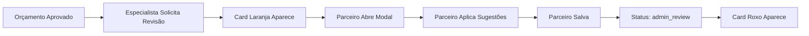
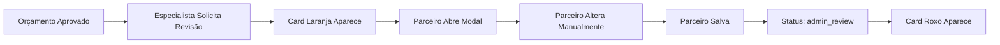

# 🧪 Guia de Teste - Fluxo de Revisão de Prazos do Parceiro

## ✅ Status da Implementação: COMPLETO

Todas as funcionalidades foram implementadas:
- ✅ Backend (3 APIs)
- ✅ Frontend (2 Cards + Modal)
- ✅ Integração no Dashboard
- ✅ Banco de dados populado com dados de teste

---

## 🎯 Como Visualizar os Cards

### Dados de Teste Existentes:

**Orçamento com Revisão Solicitada:**
- **ID**: `1a190673-e368-4a7c-8d54-5918a34c6f9b`
- **Status**: `specialist_time_revision_requested`
- **Parceiro ID**: `de4c8646-5620-486c-9038-d4dba29d8bbd`
- **Especialista**: Especialista Teste 24676

### Passo a Passo para Testar:

#### 1️⃣ Fazer Login como Parceiro Correto

Você precisa fazer login com o parceiro que possui o orçamento:

```sql
-- Buscar email do parceiro
SELECT p.id, p.email, p.full_name 
FROM profiles p 
WHERE p.id = 'de4c8646-5620-486c-9038-d4dba29d8bbd';
```

#### 2️⃣ Acessar o Dashboard

1. Faça login com as credenciais do parceiro
2. Navegue para `/dashboard`
3. Você deverá ver:

**Card Laranja** (no topo):
```
⏱️ Solicitações de Ajuste de Prazo (1)
┌─────────────────────────────────────────┐
│ 🚗 [PLACA] | [CLIENTE]                  │
│ Orçamento #1A190673 | Solicitado: ...   │
│ Especialista: Especialista Teste 24676  │
│                                          │
│ [Revisar Prazos] [Ver Detalhes]        │
└─────────────────────────────────────────┘
```

#### 3️⃣ Testar o Modal

1. Clique em **"Revisar Prazos"**
2. Modal abre com 3 seções:
   - ℹ️ Informações do Orçamento
   - 📝 Solicitação do Especialista
   - ✏️ Editar Prazos dos Itens
3. Edite os prazos
4. Clique em **"Salvar e Reenviar"**
5. Status muda para `admin_review`

#### 4️⃣ Ver Card Roxo

Após salvar a revisão:
1. Recarregue o dashboard
2. O **Card Laranja** desaparece (orçamento não está mais em `specialist_time_revision_requested`)
3. O **Card Roxo** aparece (orçamento agora está em `admin_review`)

```
🔍 Orçamentos em Análise (1)
┌─────────────────────────────────────────┐
│ 🚗 [PLACA] | [CLIENTE]                  │
│ Orçamento #1A190673 | Enviado em: ...   │
│ ⏱️ 0 dias                                │
│                                          │
│ ⏳ Aguardando revisão do admin          │
│                                          │
│ [Ver Detalhes]                          │
└─────────────────────────────────────────┘
```

---

## 🐛 Troubleshooting

### Card não aparece?

**Verificar se está logado como parceiro correto:**
```sql
-- Verificar qual parceiro tem orçamento pendente
SELECT 
  q.id as quote_id,
  q.status,
  p.email as partner_email,
  p.full_name as partner_name
FROM quotes q
JOIN profiles p ON q.partner_id = p.id
WHERE q.status = 'specialist_time_revision_requested';
```

**Verificar se a API está retornando dados:**
1. Abra DevTools (F12)
2. Vá para Network
3. Recarregue o dashboard
4. Procure por requisição: `GET /api/partner/quotes/pending-time-revisions`
5. Verifique a resposta

**Verificar console do navegador:**
- Abra Console (F12)
- Procure por erros relacionados a `usePartnerTimeRevisions`

---

## 🔄 Fluxo Completo de Teste

### Cenário 1: Revisão com Sugestões



### Cenário 2: Revisão sem Sugestões



---

## 📸 Screenshots Esperados

### Dashboard com Cards

```
┌──────────────────────────────────────────────────────────┐
│  Dashboard do Parceiro                                   │
├──────────────────────────────────────────────────────────┤
│  Bem-vindo, Parceiro Teste!                              │
│                                                          │
│  ⏱️ Solicitações de Ajuste de Prazo (1) 🔴             │
│  [Card Laranja com orçamento pendente]                   │
│                                                          │
│  🔍 Orçamentos em Análise (0)                           │
│  [Oculto - sem dados]                                    │
│                                                          │
│  📊 Orçamentos                                           │
│  [Contadores: Pendente, Em Análise, etc.]               │
└──────────────────────────────────────────────────────────┘
```

### Modal de Revisão

```
┌──────────────────────────────────────────────────────────┐
│  Revisar Prazos - Orçamento #1A190673             [X]   │
├──────────────────────────────────────────────────────────┤
│                                                          │
│  ℹ️ Informações do Orçamento                            │
│  Cliente: [Nome] | Veículo: [Modelo - Placa]           │
│                                                          │
│  📝 Solicitação do Especialista                         │
│  Especialista: Especialista Teste 24676                 │
│  Comentário: [Se houver]                                │
│                                                          │
│  ✏️ Editar Prazos dos Itens                             │
│  1. [Descrição Item]                                    │
│     Prazo Atual: [X] dias                               │
│     💡 Sugestão: [Y] dias [Aplicar Sugestão]           │
│     Novo Prazo: [___] dias                              │
│                                                          │
│  2. [Descrição Item]...                                 │
│                                                          │
│  💬 Comentário (opcional): [_____]                      │
│                                                          │
├──────────────────────────────────────────────────────────┤
│                           [Cancelar] [Salvar e Reenviar]│
└──────────────────────────────────────────────────────────┘
```

---

## 🧪 Comandos Úteis

### Verificar Status dos Orçamentos
```sql
SELECT id, status, partner_id 
FROM quotes 
WHERE status IN ('specialist_time_revision_requested', 'admin_review');
```

### Criar Novo Teste
```sql
-- Mudar um orçamento para specialist_time_revision_requested
UPDATE quotes 
SET status = 'specialist_time_revision_requested' 
WHERE id = '[SEU_QUOTE_ID]';

-- Criar registro de revisão
INSERT INTO quote_time_reviews (
  quote_id, 
  specialist_id, 
  action, 
  comments
) VALUES (
  '[SEU_QUOTE_ID]',
  '[ID_ESPECIALISTA]',
  'revision_requested',
  'Teste de revisão de prazos'
);
```

### Resetar Teste
```sql
-- Voltar orçamento para approved
UPDATE quotes 
SET status = 'approved' 
WHERE id = '[SEU_QUOTE_ID]';

-- Limpar registros de revisão
DELETE FROM quote_time_reviews 
WHERE quote_id = '[SEU_QUOTE_ID]';
```

---

## ✅ Checklist de Validação

- [ ] Login como parceiro correto
- [ ] Dashboard carregando sem erros
- [ ] Card laranja aparece quando há revisão solicitada
- [ ] Botão "Revisar Prazos" abre modal
- [ ] Modal exibe informações do orçamento
- [ ] Modal exibe solicitação do especialista
- [ ] Modal exibe itens para editar
- [ ] Botão "Aplicar Sugestão" funciona
- [ ] Validação de campos funciona
- [ ] Salvar atualiza prazos no banco
- [ ] Status muda para admin_review
- [ ] Card roxo aparece após salvar
- [ ] Toast de sucesso aparece

---

## 📞 Suporte

Se algum passo não funcionar, verifique:
1. Console do navegador (F12) para erros
2. Network tab para requisições falhadas
3. Logs do servidor Next.js
4. Logs do Supabase

**Documentos relacionados:**
- [PARTNER_TIME_REVISION_FLOW.md](./PARTNER_TIME_REVISION_FLOW.md) - Planejamento completo
- [SPECIALIST_TIME_APPROVAL.md](./SPECIALIST_TIME_APPROVAL.md) - Fluxo do especialista
