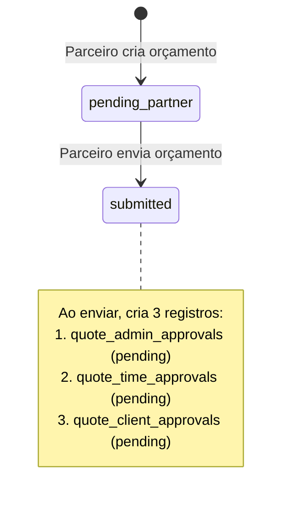
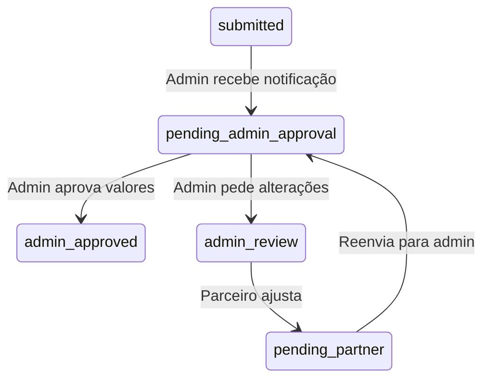
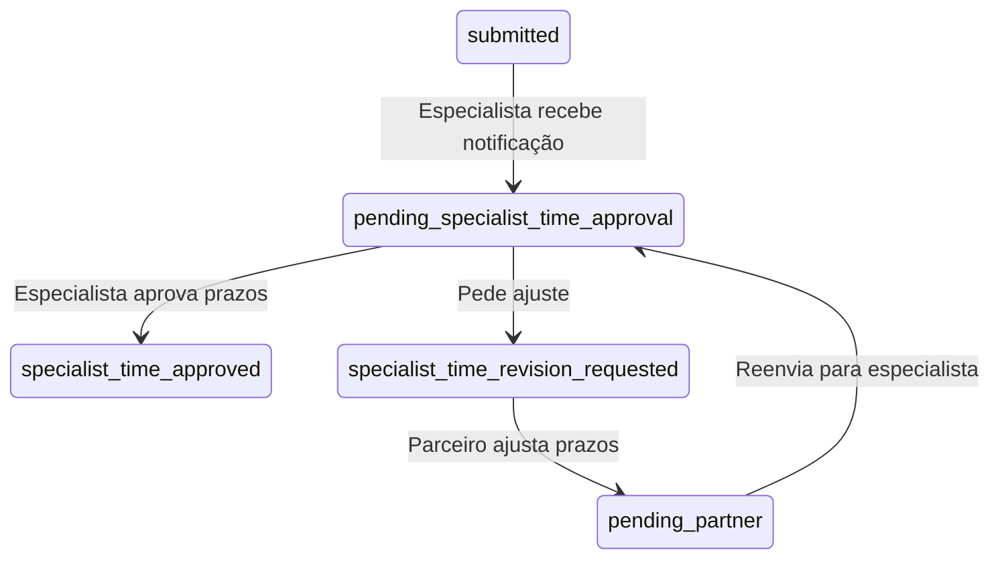
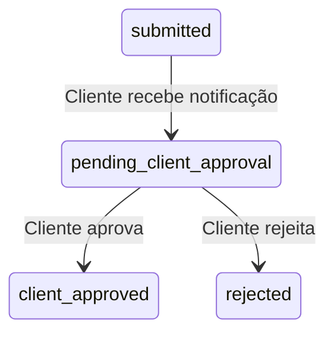
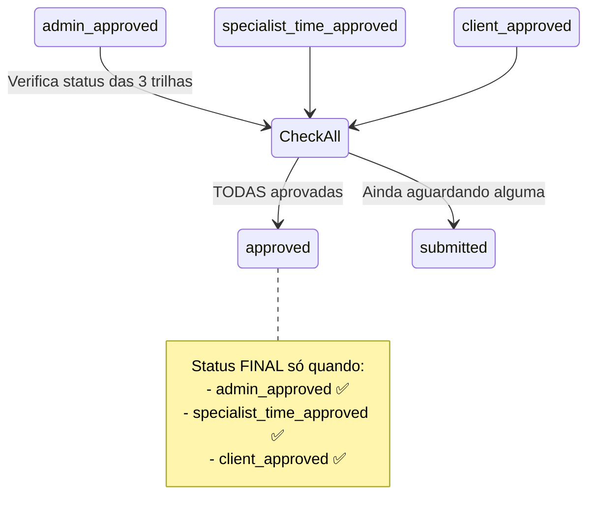

# 🔄 Redesign do Fluxo de Aprovação de Orçamentos

**Data**: 15/10/2025  
**Objetivo**: Separar os fluxos de aprovação em 3 trilhas independentes que convergem para o status `approved`

---

## 🎯 Problema Atual

O fluxo atual está acoplado e confuso:
- O especialista só pode revisar prazos quando o orçamento já está `approved`
- Não há separação clara entre aprovação de valores (admin) e aprovação de prazos (especialista)
- O status `approved` é usado prematuramente

---

## ✅ Solução Proposta: 3 Trilhas Independentes

### Conceito: Aprovações em Paralelo

```
┌─────────────────────────────────────────────────────────────────┐
│                    ORÇAMENTO CRIADO                             │
│                   (pending_partner)                             │
└─────────────────────────────────────────────────────────────────┘
                              │
                              ▼
┌─────────────────────────────────────────────────────────────────┐
│              PARCEIRO ENVIA ORÇAMENTO                           │
│              (3 fluxos iniciam em PARALELO)                     │
└─────────────────────────────────────────────────────────────────┘
                              │
           ┌──────────────────┼──────────────────┐
           │                  │                  │
           ▼                  ▼                  ▼
    ┌──────────┐      ┌──────────┐      ┌──────────┐
    │  TRILHA  │      │  TRILHA  │      │  TRILHA  │
    │   ADMIN  │      │ESPECIALIS│      │ CLIENTE  │
    │          │      │    TA    │      │          │
    └──────────┘      └──────────┘      └──────────┘
           │                  │                  │
           └──────────────────┼──────────────────┘
                              ▼
                    ┌──────────────────┐
                    │  TODAS AS 3      │
                    │  APROVAÇÕES OK?  │
                    └──────────────────┘
                              │
                              ▼
                    ┌──────────────────┐
                    │    APPROVED      │
                    │  (Status Final)  │
                    └──────────────────┘
```

---

## 📊 Novos Status do Orçamento

### Status de Controle de Fluxo

| Status | Descrição | Significado |
|--------|-----------|-------------|
| `pending_partner` | Orçamento sendo criado pelo parceiro | Ainda não enviado |
| `submitted` | **NOVO** - Orçamento enviado, aguardando 3 aprovações | Fluxo iniciado |
| `pending_admin_approval` | Aguardando aprovação do admin (valores/itens) | Trilha Admin pendente |
| `admin_approved` | **NOVO** - Admin aprovou valores | ✅ Trilha Admin completa |
| `pending_specialist_time_approval` | Aguardando aprovação de prazos pelo especialista | Trilha Especialista pendente |
| `specialist_time_approved` | Especialista aprovou prazos | ✅ Trilha Especialista completa |
| `pending_client_approval` | Aguardando aprovação do cliente | Trilha Cliente pendente |
| `client_approved` | **NOVO** - Cliente aprovou | ✅ Trilha Cliente completa |
| `approved` | **TODAS as 3 aprovações concluídas** | ✅✅✅ Status FINAL |

### Status de Revisão/Exceção

| Status | Descrição | Quando Usar |
|--------|-----------|-------------|
| `admin_review` | Admin solicitou alterações | Volta para parceiro |
| `specialist_time_revision_requested` | Especialista pediu ajuste de prazos | Volta para parceiro |
| `rejected` | Algum ator rejeitou o orçamento | Fluxo encerrado |

---

## 🔄 Fluxo Detalhado com 3 Trilhas

### Fase 1: Criação e Envio



### Fase 2: As 3 Trilhas Paralelas

#### Trilha 1: Admin (Valores e Itens)



**Campos de Controle:**
```sql
-- Nova tabela: quote_admin_approvals
CREATE TABLE quote_admin_approvals (
    id UUID PRIMARY KEY DEFAULT gen_random_uuid(),
    quote_id UUID NOT NULL REFERENCES quotes(id),
    admin_id UUID REFERENCES admins(id),
    status TEXT NOT NULL CHECK (status IN ('pending', 'approved', 'revision_requested')),
    comments TEXT,
    approved_at TIMESTAMPTZ,
    created_at TIMESTAMPTZ DEFAULT now()
);
```

#### Trilha 2: Especialista (Prazos)



**Campos de Controle:**
```sql
-- Tabela existente: quote_time_reviews (já criada)
-- Ajustar para usar status mais claro
ALTER TABLE quote_time_reviews 
ADD COLUMN status TEXT CHECK (status IN ('pending', 'approved', 'revision_requested'));
```

#### Trilha 3: Cliente (Aprovação Final)



**Campos de Controle:**
```sql
-- Nova tabela: quote_client_approvals
CREATE TABLE quote_client_approvals (
    id UUID PRIMARY KEY DEFAULT gen_random_uuid(),
    quote_id UUID NOT NULL REFERENCES quotes(id),
    client_id UUID REFERENCES clients(id),
    status TEXT NOT NULL CHECK (status IN ('pending', 'approved', 'rejected')),
    comments TEXT,
    approved_at TIMESTAMPTZ,
    created_at TIMESTAMPTZ DEFAULT now()
);
```

### Fase 3: Convergência para `approved`



---

## 🗄️ Estrutura de Dados Completa

### Tabela Central: `quotes`

```sql
ALTER TABLE quotes ADD COLUMN IF NOT EXISTS approval_status JSONB DEFAULT '{
    "admin": "pending",
    "specialist_time": "pending",
    "client": "pending"
}'::jsonb;

-- Função para verificar se todas as aprovações estão completas
CREATE OR REPLACE FUNCTION check_all_approvals_completed(p_quote_id UUID)
RETURNS BOOLEAN AS $$
DECLARE
    v_approval_status JSONB;
BEGIN
    SELECT approval_status INTO v_approval_status
    FROM quotes
    WHERE id = p_quote_id;
    
    RETURN (
        v_approval_status->>'admin' = 'approved' AND
        v_approval_status->>'specialist_time' = 'approved' AND
        v_approval_status->>'client' = 'approved'
    );
END;
$$ LANGUAGE plpgsql;

-- Trigger para atualizar status para 'approved' quando todas as trilhas completarem
CREATE OR REPLACE FUNCTION update_quote_status_on_approval()
RETURNS TRIGGER AS $$
BEGIN
    IF check_all_approvals_completed(NEW.id) THEN
        UPDATE quotes
        SET status = 'approved'
        WHERE id = NEW.id;
    END IF;
    
    RETURN NEW;
END;
$$ LANGUAGE plpgsql;

CREATE TRIGGER trg_update_quote_status_on_approval
AFTER UPDATE OF approval_status ON quotes
FOR EACH ROW
EXECUTE FUNCTION update_quote_status_on_approval();
```

### Tabelas de Controle

#### 1. Admin Approvals

```sql
CREATE TABLE IF NOT EXISTS quote_admin_approvals (
    id UUID PRIMARY KEY DEFAULT gen_random_uuid(),
    quote_id UUID NOT NULL REFERENCES quotes(id) ON DELETE CASCADE,
    admin_id UUID REFERENCES profiles(id),
    status TEXT NOT NULL CHECK (status IN ('pending', 'approved', 'revision_requested')),
    comments TEXT,
    reviewed_items JSONB, -- Itens específicos revisados
    approved_at TIMESTAMPTZ,
    created_at TIMESTAMPTZ DEFAULT now(),
    updated_at TIMESTAMPTZ DEFAULT now()
);

CREATE INDEX idx_admin_approvals_quote_id ON quote_admin_approvals(quote_id);
CREATE INDEX idx_admin_approvals_status ON quote_admin_approvals(status);
```

#### 2. Time Approvals (já existe, ajustar)

```sql
-- Tabela quote_time_reviews já existe
-- Adicionar coluna de status para clareza
ALTER TABLE quote_time_reviews 
ADD COLUMN IF NOT EXISTS approval_status TEXT 
CHECK (approval_status IN ('pending', 'approved', 'revision_requested'));

-- Popular com base no action existente
UPDATE quote_time_reviews
SET approval_status = CASE
    WHEN action = 'approved' THEN 'approved'
    WHEN action = 'revision_requested' THEN 'revision_requested'
    ELSE 'pending'
END
WHERE approval_status IS NULL;
```

#### 3. Client Approvals

```sql
CREATE TABLE IF NOT EXISTS quote_client_approvals (
    id UUID PRIMARY KEY DEFAULT gen_random_uuid(),
    quote_id UUID NOT NULL REFERENCES quotes(id) ON DELETE CASCADE,
    client_id UUID REFERENCES profiles(id),
    status TEXT NOT NULL CHECK (status IN ('pending', 'approved', 'rejected')),
    comments TEXT,
    approved_at TIMESTAMPTZ,
    rejected_at TIMESTAMPTZ,
    created_at TIMESTAMPTZ DEFAULT now(),
    updated_at TIMESTAMPTZ DEFAULT now()
);

CREATE INDEX idx_client_approvals_quote_id ON quote_client_approvals(quote_id);
CREATE INDEX idx_client_approvals_status ON quote_client_approvals(status);
```

---

## 🔄 APIs Necessárias

### 1. API do Parceiro

#### POST `/api/partner/quotes/[quoteId]/submit`
```typescript
// Envia o orçamento e inicia as 3 trilhas
{
  "action": "submit"
}

// Resposta:
{
  "success": true,
  "data": {
    "quote_id": "...",
    "status": "submitted",
    "approval_status": {
      "admin": "pending",
      "specialist_time": "pending",
      "client": "pending"
    }
  }
}
```

### 2. APIs do Admin

#### GET `/api/admin/quotes/pending-approval`
```typescript
// Lista orçamentos aguardando aprovação do admin
// Filtra: approval_status->>'admin' = 'pending'
```

#### POST `/api/admin/quotes/[quoteId]/approve`
```typescript
{
  "action": "approve", // ou "request_revision"
  "comments": "..."
}

// Atualiza:
// approval_status->>'admin' = 'approved'
// Verifica se todas as 3 estão aprovadas → status = 'approved'
```

### 3. APIs do Especialista

#### GET `/api/specialist/quotes/pending-time-approval`
```typescript
// Lista orçamentos aguardando aprovação de prazos
// Filtra: approval_status->>'specialist_time' = 'pending'
```

#### POST `/api/specialist/quotes/[quoteId]/approve-times`
```typescript
{
  "action": "approve", // ou "request_revision"
  "comments": "...",
  "revision_requests": { ... }
}

// Atualiza:
// approval_status->>'specialist_time' = 'approved'
// Verifica se todas as 3 estão aprovadas → status = 'approved'
```

### 4. APIs do Cliente

#### GET `/api/client/quotes/pending-approval`
```typescript
// Lista orçamentos aguardando aprovação do cliente
// Filtra: approval_status->>'client' = 'pending'
```

#### POST `/api/client/quotes/[quoteId]/approve`
```typescript
{
  "action": "approve", // ou "reject"
  "comments": "..."
}

// Atualiza:
// approval_status->>'client' = 'approved'
// Verifica se todas as 3 estão aprovadas → status = 'approved'
```

---

## 📋 Plano de Implementação

### Fase 1: Migrations (2 horas)

1. ✅ Criar `quote_admin_approvals`
2. ✅ Criar `quote_client_approvals`
3. ✅ Adicionar `approval_status` JSONB em `quotes`
4. ✅ Criar funções de verificação
5. ✅ Criar triggers automáticos

### Fase 2: Backend - Admin (3 horas)

1. Criar `GET /api/admin/quotes/pending-approval`
2. Criar `POST /api/admin/quotes/[quoteId]/approve`
3. Ajustar dashboard do admin

### Fase 3: Backend - Especialista (2 horas)

1. Ajustar `GET /api/specialist/quotes/pending-time-approval`
2. Ajustar `POST /api/specialist/quotes/[quoteId]/approve-times`
3. Usar `approval_status` ao invés de `status`

### Fase 4: Backend - Cliente (3 horas)

1. Criar `GET /api/client/quotes/pending-approval`
2. Criar `POST /api/client/quotes/[quoteId]/approve`
3. Criar interface de aprovação para o cliente

### Fase 5: Backend - Parceiro (2 horas)

1. Criar `POST /api/partner/quotes/[quoteId]/submit`
2. Ajustar APIs de atualização após revisão
3. Mostrar status das 3 trilhas no dashboard

### Fase 6: Frontend (4 horas)

1. Dashboard do Admin com filtro por `approval_status.admin`
2. Dashboard do Especialista com filtro por `approval_status.specialist_time`
3. Dashboard do Cliente com lista de orçamentos pendentes
4. Dashboard do Parceiro mostrando status das 3 trilhas

### Fase 7: Testes (2 horas)

1. Testar fluxo completo (3 atores aprovam)
2. Testar cenários de revisão
3. Testar rejeição
4. Testar concorrência (2 atores aprovam simultaneamente)

---

## 📊 Exemplos de Estados

### Exemplo 1: Aprovação Linear

```json
{
  "quote_id": "123",
  "status": "submitted",
  "approval_status": {
    "admin": "pending",
    "specialist_time": "pending",
    "client": "pending"
  }
}

// Admin aprova primeiro
→ approval_status.admin = "approved"
→ status = "submitted" (ainda aguardando outros 2)

// Especialista aprova
→ approval_status.specialist_time = "approved"
→ status = "submitted" (ainda aguardando cliente)

// Cliente aprova
→ approval_status.client = "approved"
→ status = "approved" ✅ (TODAS COMPLETAS)
```

### Exemplo 2: Com Revisão do Especialista

```json
{
  "quote_id": "456",
  "status": "submitted",
  "approval_status": {
    "admin": "approved", // ✅ Admin já aprovou
    "specialist_time": "pending",
    "client": "approved" // ✅ Cliente já aprovou
  }
}

// Especialista pede revisão
→ approval_status.specialist_time = "revision_requested"
→ status = "specialist_time_revision_requested" 
→ Volta para parceiro

// Parceiro ajusta e reenvia
→ approval_status.specialist_time = "pending"
→ status = "submitted"

// Especialista aprova
→ approval_status.specialist_time = "approved"
→ status = "approved" ✅ (TODAS COMPLETAS)
```

---

## ✅ Benefícios da Nova Arquitetura

1. **Independência**: Cada ator pode trabalhar em paralelo
2. **Clareza**: Status `approved` só quando TUDO está aprovado
3. **Rastreabilidade**: Cada trilha tem histórico próprio
4. **Flexibilidade**: Fácil adicionar novos atores no futuro
5. **Performance**: Menos dependências entre fluxos

---

## 🚀 Próximos Passos Imediatos

1. **Revisar este documento** com o time
2. **Criar migrations** da Fase 1
3. **Implementar Backend** seguindo as fases 2-5
4. **Testar** cenários críticos
5. **Deploy** gradual com feature flag

---

**Aprovado por**: _____________________  
**Data de Início**: 15/10/2025  
**Estimativa Total**: 18 horas (2-3 dias)
