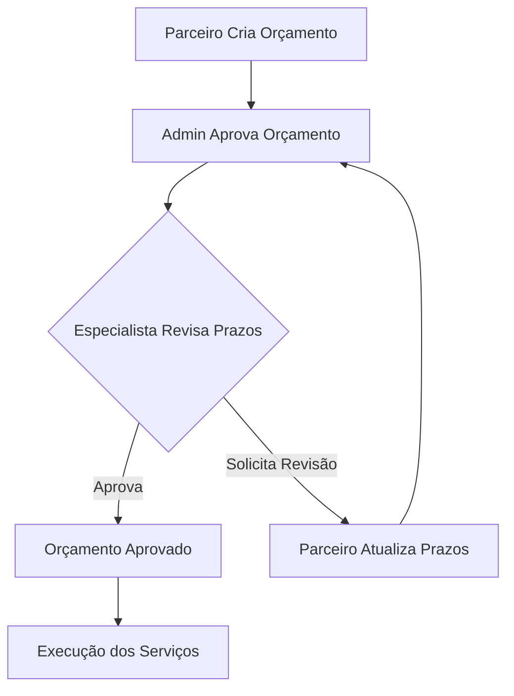

# Feature: Aprovação de Prazos por Especialistas

## 📋 Resumo

Esta feature permite que especialistas revisem e aprovem os prazos estimados definidos pelos parceiros nos orçamentos, criando um processo de validação adicional antes da execução dos serviços.

## 🎯 Objetivo

Permitir que especialistas, que conhecem melhor os clientes e suas necessidades, validem se os prazos propostos pelos parceiros são realistas e adequados, evitando conflitos e expectativas não atendidas.

## 🔄 Fluxo de Trabalho



### Passo a Passo

1. **Parceiro** cria orçamento com prazos estimados para cada serviço
   - Status: `pending_admin_approval`

2. **Admin** revisa e aprova o orçamento integralmente
   - Status: `approved`

3. **Especialista** acessa o dashboard e vê notificação de novos orçamentos
   - Clica no contador "Aprovações de prazo: X"
   - Navega para `/dashboard/specialist/time-approvals`
   - Vê lista de orçamentos aprovados aguardando revisão de prazos

4. **Especialista** avalia cada orçamento e pode:
   
   **Opção A - Aprovar:**
   - Clica em "Avaliar Prazos"
   - Seleciona "Aprovar todos os prazos"
   - Adiciona observações (opcional)
   - Confirma
   - Status: `specialist_time_approved`
   
   **Opção B - Solicitar Revisão:**
   - Clica em "Avaliar Prazos"
   - Seleciona "Solicitar revisão"
   - Para cada item que precisa de ajuste:
     - Define prazo sugerido (dias)
     - Explica o motivo
   - Adiciona observações gerais (opcional)
   - Confirma
   - Status: `specialist_time_revision_requested`

5. **Parceiro** [PENDENTE] vê notificação de revisão solicitada
   - Acessa o orçamento
   - Vê detalhes das revisões solicitadas
   - Atualiza os prazos conforme sugestões
   - Salva alterações
   - Status volta para: `approved`
   - **Volta para passo 3** (novo ciclo de revisão)

## 🗄️ Estrutura de Dados

### Tabela: `quote_time_reviews`

Armazena o histórico de revisões de prazos:

```sql
CREATE TABLE quote_time_reviews (
    id UUID PRIMARY KEY,
    quote_id UUID REFERENCES quotes(id),
    specialist_id UUID REFERENCES specialists(profile_id),
    action TEXT CHECK (action IN ('approved', 'revision_requested')),
    comments TEXT,
    reviewed_item_ids UUID[],
    revision_requests JSONB,
    created_by UUID REFERENCES profiles(id),
    created_at TIMESTAMP,
    updated_at TIMESTAMP
);
```

**Exemplo de `revision_requests`:**
```json
{
  "item-uuid-1": {
    "suggested_days": 5,
    "reason": "Esse tipo de serviço costuma levar 5 dias úteis"
  },
  "item-uuid-2": {
    "suggested_days": 3,
    "reason": "Prazo muito otimista, recomendo adicionar 1 dia"
  }
}
```

### ENUM: `quote_status`

Novos valores adicionados:
- `specialist_time_approved`: Prazos aprovados pelo especialista
- `specialist_time_revision_requested`: Especialista solicitou revisão

## 🔌 APIs

### Especialista

#### 1. Listar Orçamentos Pendentes
```http
GET /api/specialist/quotes/pending-time-approval
Authorization: Bearer {token}
```

**Response 200:**
```json
{
  "success": true,
  "data": [
    {
      "id": "quote-uuid",
      "created_at": "2025-10-15T10:30:00Z",
      "total_value": 1500.00,
      "status": "approved",
      "partners": {
        "company_name": "Oficina XYZ"
      },
      "vehicles": {
        "plate": "ABC-1234",
        "model": "Civic",
        "brand": "Honda"
      },
      "clients": {
        "full_name": "João Silva"
      },
      "items": [
        {
          "id": "item-uuid",
          "description": "Troca de óleo",
          "quantity": 1,
          "unit_price": 150.00,
          "total_price": 150.00,
          "estimated_days": 1
        }
      ]
    }
  ]
}
```

#### 2. Revisar Prazos
```http
POST /api/specialist/quotes/{quoteId}/review-times
Authorization: Bearer {token}
Content-Type: application/json
```

**Body (Aprovar):**
```json
{
  "action": "approved",
  "comments": "Prazos adequados para este cliente"
}
```

**Body (Solicitar Revisão):**
```json
{
  "action": "revision_requested",
  "comments": "Alguns prazos precisam ser ajustados",
  "revision_requests": {
    "item-uuid-1": {
      "suggested_days": 5,
      "reason": "Cliente costuma ter atrasos em aprovações"
    }
  }
}
```

**Response 200:**
```json
{
  "success": true,
  "data": {
    "id": "review-uuid",
    "quote_id": "quote-uuid",
    "action": "revision_requested",
    "created_at": "2025-10-15T11:00:00Z"
  }
}
```

### Parceiro (PENDENTE)

#### 3. Ver Revisões Solicitadas
```http
GET /api/partner/quotes/{quoteId}/time-reviews
Authorization: Bearer {token}
```

#### 4. Atualizar Prazos
```http
PUT /api/partner/quotes/{quoteId}/update-times
Authorization: Bearer {token}
Content-Type: application/json
```

**Body:**
```json
{
  "items": [
    {
      "id": "item-uuid-1",
      "estimated_days": 5
    },
    {
      "id": "item-uuid-2",
      "estimated_days": 3
    }
  ]
}
```

## 🎨 Interface

### Especialista

#### Dashboard
- **Contador**: Mostra quantidade de aprovações pendentes
- **Clique**: Navega para página de aprovações

#### Página de Aprovações (`/dashboard/specialist/time-approvals`)
- **Lista**: Cards com informações de cada orçamento
- **Filtros**: [FUTURO] Por cliente, parceiro, data
- **Ações**: Botão "Avaliar Prazos" em cada card

#### Modal de Avaliação
- **Opções**:
  - ✅ Aprovar todos os prazos
  - 🔄 Solicitar revisão
- **Campos** (quando solicitar revisão):
  - Para cada item:
    - Prazo sugerido (número)
    - Motivo da sugestão (texto)
  - Observações gerais (textarea)

### Parceiro (PENDENTE)

#### Página de Orçamento
- **Indicador**: Badge mostrando "Revisão Pendente"
- **Modal**: Visualizar revisões solicitadas
- **Formulário**: Atualizar prazos específicos

## 🔐 Segurança

### RLS Policies

```sql
-- Especialistas podem ver revisões de seus clientes
CREATE POLICY "specialists_view_own_reviews"
ON quote_time_reviews FOR SELECT
USING (
  specialist_id = auth.uid() OR
  get_my_claim('role') = 'admin'
);

-- Especialistas podem criar revisões
CREATE POLICY "specialists_create_reviews"
ON quote_time_reviews FOR INSERT
WITH CHECK (
  specialist_id = auth.uid() AND
  get_my_claim('role') = 'specialist'
);

-- Admins podem gerenciar tudo
CREATE POLICY "admins_manage_all"
ON quote_time_reviews FOR ALL
USING (get_my_claim('role') = 'admin');
```

### Validações

- ✅ Especialista só pode revisar orçamentos de seus clientes
- ✅ Parceiro só pode atualizar seus próprios orçamentos
- ✅ Orçamento deve estar em status correto para ação
- ✅ Prazos devem ser > 0
- ✅ Revisões devem ter motivo quando solicitar mudanças

## 🧪 Testes

### Manual

1. **Login como Especialista**
```bash
# Acesse: http://localhost:3000/login
# Use credenciais de especialista
```

2. **Verificar Contador**
```bash
# Dashboard deve mostrar: "Aprovações de prazo: X"
```

3. **Acessar Página de Aprovações**
```bash
# Clicar no contador OU navegar para:
# http://localhost:3000/dashboard/specialist/time-approvals
```

4. **Testar Aprovação**
- Clicar em "Avaliar Prazos"
- Selecionar "Aprovar todos os prazos"
- Adicionar comentário
- Confirmar

5. **Testar Revisão**
- Clicar em "Avaliar Prazos" em outro orçamento
- Selecionar "Solicitar revisão"
- Preencher prazo sugerido e motivo
- Confirmar

### Via Script

```bash
# Execute o script de teste
./scripts/test-time-approval-api.sh

# Siga as instruções interativas
```

### Via API (curl)

```bash
# 1. Obter token (do DevTools, aba Network)
TOKEN="seu_token_aqui"

# 2. Listar pendentes
curl 'http://localhost:3000/api/specialist/quotes/pending-time-approval' \
  -H "Authorization: Bearer $TOKEN"

# 3. Aprovar
curl 'http://localhost:3000/api/specialist/quotes/QUOTE_ID/review-times' \
  -X POST \
  -H "Authorization: Bearer $TOKEN" \
  -H "Content-Type: application/json" \
  -d '{"action":"approved","comments":"OK"}'
```

## 📊 Métricas

### Implementação
- **Migrações SQL**: 2
- **APIs**: 4 (2 specialist, 2 partner)
- **Páginas**: 1
- **Componentes**: 2
- **Linhas de Código**: ~1200

### Performance
- **Query Time**: ~400-500ms (queries sequenciais)
- **Recomendação**: Criar view materializada para melhorar

## 🐛 Troubleshooting

### Erro 500 na API
**Problema**: Query complexa com joins aninhados
**Solução**: Implementada - queries sequenciais

### Counter não aparece
**Verificar**:
1. Usuário está logado como especialista?
2. Existem orçamentos com status `approved`?
3. Especialista está associado a clientes?
4. Clientes têm veículos?
5. Veículos têm service orders?
6. Service orders têm quotes?

### Revisão não é criada
**Verificar**:
1. Quote pertence a um cliente do especialista?
2. Quote está no status correto (`approved`)?
3. Dados da revisão estão válidos?
4. RLS policies estão configuradas?

## 📚 Documentação Adicional

- [Revisão Detalhada](./docs/refactoring/SPECIALIST_TIME_APPROVAL_REVIEW.md)
- [Resumo Executivo](./docs/refactoring/SPECIALIST_TIME_APPROVAL_SUMMARY.md)

## ✅ Checklist de Implementação

### Backend
- [x] Migração: Tabela `quote_time_reviews`
- [x] Migração: Novos valores ENUM `quote_status`
- [x] API: GET pending-time-approval
- [x] API: POST review-times
- [x] API: GET time-reviews (parceiro)
- [x] API: PUT update-times (parceiro)

### Frontend Especialista
- [x] Página time-approvals
- [x] Modal de revisão
- [x] Counter no dashboard
- [x] Estilização

### Frontend Parceiro
- [ ] Indicador de revisão pendente
- [ ] Modal de visualização de revisões
- [ ] Formulário de atualização de prazos
- [ ] Histórico de revisões

### Extras
- [ ] Sistema de notificações
- [ ] Logs de auditoria
- [ ] Métricas e dashboard
- [ ] Testes E2E
- [ ] View materializada (performance)

## 🚀 Próximos Passos

1. **Implementar interface do parceiro** (ALTA PRIORIDADE)
2. Testar fluxo completo end-to-end
3. Implementar notificações básicas
4. Ajustar filtros e validações baseado em feedback
5. Otimizar performance com view materializada

## 👥 Contato

Para dúvidas ou sugestões sobre esta feature, entre em contato com a equipe de desenvolvimento.