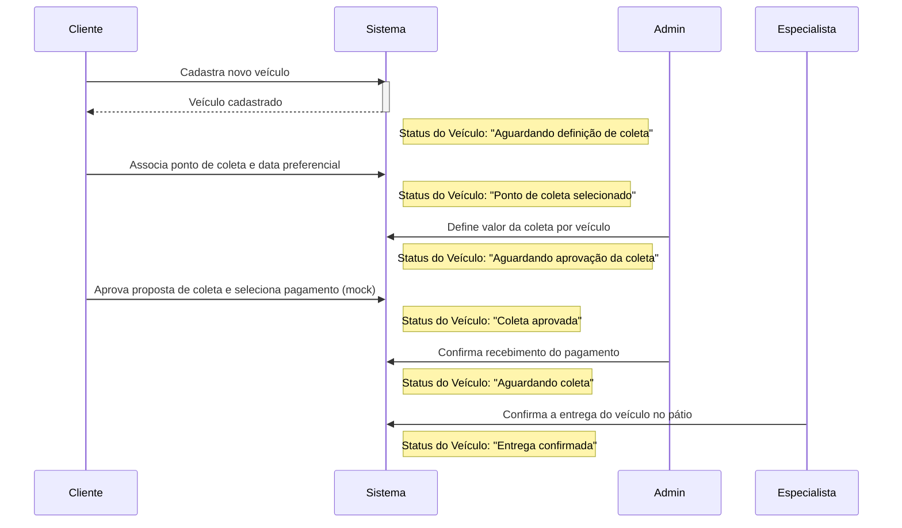

# Fluxo de Aprovação de Coleta (Caminho Feliz)

```mermaid
sequenceDiagram
    participant Cliente
    participant Sistema
    participant Admin
    participant Especialista

    Cliente->>Sistema: Cadastra novo veículo
    activate Sistema
    Sistema-->>Cliente: Veículo cadastrado
    deactivate Sistema
    note right of Sistema: Status do Veículo: "Aguardando definição de coleta"

    Cliente->>Sistema: Associa ponto de coleta e data preferencial
    note right of Sistema: Status do Veículo: "Ponto de coleta selecionado"

    Admin->>Sistema: Define valor da coleta por veículo
    note right of Sistema: Status do Veículo: "Aguardando aprovação da coleta"

    Cliente->>Sistema: Aprova proposta de coleta e seleciona pagamento (mock)
    note right of Sistema: Status do Veículo: "Coleta aprovada"

    Admin->>Sistema: Confirma recebimento do pagamento
    note right of Sistema: Status do Veículo: "Aguardando coleta"

    Especialista->>Sistema: Confirma a entrega do veículo no pátio
    note right of Sistema: Status do Veículo: "Entrega confirmada"
```
