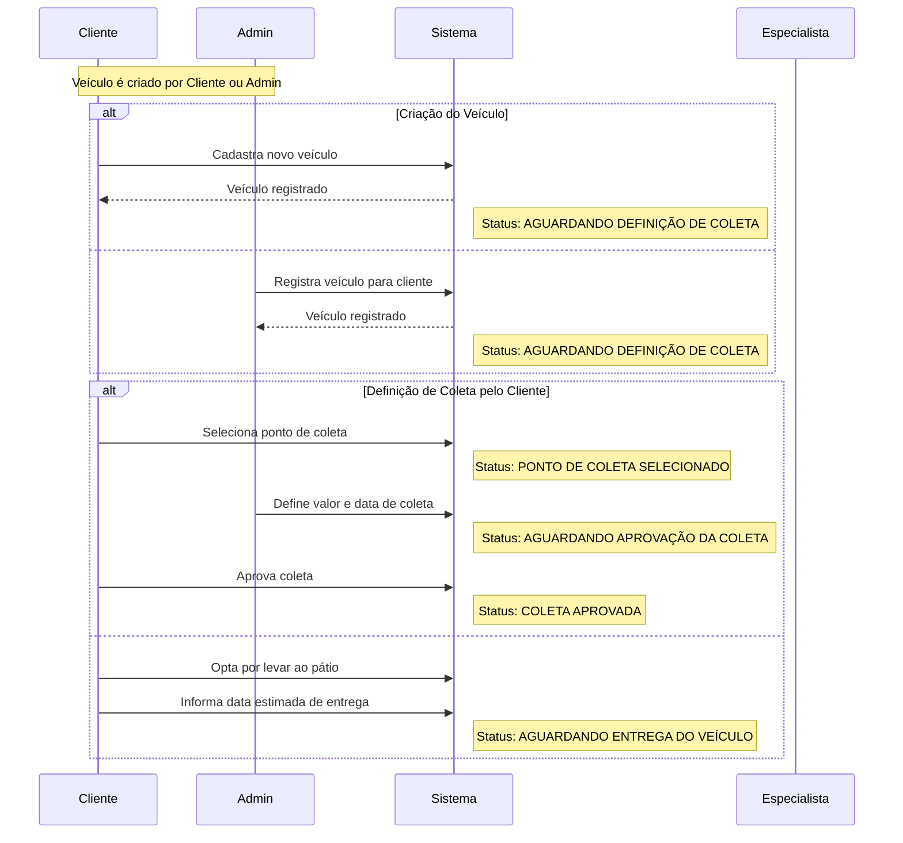
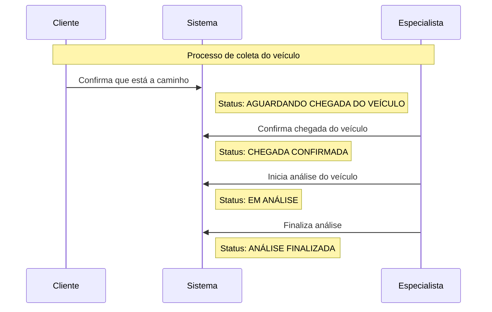
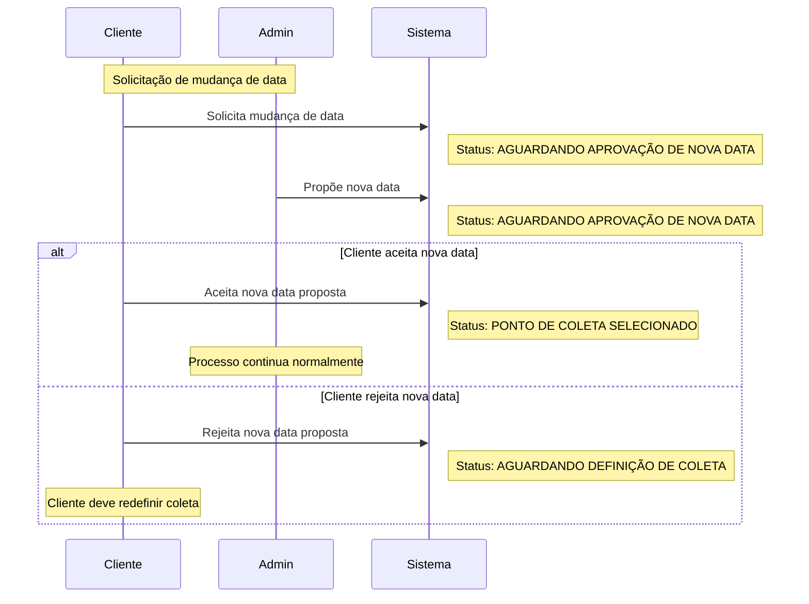
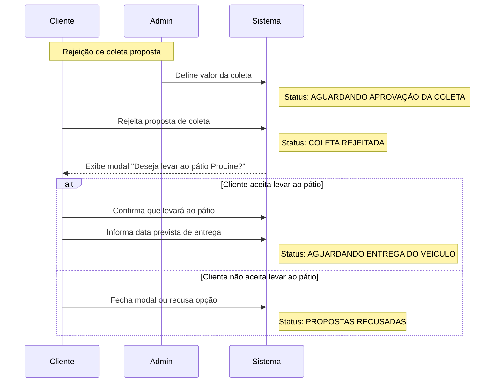
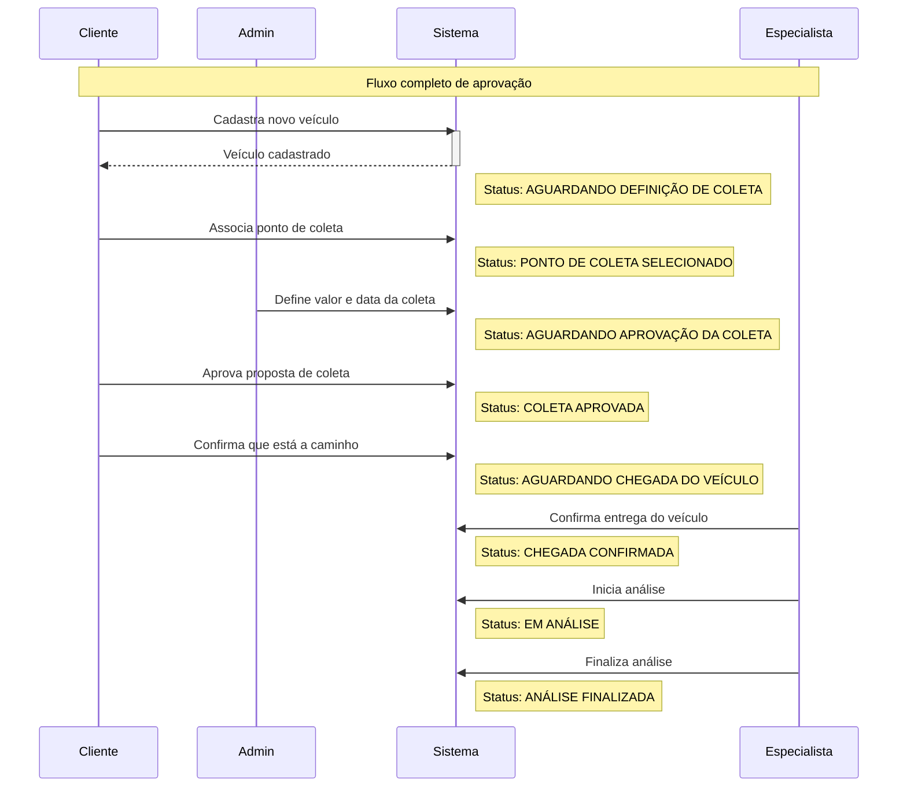

# Diagramas de Sequência dos Fluxos de Status dos Veículos

## 1. Fluxo Principal - Criação e Definição Inicial

## 2. Fluxo de Coleta e Entrega (Não será implementado no mvp)

No mvp o veículo que estiver com o estado 'Aguardando Coleta' não deve exigir nada do cliente, nenhuma ação de confirmação que o carro foi coletado. O unico agente responsável por indicar que a coleta e entrega foi finalizada é o especialista que confirma o recebimento do veículo no pátio. 

## 3. Fluxo de Mudança de Data

## 4. Fluxo de Rejeição de Coleta

## 5. Fluxo Completo de Aprovação (Caminho Feliz)

