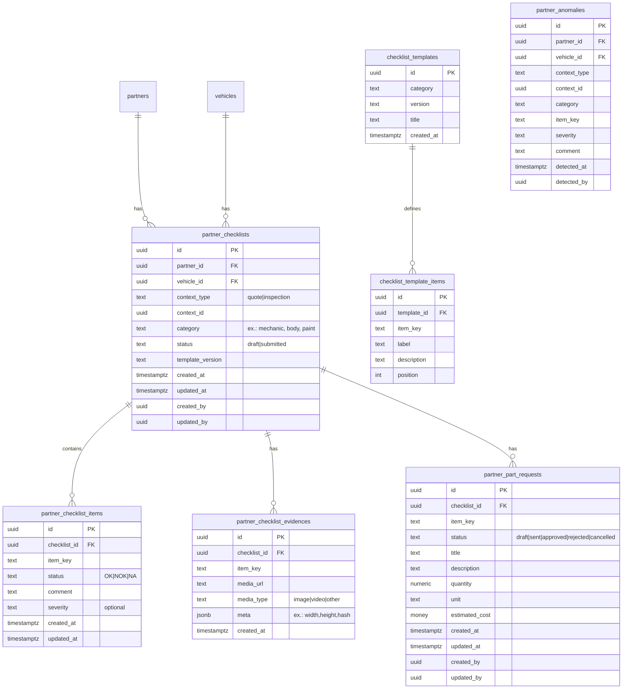

# Modelagem de Dados — Checklist/Vistoria por Parceiro

Status: proposta (alvo de implementação)

Este documento descreve um modelo de dados ideal para suportar isolamento por parceiro, contexto
(orçamento/inspeção), checklist exclusivo para mecânica e genérico para demais categorias,
evidências, solicitações de peças por item, e visualização somente leitura.

## Princípios

- Isolamento por `partner_id` garantido por chaves únicas e relacionamentos.
- Contexto normalizado como `(context_type, context_id)` para suportar `quote` e `inspection` de
  forma uniforme.
- Versionamento de templates por categoria para garantir consistência de `item_key`.
- Itens e evidências vinculados ao checklist (relação 1:N), com `item_key` como âncora semântica.
- Solicitações de peças por item (relação 1:N com checklist + `item_key`).

## Entidades Principais

- Partners (`partners`): catálogo de parceiros (fora do escopo detalhado aqui).
- Vehicles (`vehicles`): veículos (fora do escopo detalhado aqui).
- Partner Checklists (`partner_checklists`): registro raiz por parceiro/veículo/contexto/categoria.
- Items (`partner_checklist_items`): respostas por item (`item_key`).
- Evidences (`partner_checklist_evidences`): mídias por item e checklist.
- Part Requests (`partner_part_requests`): solicitações de compra por item.
- Templates (`checklist_templates`, `checklist_template_items`): versões por categoria.
- Anomalies (`partner_anomalies`): derivadas de itens NOK (opcional/derivada).

## Diagrama ER (Mermaid)



## DDL Sugerido (PostgreSQL)

### partner_checklists

```sql
create table if not exists partner_checklists (
  id uuid primary key default gen_random_uuid(),
  partner_id uuid not null references partners(profile_id) on delete cascade,
  vehicle_id uuid not null references vehicles(id) on delete cascade,
  context_type text not null check (context_type in ('quote','inspection')),
  context_id uuid not null,
  category text not null, -- ex.: 'mechanic', 'body', 'paint', 'electrical'
  status text not null default 'draft' check (status in ('draft','submitted')),
  template_version text not null,
  created_at timestamptz not null default now(),
  updated_at timestamptz not null default now(),
  created_by uuid references profiles(id),
  updated_by uuid references profiles(id),
  unique (partner_id, vehicle_id, context_type, context_id, category)
);
create index if not exists idx_partner_checklists_lookup
  on partner_checklists (partner_id, vehicle_id, context_type, context_id, category);
create index if not exists idx_partner_checklists_vehicle
  on partner_checklists (vehicle_id, context_type, context_id);
```

### partner_checklist_items

```sql
create table if not exists partner_checklist_items (
  id uuid primary key default gen_random_uuid(),
  checklist_id uuid not null references partner_checklists(id) on delete cascade,
  item_key text not null,
  status text not null check (status in ('OK','NOK','NA')),
  comment text,
  severity text check (severity in ('low','medium','high')),
  created_at timestamptz not null default now(),
  updated_at timestamptz not null default now(),
  unique (checklist_id, item_key)
);
create index if not exists idx_items_checklist on partner_checklist_items (checklist_id);
create index if not exists idx_items_key on partner_checklist_items (item_key);
```

### partner_checklist_evidences

```sql
create table if not exists partner_checklist_evidences (
  id uuid primary key default gen_random_uuid(),
  checklist_id uuid not null references partner_checklists(id) on delete cascade,
  item_key text not null,
  media_url text not null,
  media_type text check (media_type in ('image','video','other')),
  meta jsonb,
  created_at timestamptz not null default now()
);
create index if not exists idx_evidences_checklist on partner_checklist_evidences (checklist_id);
create index if not exists idx_evidences_item_key on partner_checklist_evidences (item_key);
```

### partner_part_requests

```sql
create table if not exists partner_part_requests (
  id uuid primary key default gen_random_uuid(),
  checklist_id uuid not null references partner_checklists(id) on delete cascade,
  item_key text not null,
  status text not null default 'draft' check (status in ('draft','sent','approved','rejected','cancelled')),
  title text not null,
  description text,
  quantity numeric default 1 check (quantity > 0),
  unit text,
  estimated_cost numeric,
  created_at timestamptz not null default now(),
  updated_at timestamptz not null default now(),
  created_by uuid references profiles(id),
  updated_by uuid references profiles(id),
  unique (checklist_id, item_key)
);
create index if not exists idx_part_requests_checklist on partner_part_requests (checklist_id);
```

### checklist_templates e checklist_template_items

```sql
create table if not exists checklist_templates (
  id uuid primary key default gen_random_uuid(),
  category text not null,
  version text not null,
  title text not null,
  created_at timestamptz not null default now(),
  unique (category, version)
);
create table if not exists checklist_template_items (
  id uuid primary key default gen_random_uuid(),
  template_id uuid not null references checklist_templates(id) on delete cascade,
  item_key text not null,
  label text not null,
  description text,
  position int,
  unique (template_id, item_key)
);
```

### partner_anomalies (opcional)

```sql
create table if not exists partner_anomalies (
  id uuid primary key default gen_random_uuid(),
  partner_id uuid not null references partners(profile_id) on delete cascade,
  vehicle_id uuid not null references vehicles(id) on delete cascade,
  context_type text not null check (context_type in ('quote','inspection')),
  context_id uuid not null,
  category text not null,
  item_key text not null,
  severity text check (severity in ('low','medium','high')),
  comment text,
  detected_at timestamptz not null default now(),
  detected_by uuid references profiles(id),
  unique (partner_id, vehicle_id, context_type, context_id, category, item_key)
);
create index if not exists idx_anomalies_partner on partner_anomalies (partner_id);
create index if not exists idx_anomalies_vehicle on partner_anomalies (vehicle_id);
```

## Views Auxiliares

### vw_partner_checklist_summary

```sql
create or replace view vw_partner_checklist_summary as
select
  c.id as checklist_id,
  c.partner_id,
  c.vehicle_id,
  c.context_type,
  c.context_id,
  c.category,
  c.status,
  count(i.id) as total_items,
  count(case when i.status = 'OK' then 1 end) as items_ok,
  count(case when i.status = 'NOK' then 1 end) as items_nok,
  count(case when i.status = 'NA' then 1 end) as items_na,
  count(e.id) as total_evidences,
  count(pr.id) as total_part_requests,
  greatest(c.updated_at, max(i.updated_at), max(e.created_at), max(pr.updated_at)) as last_activity_at
from partner_checklists c
left join partner_checklist_items i on i.checklist_id = c.id
left join partner_checklist_evidences e on e.checklist_id = c.id
left join partner_part_requests pr on pr.checklist_id = c.id
group by 1,2,3,4,5,6,7,c.updated_at;
```

## Regras e Garantias

- Unicidade: checklist único por `(partner_id, vehicle_id, context_type, context_id, category)`.
- Integridade: deleção em cascata de itens/evidências/solicitações ao remover checklist.
- Estabilidade de `item_key`: garantida pelo template e versionamento; chaves únicas por template.
- Desempenho: índices por colunas de filtro; evitar scans por mídia.

## Migração de Legado (alto nível)

- Caso existam tabelas específicas de mecânica sem `partner_id` em itens/evidências, migrar para o
  modelo aqui proposto:
  - Promover registros existentes para `partner_checklists` (criando um checklist por
    parceiro/contexto).
  - Migrar itens e evidências para `partner_checklist_items/evidences` preservando `item_key`.
  - Mapear `quote_id/inspection_id` para `(context_type, context_id)`.
- Se manter tabelas antigas por compatibilidade, criar processos ETL/espelhos até desativação.

## Boas Práticas de Armazenamento de Mídia

- Armazenar `media_url` como URL assinada/indireta; usar buckets com políticas restritivas.
- Gerar thumbnails e metadados (dimensões, hash) em `meta` para pré-visualização eficiente.
- Validar extensões, tamanho máximo e detectar conteúdo inválido.

## Vistas de Apoio

- `vw_partner_checklist_summary`: contagem de itens OK/NOK/NA, evidências e solicitações por checklist.
- `vw_partner_categories_by_vehicle`: categorias e parceiros com checklist existente por
  `(vehicle_id, context)`.

```sql
create or replace view vw_partner_categories_by_vehicle as
select
  c.vehicle_id,
  c.context_type,
  c.context_id,
  c.partner_id,
  p.company_name as partner_name,
  c.category,
  concat(initcap(replace(c.category, '_', ' ')), ' • ', p.company_name) as label,
  s.items_nok,
  s.total_evidences
from partner_checklists c
join partners p on p.profile_id = c.partner_id
join vw_partner_checklist_summary s on s.checklist_id = c.id
where c.status = 'submitted'
order by c.category, p.company_name;
```