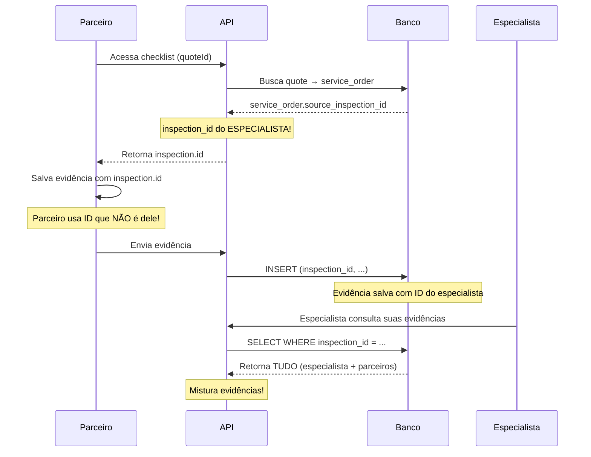

# RESPOSTAS ÀS SUAS PERGUNTAS

## ❓ 1. "O inspection_id serve para trazer informações do especialista"

**✅ CORRETO!**

O `inspection_id` **deve** ser usado pelo parceiro para:

### **Consultar (READ):**
```typescript
// ✅ BOM: Parceiro lê dados do especialista
const inspection = await getInspection(inspection_id);
// Usa para preencher formulário:
// - odometer
// - fuel_level  
// - observations
// - categoria de serviço marcada pelo especialista
```

### **NÃO Salvar (WRITE):**
```typescript
// ❌ RUIM: Parceiro salva COM inspection_id do especialista
await saveEvidence({
  inspection_id,  // ← inspection do ESPECIALISTA!
  vehicle_id,
  item_key: 'clutch',
  storage_path: '...'
});

// ✅ BOM: Parceiro salva COM quote_id próprio
await saveEvidence({
  quote_id,  // ← quote do PARCEIRO!
  vehicle_id,
  item_key: 'clutch',
  storage_path: '...'
});
```

---

## ❓ 2. "Para mim não ficou claro o 'pegar emprestado'"

### **O QUE É O "EMPRÉSTIMO":**



### **POR QUE É RUIM:**

```typescript
// Cenário Real:

// 1. Especialista faz inspeção
const specialistInspection = {
  id: "abc-123",
  vehicle_id: "xyz-789",
  made_by: "specialist-001"
};

// 2. Parceiro recebe orçamento
const partnerQuote = {
  id: "quote-456",
  vehicle_id: "xyz-789", // mesmo veículo
  partner_id: "partner-002"
};

// 3. Parceiro salva evidência
await saveEvidence({
  inspection_id: "abc-123",  // ← ID do ESPECIALISTA!
  vehicle_id: "xyz-789",
  item_key: "clutch",
  made_by: "partner-002"  // ← mas é do PARCEIRO!
});

// 4. Quando buscar:
const evidences = await getEvidences({ inspection_id: "abc-123" });
// Retorna:
// - Evidências do especialista ✅
// - Evidências do parceiro ❌ (misturadas!)

// Problema: Não dá pra saber QUEM fez o quê!
```

---

## ❓ 3. "Os parceiros devem usar inspection_id para consultar, mas salvar com quote_id"

**✅ EXATAMENTE ISSO!**

### **Fluxo Correto:**

```typescript
// LEITURA: Usar inspection_id
async function loadChecklistForm() {
  // ✅ Ler dados do especialista
  const inspection = await fetch(`/api/partner/get-vehicle-from-inspection?quoteId=${quoteId}`);
  
  // Preencher formulário com dados do especialista
  setForm({
    date: inspection.inspection_date,
    odometer: inspection.odometer,
    fuelLevel: inspection.fuel_level,
    observations: inspection.observations,
  });
  
  // Ler categoria marcada pelo especialista
  const services = inspection.services;
  if (services.includes('mechanics')) {
    // Parceiro mecânico vai trabalhar neste veículo
  }
}

// ESCRITA: Usar quote_id
async function saveEvidence(file: File) {
  // ❌ NÃO fazer:
  formData.append('inspection_id', inspection.id);
  
  // ✅ FAZER:
  formData.append('quote_id', quote.id);  // ID do parceiro!
  formData.append('vehicle_id', vehicle.id);
  formData.append('item_key', 'clutch');
  formData.append('file', file);
  
  await fetch('/api/partner/checklist/upload-evidence', {
    method: 'POST',
    body: formData
  });
}
```

### **Separação Clara:**

```
┌─────────────────────────────────────────┐
│         ESPECIALISTA (Inspection)       │
├─────────────────────────────────────────┤
│ - Faz inspeção inicial                  │
│ - Marca categorias necessárias          │
│ - Tira fotos iniciais                   │
│ - Salva com inspection_id              │
│                                         │
│ inspection_media ← fotos do especialista│
└─────────────────────────────────────────┘
              ↓
        Gera Service Order
              ↓
┌─────────────────────────────────────────┐
│         PARCEIROS (Quotes)              │
├─────────────────────────────────────────┤
│ - Lêem inspection para contexto         │
│ - Fazem checklist próprio               │
│ - Tiram evidências próprias             │
│ - Salvam com quote_id                  │
│                                         │
│ mechanics_checklist_evidences ← quote_id│
│ vehicle_anomalies ← quote_id           │
└─────────────────────────────────────────┘
```

---

## ❓ 4. "Como está o relacionamento no banco?"

### **Estado Atual (COM BUG):**

```sql
-- ESPECIALISTA
CREATE TABLE inspection_media (
  id UUID PRIMARY KEY,
  inspection_id UUID NOT NULL,  -- ✅ Correto
  storage_path TEXT,
  uploaded_by UUID  -- ID do especialista
);

-- PARCEIROS
CREATE TABLE mechanics_checklist_evidences (
  id UUID PRIMARY KEY,
  inspection_id UUID NOT NULL,  -- ❌ ERRADO! Deveria ser quote_id
  vehicle_id UUID NOT NULL,
  item_key TEXT,
  storage_path TEXT
);

CREATE TABLE vehicle_anomalies (
  id UUID PRIMARY KEY,
  inspection_id UUID NOT NULL,  -- ❌ ERRADO! Deveria ser quote_id
  vehicle_id UUID NOT NULL,
  description TEXT,
  photos TEXT[]
);
```

### **Como Deveria Ser:**

```sql
-- ESPECIALISTA (sem mudanças)
CREATE TABLE inspection_media (
  id UUID PRIMARY KEY,
  inspection_id UUID NOT NULL,  -- ✅ Correto
  storage_path TEXT,
  uploaded_by UUID  -- ID do especialista
);

-- PARCEIROS (corrigido)
CREATE TABLE mechanics_checklist_evidences (
  id UUID PRIMARY KEY,
  inspection_id UUID,  -- ✅ Opcional (compatibilidade)
  quote_id UUID,       -- ✅ NOVO! ID do orçamento do parceiro
  vehicle_id UUID NOT NULL,
  item_key TEXT,
  storage_path TEXT,
  CONSTRAINT check_has_inspection_or_quote 
    CHECK (inspection_id IS NOT NULL OR quote_id IS NOT NULL)
);

CREATE TABLE vehicle_anomalies (
  id UUID PRIMARY KEY,
  inspection_id UUID,  -- ✅ Opcional (compatibilidade)
  quote_id UUID,       -- ✅ NOVO! ID do orçamento do parceiro
  vehicle_id UUID NOT NULL,
  description TEXT,
  photos TEXT[],
  CONSTRAINT check_has_inspection_or_quote 
    CHECK (inspection_id IS NOT NULL OR quote_id IS NOT NULL)
);
```

### **Queries Corretas:**

```typescript
// ✅ Buscar evidências de ESPECIALISTA
const specialistEvidences = await supabase
  .from('inspection_media')
  .select('*')
  .eq('inspection_id', inspectionId);

// ✅ Buscar evidências de PARCEIRO específico
const partnerEvidences = await supabase
  .from('mechanics_checklist_evidences')
  .select('*')
  .eq('quote_id', quoteId)  // ← ID do parceiro!
  .eq('vehicle_id', vehicleId);

// ✅ Buscar TODAS evidências do veículo (especialista + parceiros)
const allEvidences = await Promise.all([
  // Especialista
  supabase
    .from('inspection_media')
    .select('*')
    .in('inspection_id', [inspectionIds...])
    .eq('profiles.role', 'specialist'),
  
  // Parceiros
  supabase
    .from('mechanics_checklist_evidences')
    .select('*, quotes!inner(partner_id, partners(name))')
    .eq('vehicle_id', vehicleId)
]);
```

---

## ❓ 5. "Qual implementação é mais fácil?"

### **RESPOSTA: Opção 2 (Botão) é MUITO mais fácil!**

### **Comparação Prática:**

#### **Opção 1 (Refatoração quote_id):**
```
📝 Tarefas:
1. Criar 2 migrations ⏱️ 30 min
2. Testar migrations localmente ⏱️ 15 min
3. Modificar upload-evidence API ⏱️ 20 min
4. Modificar save-anomalies API ⏱️ 20 min
5. Modificar submit API ⏱️ 15 min
6. Modificar usePartnerChecklist hook ⏱️ 30 min
7. Modificar vehicle-partner-evidences API ⏱️ 20 min
8. Testar salvamento de evidências ⏱️ 15 min
9. Testar salvamento de anomalias ⏱️ 15 min
10. Testar visualização de evidências ⏱️ 15 min
────────────────────────────────────────────
Total: ~3 horas
Risco: Médio (muitas mudanças)
```

#### **Opção 2 (Botão Ver Checklist):**
```
📝 Tarefas:
1. Criar API de leitura ⏱️ 30 min
2. Criar hook de busca ⏱️ 15 min
3. Criar componente viewer ⏱️ 30 min
4. Modificar VehicleDetails ⏱️ 15 min
5. Testar visualização ⏱️ 15 min
────────────────────────────────────────────
Total: ~1.5 horas
Risco: Baixo (apenas leitura)
```

### **Por Que Opção 2 é Mais Fácil:**

1. **Não mexe em migrations** 
   - Sem risco de quebrar banco

2. **Não mexe em salvamento**
   - Sistema continua funcionando como está

3. **Apenas leitura**
   - Menor chance de bugs

4. **Reutiliza código existente**
   - Componentes de checklist já existem
   - Só precisa adaptar para modo readonly

5. **Menos arquivos**
   - 4 arquivos vs 8 arquivos

6. **Teste mais simples**
   - Só testar visualização
   - Não precisa testar salvamento

---

## 🎯 RECOMENDAÇÃO FINAL

### **FAZER AGORA (Opção 2):**

```typescript
// 1. Cliente vê botões ao invés de fotos soltas
<button onClick={() => showChecklist('mechanics')}>
  📋 Ver Checklist Completo - Mecânica
</button>

// 2. Modal mostra TUDO:
<ChecklistViewer>
  - Data e odômetro
  - Status de cada item (ok/atenção/crítico)
  - Notas de cada item
  - Evidências de cada item
  - Anomalias com fotos
  - Nome do parceiro que fez
</ChecklistViewer>

// 3. UX MUITO melhor!
```

### **FAZER DEPOIS (Opção 1):**

```typescript
// Quando tiver tempo:
// 1. Criar migrations para quote_id
// 2. Refatorar salvamento
// 3. Corrigir arquitetura
// 4. ChecklistViewer já existe (reutilizar!)
```

---

## 🚀 PRÓXIMO PASSO

**Quer que eu implemente a Opção 2 (Botão Ver Checklist)?**

Vou criar:
1. ✅ API `/api/client/partner-checklist` (leitura)
2. ✅ Hook `usePartnerChecklists` (busca)
3. ✅ Componente `ChecklistViewer` (visualização)
4. ✅ Modificar `VehicleDetails` (botões)

**Tempo: ~1.5 horas**  
**Risco: Baixo**  
**Resultado: Cliente vê checklist completo com contexto!**
