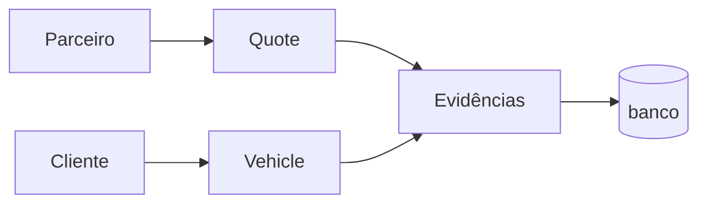

# COMPARAÇÃO: Duas Abordagens para Solução

## 🎯 OPÇÃO 1: Refatoração com quote_id (Proposta Original)

### **Como Funcionaria:**



### **Mudanças Necessárias:**

#### 1. Migrations (2 arquivos)
```sql
-- mechanics_checklist_evidences
ALTER TABLE mechanics_checklist_evidences 
  ALTER COLUMN inspection_id DROP NOT NULL;

ALTER TABLE mechanics_checklist_evidences 
  ADD COLUMN IF NOT EXISTS quote_id UUID REFERENCES quotes(id);

ALTER TABLE mechanics_checklist_evidences
  ADD CONSTRAINT check_has_inspection_or_quote 
  CHECK (inspection_id IS NOT NULL OR quote_id IS NOT NULL);

-- vehicle_anomalies (mesma estrutura)
```

#### 2. APIs (3 arquivos)
- `upload-evidence/route.ts`: Receber quote_id ao invés de inspection_id
- `save-anomalies/route.ts`: Salvar com quote_id
- `submit/route.ts`: Persistir evidências com quote_id

#### 3. Hooks (1 arquivo)
- `usePartnerChecklist.ts`: 
  - Buscar quote_id do parceiro
  - Enviar quote_id em todos uploads
  - Remover dependência de inspection_id

#### 4. Queries de Busca (1 arquivo)
- `vehicle-partner-evidences/route.ts`: Buscar por quote_id OR inspection_id

### **Vantagens:**
✅ Arquitetura correta (parceiro usa quote, não inspection)  
✅ Separa contextos (inspeção vs orçamento)  
✅ Fácil filtrar por parceiro específico  
✅ Não depende de inspection do especialista  
✅ Schema correto semanticamente  

### **Desvantagens:**
❌ ~6-8 arquivos para modificar  
❌ 2 migrations para criar e testar  
❌ Risco de quebrar algo durante refatoração  
❌ Tempo: ~2-3 horas de desenvolvimento  
❌ Precisa testar fluxo completo end-to-end  

---

## 🎯 OPÇÃO 2: Botão "Ver Checklist" (Proposta Nova)

### **Como Funcionaria:**

```mermaid
graph LR
    C[Cliente] --> B[Botão "Ver Checklist - Mecânica"]
    B --> M[Modal/Página]
    M --> CH[Checklist Completo]
    CH --> IT[Itens + Status]
    CH --> EV[Evidências]
    CH --> NO[Notas]
```

### **O Que Seria Exibido:**

#### Tela do Cliente (VehicleDetails.tsx):
```tsx
<div className="card">
  <h2>Checklists dos Parceiros</h2>
  
  {/* Mecânica */}
  <button onClick={() => openChecklistModal('mechanics', mechanicsChecklistId)}>
    📋 Ver Checklist - Mecânica
  </button>
  
  {/* Funilaria/Pintura */}
  <button onClick={() => openChecklistModal('bodyPaint', bodyPaintChecklistId)}>
    📋 Ver Checklist - Funilaria/Pintura
  </button>
  
  {/* Pneus */}
  <button onClick={() => openChecklistModal('tires', tiresChecklistId)}>
    📋 Ver Checklist - Pneus
  </button>
</div>
```

#### Modal/Página de Visualização:
```tsx
<ChecklistViewer readonly={true}>
  <h2>Checklist de Mecânica - Parceiro XYZ</h2>
  <p>Data: 12/10/2025 | Odômetro: 45.000 km</p>
  
  <section>
    <h3>Embreagem</h3>
    <Badge status="critical">Atenção</Badge>
    <p>Notas: Embreagem com folga</p>
    
  </section>
  
  <section>
    <h3>Velas de Ignição</h3>
    <Badge status="ok">OK</Badge>
    <p>Sem observações</p>
  </section>
  
  {/* ... todos os itens ... */}
  
  <section>
    <h3>Anomalias Encontradas</h3>
    <div>
      <p>Descrição: Para-choque amassado</p>
      
      
    </div>
  </section>
</ChecklistViewer>
```

### **Mudanças Necessárias:**

#### 1. Nova API: `/api/client/partner-checklist`
```typescript
// GET ?checklistId={id}&type={mechanics|bodyPaint|tires}
// Retorna:
{
  checklist: {
    partner: { name, category },
    date: "2025-10-12",
    odometer: 45000,
    fuelLevel: "half",
    observations: "Veículo necessita atenção",
    items: [
      {
        key: "clutch",
        label: "Embreagem",
        status: "critical",
        notes: "Embreagem com folga",
        evidence_url: "https://..."
      },
      // ... mais itens
    ],
    anomalies: [
      {
        description: "Para-choque amassado",
        photos: ["url1", "url2"]
      }
    ]
  }
}
```

#### 2. Componente: `ChecklistViewer.tsx`
- Exibe checklist completo em modo leitura
- Mostra todos itens com status, notas e evidências
- Mostra anomalias com fotos
- Agrupa por categoria

#### 3. Modificar: `VehicleDetails.tsx`
- Remover seção "Evidências do Parceiro" (apenas fotos)
- Adicionar seção "Checklists dos Parceiros" (botões)
- Abrir modal ao clicar no botão

#### 4. Hook: `usePartnerChecklists.ts`
```typescript
// Busca TODOS os checklists de parceiros do veículo
const { checklists } = usePartnerChecklists(vehicleId);
// Retorna:
// [
//   { id, type: 'mechanics', partner_name, date, has_data: true },
//   { id, type: 'bodyPaint', partner_name, date, has_data: true }
// ]
```

### **Vantagens:**
✅ Mais fácil de implementar (~1-2 horas)  
✅ Não mexe em migrations  
✅ Não mexe no fluxo de salvamento (hack continua funcionando)  
✅ Melhor UX: Cliente vê contexto completo  
✅ Menos risco de quebrar algo  
✅ Não precisa refatorar quote_id  
✅ Reutiliza componentes do checklist existente  

### **Desvantagens:**
❌ Não resolve problema estrutural (hack permanece)  
❌ Schema continua semanticamente incorreto  
❌ Ainda depende de inspection_id emprestado  
❌ Problema vai ressurgir no futuro  

---

## 📊 COMPARAÇÃO LADO A LADO

| Critério | Opção 1 (quote_id) | Opção 2 (Botão) |
|----------|-------------------|-----------------|
| **Tempo** | 2-3 horas | 1-2 horas |
| **Complexidade** | Alta | Média |
| **Risco** | Médio | Baixo |
| **Arquitetura** | ✅ Correta | ❌ Mantém hack |
| **Manutenibilidade** | ✅ Melhor | ❌ Débito técnico |
| **UX** | Apenas fotos | ✅ Contexto completo |
| **Migrations** | ✅ Necessárias | ❌ Nenhuma |
| **Files Changed** | 6-8 | 3-4 |
| **Testing** | Extenso | Simples |
| **Futuro** | ✅ Sustentável | ⚠️ Precisará refatorar |

---

## 🤔 QUAL ESCOLHER?

### **Escolha Opção 1 SE:**
- Quer resolver o problema de raiz
- Tem tempo para fazer certo
- Quer código sustentável a longo prazo
- Está disposto a testar extensivamente

### **Escolha Opção 2 SE:**
- Precisa de resultado rápido
- Quer melhorar UX sem risco
- Prefere adiar refatoração estrutural
- Quer menos mudanças por agora

---

## 💡 RECOMENDAÇÃO HÍBRIDA

**Fazer as duas, mas em fases:**

### Fase 1 (AGORA): Opção 2
1. Implementar botão "Ver Checklist"
2. Melhorar UX imediatamente
3. Cliente fica satisfeito
4. Sistema continua funcionando

### Fase 2 (DEPOIS): Opção 1
1. Quando tiver mais tempo
2. Refatorar com quote_id
3. Corrigir arquitetura
4. Componente ChecklistViewer já existe (reutilizar!)

**Vantagem:**
- UX melhora AGORA
- Arquitetura corrigida DEPOIS
- Risco distribuído
- Progresso incremental

---

## 🎯 IMPLEMENTAÇÃO RECOMENDADA

### **Opção 2 (Botão) - Passo a Passo:**

1. **Criar API** `/api/client/partner-checklist`
   - Input: `checklistId`, `vehicleId`
   - Busca `mechanics_checklist` + `mechanics_checklist_items` + `mechanics_checklist_evidences`
   - Busca `vehicle_anomalies`
   - Une tudo e retorna JSON estruturado

2. **Criar Hook** `usePartnerChecklists(vehicleId)`
   - Lista checklists disponíveis por categoria
   - Retorna metadata (data, parceiro, categoria)

3. **Criar Componente** `ChecklistViewer`
   - Props: `checklistData`, `readonly`
   - Reutiliza estrutura do formulário de checklist
   - Modo somente leitura
   - Exibe evidências inline

4. **Modificar** `VehicleDetails.tsx`
   - Adicionar seção "Checklists dos Parceiros"
   - Botões por categoria
   - Modal com ChecklistViewer

5. **Testar**
   - Cliente vê botões
   - Clicar abre modal
   - Modal exibe checklist completo
   - Imagens aparecem corretamente

**Arquivos a modificar:**
- `app/api/client/partner-checklist/route.ts` (novo)
- `modules/vehicles/hooks/usePartnerChecklists.ts` (novo)
- `modules/vehicles/components/ChecklistViewer.tsx` (novo)
- `modules/vehicles/components/VehicleDetails.tsx` (modificar)

**Total: 4 arquivos (3 novos + 1 modificado)**

---

## 🚀 PRÓXIMOS PASSOS

**Se escolher Opção 2:**
```bash
1. Criar API de leitura de checklist
2. Criar hook de busca
3. Criar componente de visualização
4. Modificar VehicleDetails
5. Testar end-to-end
6. Commit e push
```

**Tempo estimado: 1-2 horas**
**Risco: Baixo**
**Impacto: Alto (UX muito melhor)**
