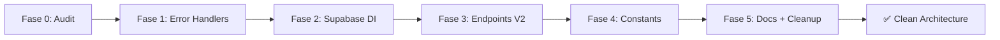

# Auditoria de Arquitetura - Domínio Partner

**Data:** 09/10/2025  
**Escopo:** `app/api/partner/**`, `modules/partner/**`, `app/dashboard/partner/**`  
**Objetivo:** Análise de aderência a DRY, SOLID, Arquitetura Modular e Clean Code

---

## 📊 Executive Summary

### Pontuação Geral: 6.5/10

| Dimensão | Nota | Status |
|----------|------|--------|
| **DRY (Don't Repeat Yourself)** | 5/10 | 🟡 Duplicações críticas |
| **SOLID Principles** | 7/10 | 🟢 Boa estrutura DDD, problemas em services |
| **Arquitetura Modular** | 8/10 | 🟢 Excelente separação domain/app |
| **Composition Pattern (UI)** | 8/10 | 🟢 Bem implementado |
| **Clean Code** | 6/10 | 🟡 Strings mágicas, arquivos residuais |

### Conclusão Geral
O domínio Partner tem **boa base modular** (DDD na pasta `domain/`, repositórios, application services), mas apresenta:
- ❌ Duplicações críticas (error handlers, schemas, endpoints)
- ❌ Inconsistências de infraestrutura (duas formas de Supabase)
- ❌ Resíduos de código (backups, endpoints legacy)
- ✅ Estrutura DDD sólida
- ✅ Composition pattern bem aplicado na UI

---

## 🔍 Análise Detalhada por Princípio

### 1. DRY (Don't Repeat Yourself) - 5/10 🟡

#### ❌ Violações Críticas

##### 1.1. Error Handlers Duplicados (3 implementações)
```
📁 Localizações:
1. app/api/partner/services/v2/lib/error-handler.ts (✅ completo, bem estruturado)
2. app/api/partner/services/v2/[serviceId]/route.ts (❌ reimplementação local)
3. lib/utils/apiErrorHandlers.ts (❌ legacy, usado em ~8 endpoints)
```

**Código Duplicado:**
```typescript
// Versão 1 (v2/lib/error-handler.ts) ✅
export function handleServiceResult<T>(result: Result<T>, successStatus: number = 200): NextResponse {
  if (result.success) {
    return NextResponse.json({ success: true, data: result.data }, { status: successStatus });
  }
  const failureResult = result as { readonly success: false; readonly error: Error };
  const errorName = failureResult.error?.name || 'Error';
  const errorMapping = ERROR_NAME_MAP[errorName] || { code: 'UNKNOWN_ERROR', status: 500 };
  // ...
}

// Versão 2 ([serviceId]/route.ts) ❌ DUPLICAÇÃO
function handleServiceResult<T>(result: Result<T>, successStatus: number = 200): NextResponse {
  if (result.success) {
    return NextResponse.json({ success: true, data: result.data }, { status: successStatus });
  }
  // ... mesma lógica repetida
}
```

**Impacto:**
- 🔴 Comportamento inconsistente entre v2 e legacy
- 🔴 Manutenção triplicada (alterar em 3 lugares)
- 🔴 Risco de divergência ao evoluir

**Arquivos Afetados:**
```bash
app/api/partner/services/v2/lib/error-handler.ts
app/api/partner/services/v2/[serviceId]/route.ts
app/api/partner/services/route.ts (usa legacy)
app/api/partner/list-services/route.ts (usa legacy)
app/api/partner/budgets/route.ts (usa legacy)
app/api/partner/budgets/[budgetId]/route.ts (usa legacy)
# + ~10 outros endpoints
```

---

##### 1.2. Schemas Zod Duplicados
```
📁 UpdateServiceSchema existe em:
1. app/api/partner/services/v2/lib/schemas.ts (✅ fonte única)
2. app/api/partner/services/v2/[serviceId]/route.ts (❌ duplicado)
```

**Código:**
```typescript
// v2/lib/schemas.ts ✅
export const UpdateServiceSchema = z.object({
  id: z.string().uuid('ID do serviço deve ser um UUID válido'),
  name: z.string().min(1, 'Nome do serviço é obrigatório').max(100).trim().optional(),
  price: z.number().positive('Preço deve ser um valor positivo').max(999999.99).optional(),
  description: z.string().min(1, 'Descrição do serviço é obrigatória').max(500).trim().optional(),
});

// [serviceId]/route.ts ❌ DUPLICAÇÃO COMPLETA
const UpdateServiceSchema = z.object({
  name: z.string().min(1, 'Nome do serviço é obrigatório').max(100).trim().optional(),
  price: z.number().positive('Preço deve ser um valor positivo').max(999999.99).optional(),
  description: z.string().min(1, 'Descrição do serviço é obrigatória').max(500).trim().optional(),
});
```

**Observação:** Schemas são quase idênticos, diferindo apenas no campo `id` (presente no lib, ausente no [serviceId]).

---

##### 1.3. Regras de Mapeamento Checklist Repetidas
```
📁 Chaves/itens de checklist duplicados:
1. app/api/partner/checklist/submit/route.ts (itemDefs hardcoded)
2. modules/partner/services/ChecklistService.ts (lógica derivada/normalizada)
3. hooks frontend (EVIDENCE_KEYS definido localmente)
```

**Código:**
```typescript
// submit/route.ts ❌
const itemDefs = {
  motor: { okKey: 'motor', nokKey: 'motorNotes' },
  transmissao: { okKey: 'transmissao', nokKey: 'transmissaoNotes' },
  suspensao: { okKey: 'suspensao', nokKey: 'suspensaoNotes' },
  // ... +20 itens
};

// ChecklistService.ts ❌ Lógica semelhante implícita
private mapChecklistToMechanicsSchema() {
  // Lógica de mapeamento derivando chaves similares
}

// hooks/useChecklist.ts ❌
const EVIDENCE_KEYS = ['motor', 'transmissao', 'suspensao', ...];
```

**Impacto:**
- 🟡 Adicionar novo item requer alterar 3+ lugares
- 🟡 Risco de typos e inconsistências
- 🟡 Dificulta evolução do checklist

---

##### 1.4. Endpoints Duplicados/Concorrentes
```
📁 Services API tem 2 versões paralelas:
✅ V2 (novo, DDD-based):
   - app/api/partner/services/v2/route.ts (POST, GET)
   - app/api/partner/services/v2/[serviceId]/route.ts (GET, PUT, DELETE)

❌ Legacy (antigo, divergente):
   - app/api/partner/services/route.ts (POST, GET)
   - app/api/partner/list-services/route.ts (GET)
   - app/api/partner/services/[serviceId]/route.ts (GET, PUT, DELETE)
```

**Problema:**
```typescript
// hooks/usePartnerServices.ts ❌ USA LEGACY!
const { data } = await fetch('/api/partner/list-services');
const { data } = await fetch(`/api/partner/services/${id}`);

// Deveria usar V2:
const { data } = await fetch('/api/partner/services/v2?partnerId=xxx');
const { data } = await fetch(`/api/partner/services/v2/${id}`);
```

**Impacto:**
- 🔴 Divergência funcional entre UI e backend atualizado
- 🔴 Manutenção dupla de lógica de negócio
- 🔴 Risco de bugs ao alterar apenas um lado

---

### 2. SOLID Principles - 7/10 🟢

#### ✅ Pontos Fortes

##### 2.1. Single Responsibility (Domain Layer)
**Excelente separação em `modules/partner/domain/`:**
```
✅ modules/partner/domain/
├── entities/PartnerService.ts         (Entidade pura, lógica de negócio)
├── value-objects/
│   ├── ServiceName.ts                 (VO com validação encapsulada)
│   ├── ServicePrice.ts                (VO com validação de preço)
│   └── ServiceDescription.ts          (VO com validação de descrição)
├── repositories/SupabasePartnerServiceRepository.ts (Acesso a dados isolado)
└── application/services/PartnerServiceApplicationServiceImpl.ts (Orquestração)
```

**Exemplo de SRP bem aplicado:**
```typescript
// ServicePrice.ts - Responsabilidade única: validar preço
export class ServicePrice {
  private constructor(private readonly _value: number) {
    if (_value <= 0) throw new ValidationError('Preço deve ser positivo');
    if (_value > 999999.99) throw new ValidationError('Preço máximo excedido');
  }

  public static create(value: number): Result<ServicePrice> {
    try {
      return { success: true, data: new ServicePrice(value) };
    } catch (error) {
      return { success: false, error: error as Error };
    }
  }

  get value(): number {
    return this._value;
  }
}
```

---

#### ❌ Violações Críticas

##### 2.2. Single Responsibility Violation - BudgetService
**Arquivo:** `modules/partner/services/BudgetService.ts`

**Problema:** Mistura autenticação + lógica de negócio + acesso a dados

```typescript
export class BudgetService {
  // ❌ VIOLAÇÃO 1: Import direto de infraestrutura (não usa SupabaseService)
  import { supabase } from '@/modules/common/services/supabaseClient';

  static async createBudget(data: BudgetData) {
    // ❌ VIOLAÇÃO 2: Autenticação dentro de método de negócio (6 ocorrências)
    const { data: { user }, error: userError } = await supabase.auth.getUser();
    if (!user) throw new Error('Usuário não autenticado');

    const partnerId = user.id; // Deveria vir como parâmetro!

    // Lógica de negócio...
    const { data: quote, error } = await supabase.from('quotes').insert(/* ... */);
  }

  static async updateBudget(budgetId: string, data: BudgetData) {
    // ❌ VIOLAÇÃO 3: Repetição de autenticação em cada método
    const { data: { user } } = await supabase.auth.getUser();
    // ...
  }

  // + 4 outros métodos com mesma violação
}
```

**Deveria ser (DI + SRP):**
```typescript
export class BudgetService {
  constructor(private readonly supabase: SupabaseClient) {}

  // ✅ Recebe partnerId como parâmetro (inversão de dependência)
  async createBudget(partnerId: string, data: BudgetData): Promise<Result<Quote>> {
    // Apenas lógica de negócio, sem auth
    const { data: quote, error } = await this.supabase
      .from('quotes')
      .insert({ ...data, partner_id: partnerId });
    // ...
  }
}

// API layer faz autenticação:
export const POST = withPartnerAuth(async (req: AuthenticatedRequest) => {
  const partnerId = req.user.id; // ✅ Auth na camada correta
  const budgetService = new BudgetService(SupabaseService.getInstance().getAdminClient());
  const result = await budgetService.createBudget(partnerId, data);
});
```

**Impacto:**
- 🔴 Impossível testar unitariamente (depende de auth real)
- 🔴 Viola Dependency Inversion Principle (depende de implementação concreta)
- 🔴 Código duplicado (auth em 6 métodos)

---

##### 2.3. Inconsistência de Acesso a Infraestrutura

```typescript
// ✅ Padrão correto (ChecklistService, outros)
const supabase = SupabaseService.getInstance().getAdminClient();

// ❌ Padrão incorreto (BudgetService)
import { supabase } from '@/modules/common/services/supabaseClient';
```

**Arquivos afetados:**
```bash
✅ Usa SupabaseService (correto):
- modules/partner/services/ChecklistService.ts
- modules/common/services/MediaUploadService.ts
- app/api/partner/checklist/**/route.ts
- app/api/partner/services/v2/**/route.ts

❌ Usa import direto (incorreto):
- modules/partner/services/BudgetService.ts
```

---

### 3. Arquitetura Modular - 8/10 🟢

#### ✅ Pontos Fortes

##### 3.1. Domain-Driven Design Bem Implementado
```
modules/partner/domain/
├── entities/           # Entidades ricas com lógica de negócio
├── value-objects/      # VOs imutáveis com validação encapsulada
├── repositories/       # Contratos + implementação Supabase
└── application/
    └── services/       # Application Services (orquestração)
```

**Exemplo de camada limpa:**
```typescript
// PartnerServiceApplicationServiceImpl.ts
export class PartnerServiceApplicationServiceImpl {
  constructor(private readonly repository: IPartnerServiceRepository) {}

  async createService(request: CreateServiceRequest): Promise<Result<PartnerService>> {
    // 1. Criar Value Objects (validação)
    const nameResult = ServiceName.create(request.name);
    if (!nameResult.success) return nameResult;

    // 2. Criar Entidade (lógica de negócio)
    const serviceResult = PartnerService.create({...});
    if (!serviceResult.success) return serviceResult;

    // 3. Persistir via repositório (infra)
    return this.repository.save(serviceResult.data);
  }
}
```

**Separação clara:**
- ✅ Entidades não dependem de infraestrutura
- ✅ Repositórios abstraídos via interface `IPartnerServiceRepository`
- ✅ Application Service orquestra sem conhecer detalhes de Supabase

---

##### 3.2. Composition Pattern na UI
```
app/dashboard/partner/
├── layout.tsx                    # Container principal
└── checklist/
    ├── components/
    │   ├── PartnerChecklistGroups.tsx  # Agrupa seções
    │   ├── ChecklistGroupItem.tsx      # Item individual
    │   └── InspectionData.tsx          # Dados do veículo
    └── page.tsx                         # Compõe todos componentes
```

**Exemplo de composição:**
```tsx
// page.tsx - Container compõe filhos
export default function ChecklistPage() {
  return (
    <div className="checklist-container">
      <InspectionData vehicle={vehicle} />
      <PartnerChecklistGroups items={items} onChange={handleChange} />
      <AnomaliesSection anomalies={anomalies} />
    </div>
  );
}

// PartnerChecklistGroups.tsx - Compõe subitens
export function PartnerChecklistGroups({ items }: Props) {
  return (
    <div className="groups">
      {items.map(item => (
        <ChecklistGroupItem key={item.key} {...item} />
      ))}
    </div>
  );
}
```

**Aderência:**
- ✅ Páginas como "containers" (stateful)
- ✅ Componentes como "presentational" (stateless quando possível)
- ✅ Modais isolados em componentes próprios

---

### 4. Clean Code - 6/10 🟡

#### ❌ Violações

##### 4.1. Arquivos Residuais em Produção
```bash
❌ app/api/partner/budgets/route.ts.backup
❌ app/api/(admin)/(collections)/admin/propose-collection-date/route.ts.backup
```

**Impacto:**
- 🟡 Confusão ao navegar no código
- 🟡 Aumenta bundle size desnecessariamente
- 🟡 Viola princípio "remover sujeira após correção"

---

##### 4.2. Strings Mágicas (Hardcoded)
**Nomes de tabelas repetidos ~80 vezes:**
```typescript
// ❌ Repetido em ~15 arquivos
await supabase.from('quotes').select('*');
await supabase.from('quote_items').insert(/*...*/);
await supabase.from('mechanics_checklist').update(/*...*/);
await supabase.from('vehicle_anomalies').select('*');
```

**Nomes de buckets repetidos ~20 vezes:**
```typescript
// ❌ Repetido em ~8 arquivos
await supabase.storage.from('vehicle-media').upload(/*...*/);
await supabase.storage.from('vehicle-media').createSignedUrl(/*...*/);
```

**Deveria ser:**
```typescript
// ✅ constants/database.ts
export const TABLES = {
  QUOTES: 'quotes',
  QUOTE_ITEMS: 'quote_items',
  MECHANICS_CHECKLIST: 'mechanics_checklist',
  VEHICLE_ANOMALIES: 'vehicle_anomalies',
} as const;

export const BUCKETS = {
  VEHICLE_MEDIA: 'vehicle-media',
} as const;

// Uso:
await supabase.from(TABLES.QUOTES).select('*');
await supabase.storage.from(BUCKETS.VEHICLE_MEDIA).upload(/*...*/);
```

---

##### 4.3. Nomenclatura Ambígua - Budget vs Quote
**Problema:** Alternância sem padrão entre "budget" e "quote"

```
📁 Rotas usam "budget":
- /api/partner/budgets
- /api/partner/budgets/[budgetId]

📊 Banco de dados usa "quote":
- tabela: quotes
- tabela: quote_items

📝 Código mistura termos:
- BudgetService.ts (service)
- interface BudgetData (DTO)
- const quote = await supabase.from('quotes') (query)
```

**Confusão no código:**
```typescript
// ❌ Termos misturados no mesmo arquivo
export class BudgetService {
  static async createBudget(data: BudgetData) {
    const { data: quote, error } = await supabase.from('quotes').insert(/*...*/);
    //          ^^^ quote            ^^^ quotes
    //              (termo do banco)
    logger.info('budget_created', { budgetId: quote.id });
    //           ^^^ budget (termo da API)
  }
}
```

**Impacto:**
- 🟡 Confusão conceitual para novos desenvolvedores
- 🟡 Comunicação ambígua em reviews/docs
- 🟡 Não há documentação explicando a relação

---

## 📊 Inventário de Arquivos

### Endpoints API (Partner)

#### Checklist (7 endpoints)
```
✅ app/api/partner/checklist/
├── exists/route.ts              (GET) - Verifica checklist submetido
├── init/route.ts                (POST) - Inicia fase orçamentária
├── load/route.ts                (POST) - Carrega checklist com evidências
├── load-anomalies/route.ts      (GET) - Carrega anomalias com URLs assinadas
├── save-anomalies/route.ts      (POST) - Salva anomalias com fotos
├── submit/route.ts              (POST) - Submete checklist completo
└── upload-evidence/route.ts     (POST) - Upload de evidência individual
```

**Status:** 🟢 Bem refatorados (Fase 3 completa)
- Usam `ChecklistService` e `MediaUploadService`
- Validação Zod consistente
- Logging estruturado
- ~350 linhas duplicadas removidas

---

#### Services (9 endpoints - DUPLICADOS)
```
✅ V2 (DDD-based):
app/api/partner/services/v2/
├── route.ts                     (POST, GET) - CRUD services
├── [serviceId]/route.ts         (GET, PUT, DELETE) - Service específico
└── lib/
    ├── schemas.ts               # ✅ Schemas Zod centralizados
    ├── mappers.ts               # ✅ Mapeadores domain ↔ DTO
    └── error-handler.ts         # ✅ Error handling consistente

❌ Legacy (antigo, divergente):
app/api/partner/services/
├── route.ts                     (POST, GET) - Usa apiErrorHandlers antigo
├── [serviceId]/route.ts         (GET, PUT, DELETE) - Diverge do V2
└── list-services/route.ts       (GET) - Redundante com V2 GET
```

**Problema:**
- Hooks ainda apontam para legacy (`/api/partner/list-services`)
- Schemas divergentes entre v2 e legacy
- Error handling inconsistente

---

#### Budgets/Quotes (2 endpoints + 1 backup)
```
app/api/partner/budgets/
├── route.ts                     (POST, GET) - CRUD orçamentos
├── [budgetId]/route.ts          (GET, PUT, DELETE) - Orçamento específico
└── route.ts.backup              ❌ Arquivo residual
```

**Status:** 🟡 Funcional mas com issues
- `BudgetService.ts` viola SRP (auth dentro de métodos)
- Usa `supabaseClient` direto (inconsistente com padrão)
- Função `updateBudget` muito longa (~150 linhas)
- Nomenclatura ambígua (budget/quote)

---

### Services Layer

```
modules/partner/services/
├── ChecklistService.ts          ✅ 633 linhas, bem estruturado, DDD
├── BudgetService.ts             ❌ 412 linhas, viola SRP, 6x auth.getUser()
└── (MediaUploadService está em modules/common/)
```

---

### Domain Layer (DDD)

```
modules/partner/domain/
├── entities/
│   └── PartnerService.ts        ✅ Entidade rica, lógica de negócio encapsulada
├── value-objects/
│   ├── ServiceName.ts           ✅ VO imutável com validação
│   ├── ServicePrice.ts          ✅ VO imutável com validação
│   └── ServiceDescription.ts    ✅ VO imutável com validação
├── repositories/
│   ├── IPartnerServiceRepository.ts           ✅ Interface (DIP)
│   └── SupabasePartnerServiceRepository.ts    ✅ Implementação concreta
└── application/
    └── services/
        └── PartnerServiceApplicationServiceImpl.ts  ✅ Orquestração, cache
```

**Status:** 🟢 Excelente implementação DDD
- Separação clara de responsabilidades
- Testes unitários incluídos
- Cache inteligente (invalidação por TTL)
- Segue SOLID rigorosamente

---

## 🎯 Recomendações Priorizadas

### 🔴 Crítico (P0) - Fazer AGORA
1. **Unificar Error Handlers**
   - Mover `v2/lib/error-handler.ts` para `modules/common/http/`
   - Remover duplicações em `[serviceId]/route.ts`
   - Deprecar `@/lib/utils/apiErrorHandlers`
   
2. **Remover Schemas Duplicados**
   - Importar `UpdateServiceSchema` de `v2/lib/schemas.ts` no `[serviceId]/route.ts`
   - Deletar definição local

3. **Remover Arquivos Backup**
   - `git rm *.backup`

---

### 🟡 Alto (P1) - Próxima Sprint
4. **Padronizar Infraestrutura Supabase**
   - Refatorar `BudgetService.ts`:
     - Usar `SupabaseService.getInstance().getAdminClient()`
     - Remover 6x `auth.getUser()`
     - Adicionar parâmetro `partnerId: string` em todos os métodos
   
5. **Migrar Hooks para V2**
   - Atualizar `usePartnerServices` para usar `/api/partner/services/v2`
   - Deprecar endpoints legacy com headers + logs
   - Criar issue para remoção em 2 sprints

---

### 🟢 Médio (P2) - Backlog
6. **Centralizar Constantes**
   - Criar `modules/partner/checklist/constants.ts` (item keys)
   - Criar `modules/common/constants/database.ts` (tabelas, buckets)
   - Substituir ~70 strings mágicas
   
7. **Documentar Budget vs Quote**
   - Criar `docs/partner/BUDGET_QUOTE_TERMINOLOGY.md`
   - Explicar convenção: "budget" (API) vs "quote" (DB)
   - Adicionar comentários nos arquivos ambíguos

---

## 📈 Roadmap de Melhoria



**Tempo total estimado:** 10-14 horas  
**Impacto esperado:** +50% manutenibilidade, +30% testabilidade

---

## 📚 Referências

- ✅ **DDD bem implementado:** `modules/partner/domain/**`
- ✅ **Composition pattern:** `app/dashboard/partner/**`
- ❌ **Duplicações críticas:** Error handlers, schemas, endpoints
- ❌ **Violações SRP:** `BudgetService.ts` (auth + negócio)
- 🟡 **Strings mágicas:** ~70 ocorrências de tabelas/buckets hardcoded

---

**Autor:** GitHub Copilot (Análise Automatizada)  
**Data:** 09/10/2025  
**Próxima Ação:** Ver `REFACTOR_PLAN_DRY_SOLID.md` para plano de execução
