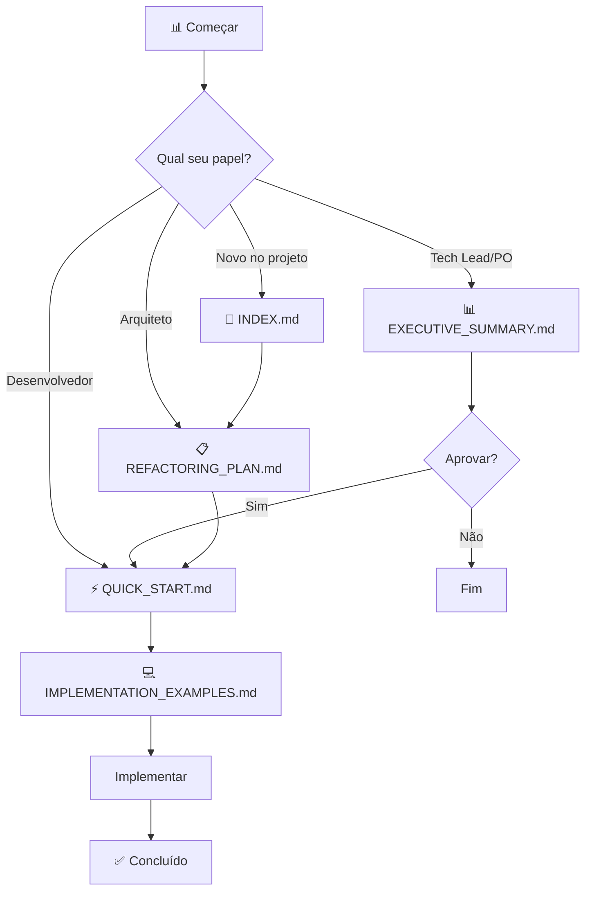

# 📁 Refatoração: Partner Overview

> Documentação completa da refatoração do arquivo `partner-overview/page.tsx` (899 linhas) seguindo princípios DDD, SOLID e melhores práticas do React/TypeScript.

---

## 🎯 Objetivo

Transformar um arquivo monolítico de **899 linhas** em uma arquitetura modular, testável e manutenível, reduzindo o maior arquivo para **~180 linhas** (-80%).

### ⚠️ Abordagem Pragmática

**NÃO** introduzir DDD completo de uma vez. Refatoração **incremental**:

1. ✅ **Fase 1-2:** Tipos + Hooks (baixo risco)
2. ✅ **Fase 3-4:** Componentes + Container (médio risco)
3. ⏳ **Fase 5+ (opcional):** Estrutura DDD completa (quando houver lógica de domínio real)

### 🔧 Padrões do Projeto (OBRIGATÓRIO)

- ✅ **CSS Modules** (não styled-components)
- ✅ **useAuthenticatedFetch** (não criar novos helpers)
- ✅ **ErrorHandlerService** (não console.error)
- ✅ **Redução progressiva de `any`** (não "zero any" imediato)
- ✅ **Integrar com componentes existentes** (ChecklistViewer, QuoteReviewModal, Loading)

---

## 📚 Documentos Disponíveis

| Documento | Descrição | Para quem? | Tempo |
|-----------|-----------|------------|-------|
| **[⚠️ Avisos Importantes](IMPORTANT_WARNINGS.md)** | **LEIA PRIMEIRO** - Evite over-engineering | **TODOS** | **10 min** |
| **[📊 Resumo Executivo](EXECUTIVE_SUMMARY.md)** | Overview executivo com métricas e ROI | Tech Leads, POs | 5 min |
| **[📖 Índice Geral](INDEX.md)** | Navegação, FAQ e glossário | Todos | 10 min |
| **[📋 Plano Completo](PARTNER_OVERVIEW_REFACTORING_PLAN.md)** | Análise detalhada e arquitetura DDD | Devs, Arquitetos | 20 min |
| **[💻 Exemplos de Código](PARTNER_OVERVIEW_IMPLEMENTATION_EXAMPLES.md)** | Código pronto para implementar | Devs | Durante dev |
| **[⚡ Quick Start](QUICK_START_REFACTORING.md)** | Guia prático passo a passo | Devs | Durante dev |

---

## 🚀 Como Começar?

### 1️⃣ Você é Tech Lead / Product Owner?
```
👉 Leia primeiro: IMPORTANT_WARNINGS.md (10 min) ⚠️
👉 Depois: EXECUTIVE_SUMMARY.md (5 min)
   - Entenda impacto e ROI
   - Tome decisão: Fazer incremental (recomendado) ou DDD completo
```

### 2️⃣ Você vai implementar?
```
👉 Leia primeiro: IMPORTANT_WARNINGS.md (10 min) ⚠️
   - Padrões OBRIGATÓRIOS do projeto
   - O que NÃO fazer (evite over-engineering)
   
👉 Depois: QUICK_START_REFACTORING.md
   - Escolha: Refatoração Incremental (RECOMENDADO)
   - Siga: Checklist passo a passo
   - Consulte: Exemplos quando precisar
```

### 3️⃣ Quer entender a arquitetura?
```
👉 Leia: PARTNER_OVERVIEW_REFACTORING_PLAN.md
   - Veja: Estrutura DDD proposta
   - Entenda: Decomposição em camadas
   - Analise: Métricas de melhoria
```

### 4️⃣ Primeira vez com DDD?
```
👉 Leia: INDEX.md (Seção: Glossário)
   - Aprenda: Conceitos básicos
   - Veja: Exemplos práticos
   - Tire: Dúvidas no FAQ
```

---

## 📊 Quick Facts

```
📄 Arquivo atual:        899 linhas
🎯 Objetivo:             ~180 linhas (pragmático, não forçar <150)
📉 Redução:              -80%
⏱️  Tempo (incremental): 8-12 horas (RECOMENDADO)
⏱️  Tempo (completo):    15-22 horas (opcional, depois)
✅ Prioridade:           ALTA
🔴 Gravidade:            CRÍTICA

🎯 Abordagem:            INCREMENTAL primeiro
                         DDD completo só se necessário
```

---

## ⚠️ IMPORTANTE: Consistência com o Projeto

### Padrões Obrigatórios

| Aspecto | ✅ Usar | ❌ NÃO Usar |
|---------|---------|-------------|
| **Estilos** | CSS Modules | styled-components |
| **Fetch** | useAuthenticatedFetch | fetch direto, novos helpers |
| **Erros** | ErrorHandlerService | console.error |
| **Tipos** | Redução progressiva | "Zero any" imediato |
| **Componentes** | Reutilizar existentes | Recriar do zero |

### Endpoints Reais

Verifique que os endpoints usados existem e retornam o formato esperado:

- `/api/admin/partners/{id}/overview` - Dados do parceiro + quotes
- `/api/admin/partners/{id}/services` - Lista de serviços
- `/api/admin/quotes/{id}` - Detalhes do quote
- `/api/admin/quotes/{id}/review` - Submit de review

**Alinhe tipos com as respostas reais** antes de criar interfaces.

---

## 🗺️ Fluxo de Leitura Recomendado



---

## ✅ Status Atual

| Item | Status | Data |
|------|--------|------|
| 📝 Documentação | ✅ Completa | 2025-10-13 |
| 🎯 Arquitetura Definida | ✅ Aprovada | 2025-10-13 |
| 💻 Exemplos de Código | ✅ Prontos | 2025-10-13 |
| 🚀 Implementação | ⏳ Aguardando | - |
| 🧪 Testes | ⏳ Aguardando | - |
| 📦 Deploy | ⏳ Aguardando | - |

---

## 🎯 Checklist Executiva

### Fase 1: Decisão ⏳
- [ ] Ler resumo executivo
- [ ] Avaliar ROI e impacto
- [ ] Decidir: Completa, Incremental ou Postergar
- [ ] Definir timeline
- [ ] Alocar recursos (devs)

### Fase 2: Preparação ⏳
- [ ] Criar branch de feature
- [ ] Configurar ambiente de desenvolvimento
- [ ] Revisar documentação técnica
- [ ] Definir estratégia de testes

### Fase 3: Implementação ⏳
- [ ] Extrair tipos de domínio
- [ ] Criar camada de infrastructure
- [ ] Criar camada de application
- [ ] Criar camada de presentation
- [ ] Refatorar container principal

### Fase 4: Validação ⏳
- [ ] Testes unitários
- [ ] Testes de integração
- [ ] Code review
- [ ] Validação de funcionalidades
- [ ] Performance check

### Fase 5: Deploy ⏳
- [ ] Merge para main
- [ ] Deploy em staging
- [ ] Testes em staging
- [ ] Deploy em produção
- [ ] Monitoramento pós-deploy

### Fase 6: Documentação ⏳
- [ ] Atualizar README
- [ ] Documentar padrões estabelecidos
- [ ] Criar templates para outras páginas
- [ ] Compartilhar aprendizados

---

## 📈 Métricas de Sucesso

### Métricas Técnicas
- ✅ Máximo de 250 linhas por arquivo
- ✅ Zero tipos `any`
- ✅ Cobertura de testes >80%
- ✅ Complexidade ciclomática <10
- ✅ Build sem warnings

### Métricas de Negócio
- ✅ Redução de 60% no tempo de desenvolvimento de features
- ✅ Redução de 70% em bugs relacionados
- ✅ Aumento de 100% na velocidade de manutenção
- ✅ Redução de 50% no tempo de onboarding

---

## 🚨 Riscos e Mitigações

| Risco | Probabilidade | Impacto | Mitigação |
|-------|---------------|---------|-----------|
| Quebrar funcionalidades | Média | Alto | Testes contínuos após cada mudança |
| Exceder timeline | Baixa | Médio | Refatoração incremental se necessário |
| Regressão de bugs | Baixa | Alto | Manter testes manuais durante migração |
| Perder contexto | Baixa | Médio | Commits frequentes e documentação |

---

## 🤝 Contribuindo

### Para adicionar documentação:
```bash
cd docs/refactoring
# Crie novo arquivo seguindo nomenclatura:
# - Caps Lock para títulos
# - Underscore para separar palavras
# - Extensão .md
```

### Para sugerir melhorias:
1. Abra issue com tag `refactoring`
2. Descreva a melhoria proposta
3. Referencie o documento específico
4. Aguarde aprovação

---

## 📞 Contato e Suporte

**Dúvidas sobre refatoração?**
1. Consulte o [📖 INDEX.md](INDEX.md) primeiro
2. Veja o FAQ no índice
3. Abra issue se não encontrar resposta

**Precisa de ajuda durante implementação?**
1. Consulte [💻 IMPLEMENTATION_EXAMPLES.md](PARTNER_OVERVIEW_IMPLEMENTATION_EXAMPLES.md)
2. Procure exemplo similar ao seu caso
3. Adapte o código para seu contexto

**Encontrou erro na documentação?**
1. Abra issue descrevendo o erro
2. Sugira correção
3. Mencione o documento específico

---

## 📅 Histórico de Versões

| Versão | Data | Mudanças | Autor |
|--------|------|----------|-------|
| 1.0 | 2025-10-13 | Documentação inicial completa | GitHub Copilot |

---

## 📜 Licença

Este documento é parte do projeto Proline e segue as mesmas diretrizes de desenvolvimento estabelecidas em `DEVELOPMENT_INSTRUCTIONS.md`.

---

**Última atualização:** 2025-10-13  
**Status:** ⏳ Aguardando Aprovação  
**Próximo passo:** Decisão de quando começar implementação
