# 📊 Visualizador de Diagramas - Refatoração Admin Module

Use este arquivo para visualizar todos os diagramas Mermaid da refatoração.

## 🎯 Como Usar

1. **Abra este arquivo no VS Code**
2. **Pressione**: `Ctrl+Shift+V` (ou `Cmd+Shift+V` no Mac)
3. **Ou clique** no ícone 📖 no canto superior direito
4. **Navegue** pelos diagramas abaixo

---

## 🏗️ Arquitetura - Camadas (Current vs Proposed)

**Arquivo**: [architecture-layers.mmd](./architecture-layers.mmd)

Comparação entre arquitetura atual (problemática) e arquitetura proposta (Clean Architecture + DDD).

```mermaid
graph TB
    subgraph Current["🔴 CURRENT ARCHITECTURE"]
        direction TB
        CurrentDashboard["AdminDashboard.tsx<br/>142 LOC, 5 responsibilities"]
        CurrentService["AdminService<br/>Tight coupling"]
        CurrentSupabase["SupabaseService"]
        
        CurrentDashboard -->|direct fetch| CurrentService
        CurrentService -->|tight coupling| CurrentSupabase
        
        CurrentProblems["❌ PROBLEMS:<br/>• No domain layer<br/>• Tight coupling<br/>• 1200 LOC duplicated<br/>• 7 loading states"]
    end
    
    subgraph Proposed["🟢 PROPOSED ARCHITECTURE"]
        direction TB
        
        subgraph Presentation["📱 Presentation"]
            Dashboard["AdminDashboard<br/>~60 LOC"]
        end
        
        subgraph Application["🎯 Application"]
            UseCase["Use Cases"]
        end
        
        subgraph Domain["💎 Domain"]
            Entities["Entities"]
            IRepo["Repository Interfaces"]
        end
        
        subgraph Infrastructure["🔧 Infrastructure"]
            RepoImpl["Repository Implementations"]
            Supabase["Supabase Client"]
        end
        
        Dashboard -->|uses| UseCase
        UseCase -->|depends on| IRepo
        IRepo <|..|implements| RepoImpl
        RepoImpl -->|uses| Supabase
        
        ProposedBenefits["✅ BENEFITS:<br/>• Separation of concerns<br/>• DDD + Clean Architecture<br/>• 60% code reduction"]
    end
    
    style Current fill:#ffebee
    style CurrentProblems fill:#c62828,color:#fff
    style Proposed fill:#e8f5e9
    style Presentation fill:#bbdefb
    style Application fill:#c5cae9
    style Domain fill:#fff9c4
    style Infrastructure fill:#d7ccc8
    style ProposedBenefits fill:#2e7d32,color:#fff
```

---

## 🏛️ Arquitetura - Estrutura de Módulo

**Arquivo**: [architecture-module-structure.mmd](./architecture-module-structure.mmd)

Estrutura de pastas proposta para o módulo admin seguindo Clean Architecture.

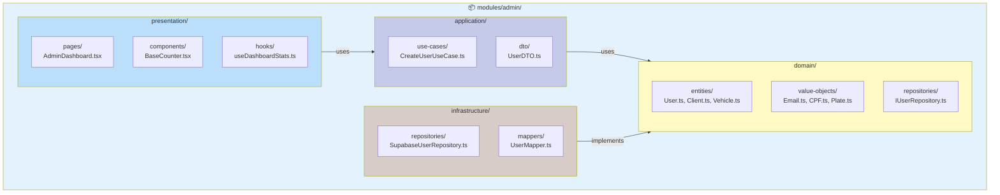

---

## 🔄 Sequência - Dashboard Loading (Current)

**Arquivo**: [sequence-current-dashboard-loading.mmd](./sequence-current-dashboard-loading.mmd)

Fluxo atual com 7 estados de loading separados.

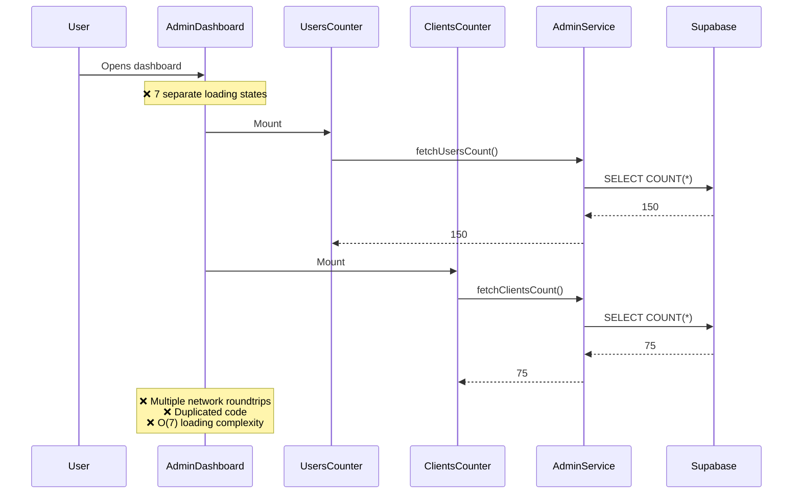

---

## 🔄 Sequência - Dashboard Loading (Proposed)

**Arquivo**: [sequence-proposed-dashboard-loading.mmd](./sequence-proposed-dashboard-loading.mmd)

Fluxo proposto com LoadingOrchestrator e agregação de dados.

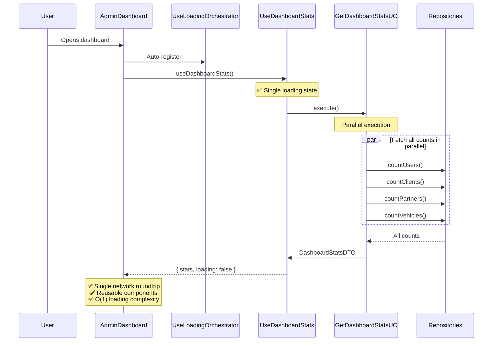

---

## 🔄 Sequência - Counter Fetch (Current)

**Arquivo**: [sequence-counter-fetch-current.mmd](./sequence-counter-fetch-current.mmd)

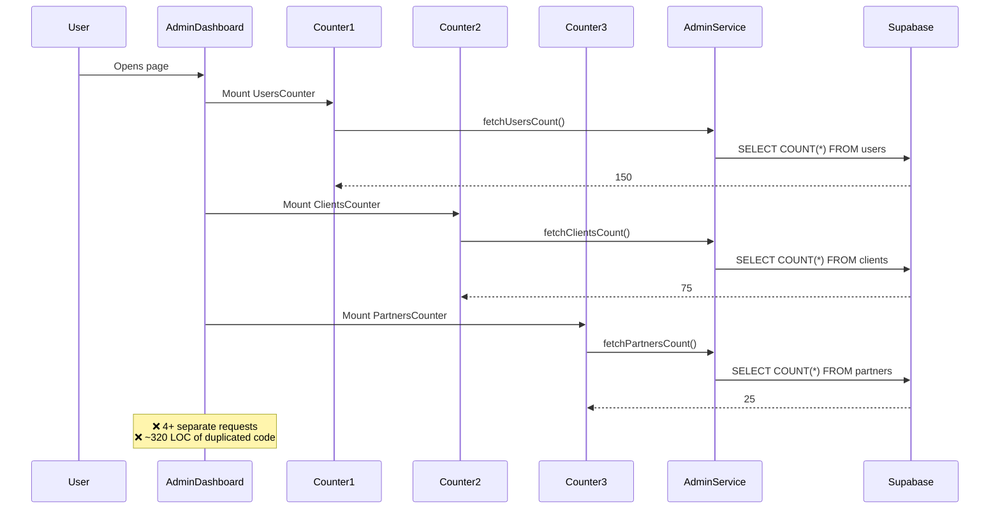

---

## 🔄 Sequência - Counter Fetch (Refactored)

**Arquivo**: [sequence-counter-fetch-refactored.mmd](./sequence-counter-fetch-refactored.mmd)

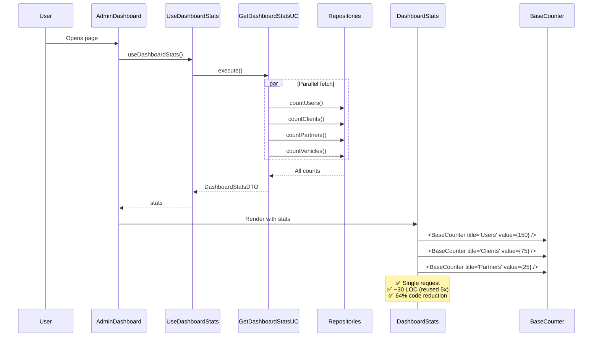

---

## 🔄 Sequência - Modal Management (Current)

**Arquivo**: [sequence-modal-management-current.mmd](./sequence-modal-management-current.mmd)

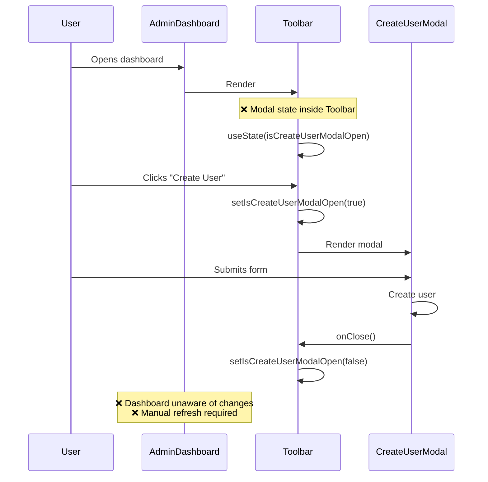

---

## 🔄 Sequência - Modal Management (Refactored)

**Arquivo**: [sequence-modal-management-refactored.mmd](./sequence-modal-management-refactored.mmd)

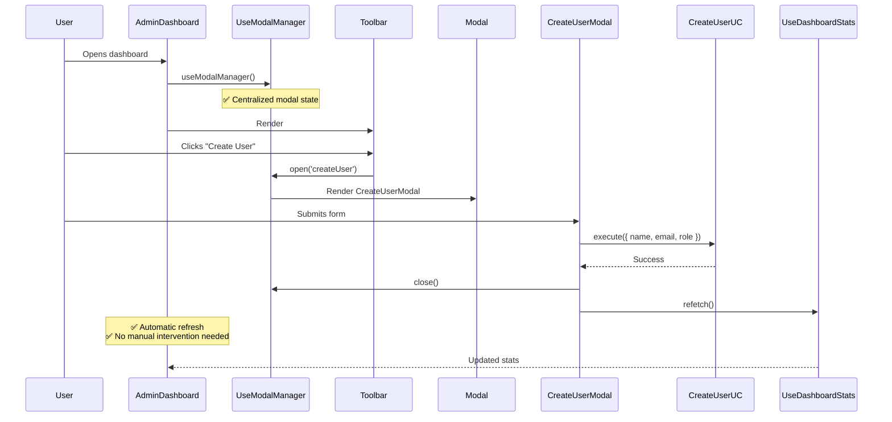

---

## 🔄 Sequência - Assign Specialist

**Arquivo**: [sequence-assign-specialist.mmd](./sequence-assign-specialist.mmd)

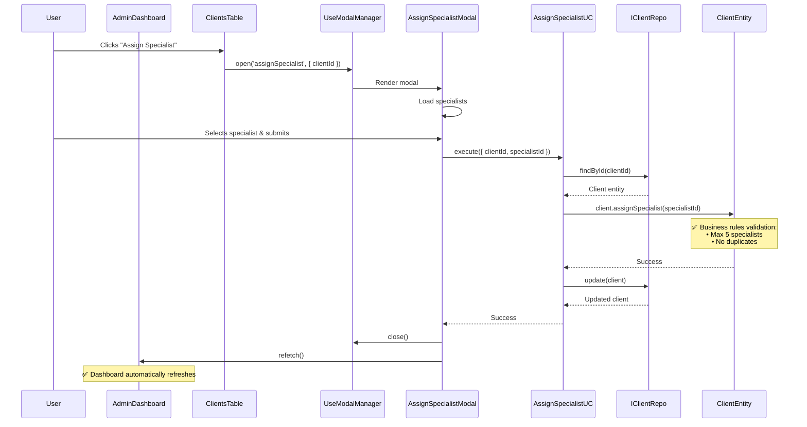

---

## 📊 Classes - Domain Model

**Arquivo**: [class-domain-model.mmd](./class-domain-model.mmd)

Modelo de domínio completo com Entities e Value Objects.

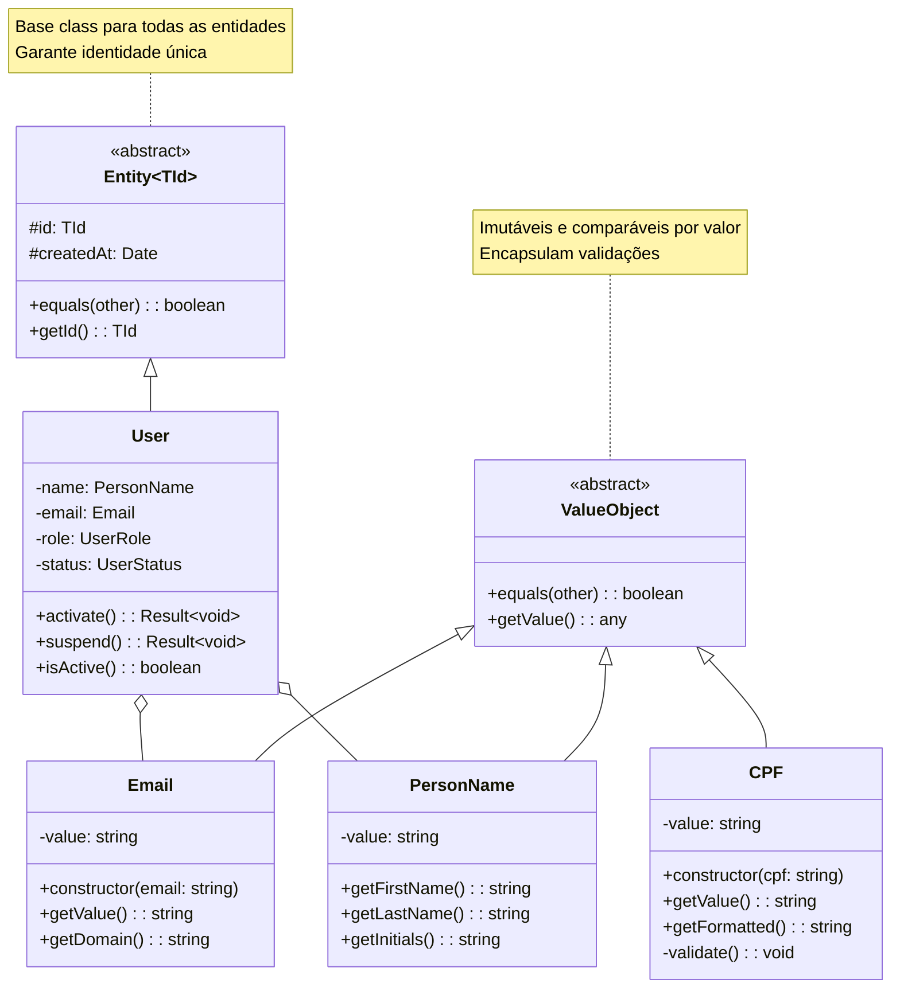

---

## 📊 Classes - Repositories

**Arquivo**: [class-repositories.mmd](./class-repositories.mmd)

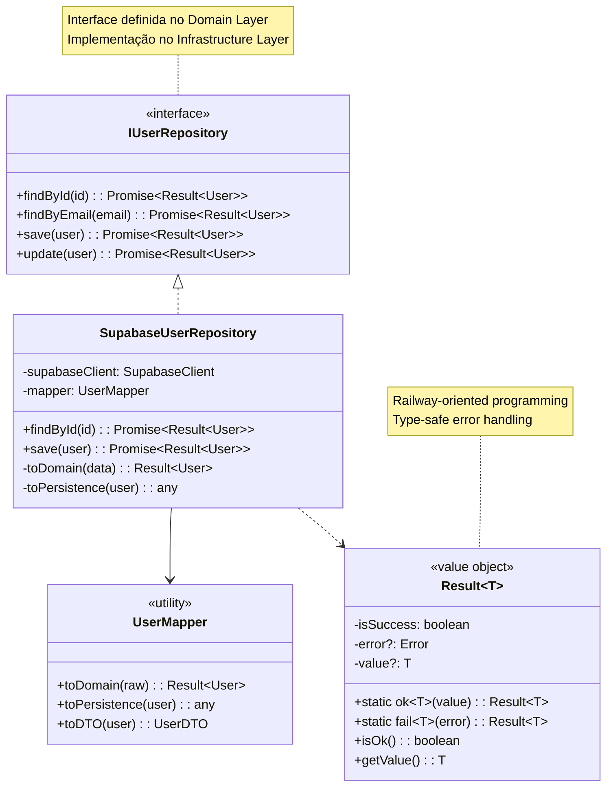

---

## 📊 Classes - Use Cases

**Arquivo**: [class-use-cases.mmd](./class-use-cases.mmd)

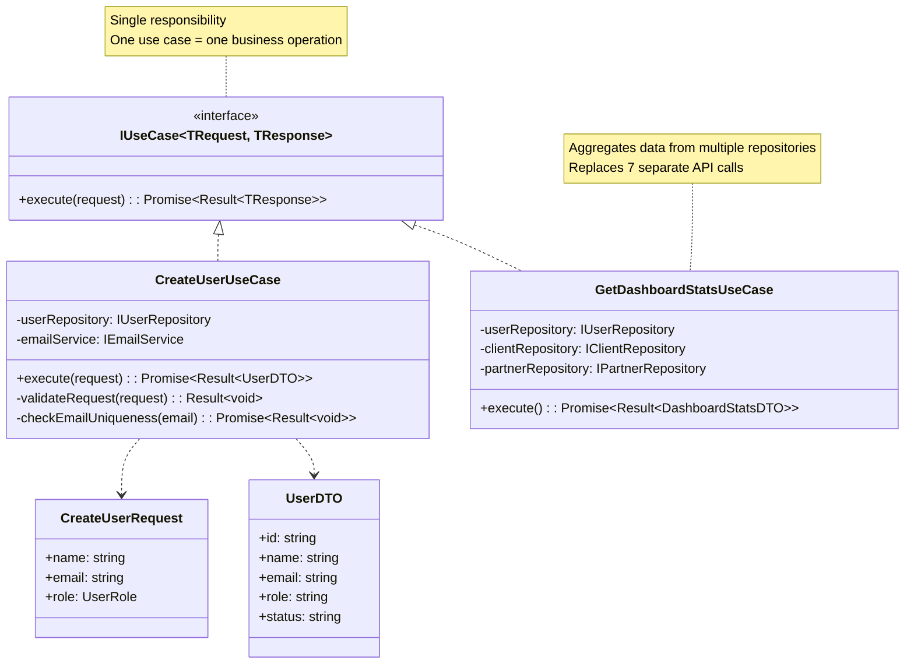

---

## 🧩 Component Composition

**Arquivo**: [component-composition.mmd](./component-composition.mmd)

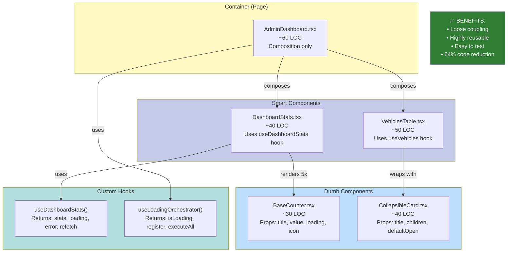

---

## 🗄️ Entity-Relationship Diagram

**Arquivo**: [er-admin-tables.mmd](./er-admin-tables.mmd)

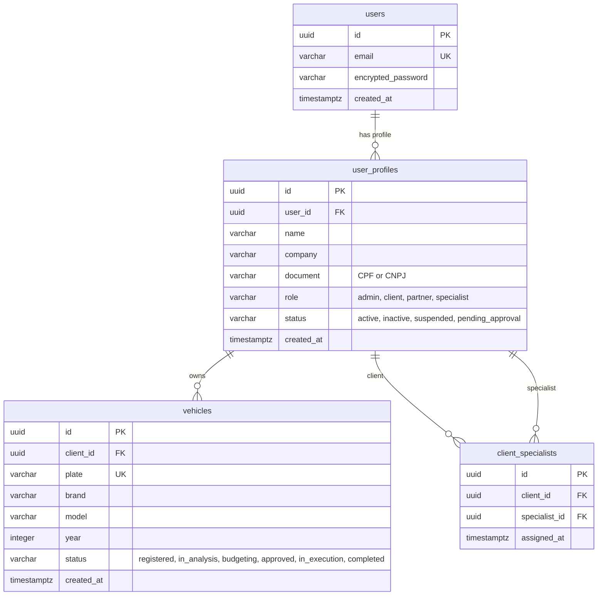

---

## 🔀 State - Loading Orchestrator

**Arquivo**: [state-loading-orchestrator.mmd](./state-loading-orchestrator.mmd)

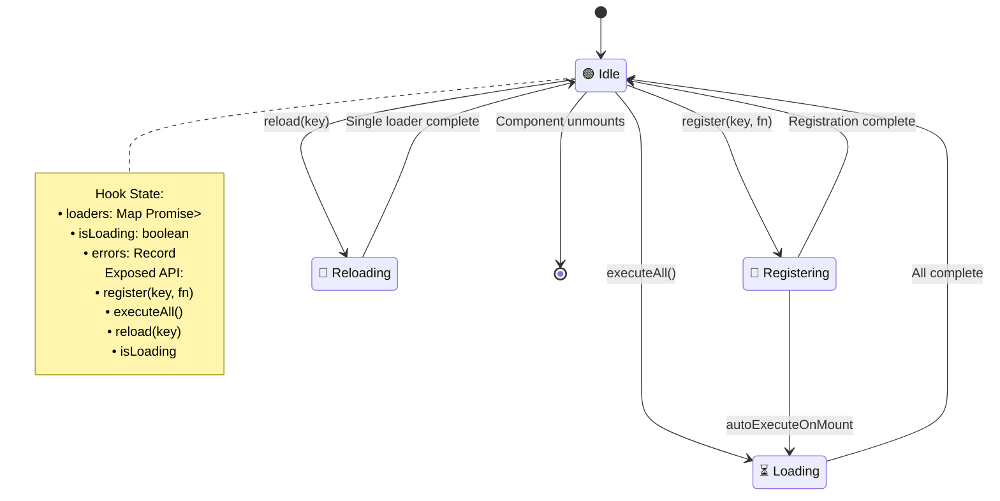

---

## 🔀 State - Modal Manager

**Arquivo**: [state-modal-manager.mmd](./state-modal-manager.mmd)

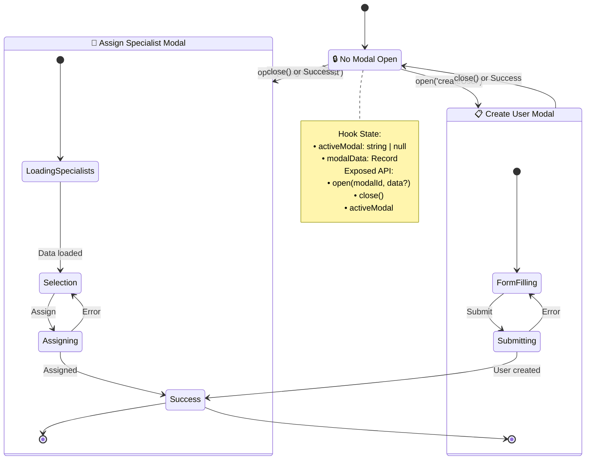

---

## 📖 Navegação Rápida

### Documentos
- [README Principal](../README.md)
- [00-OVERVIEW.md](../00-OVERVIEW.md) - Visão geral
- [01-CURRENT-STATE-ANALYSIS.md](../01-CURRENT-STATE-ANALYSIS.md) - Análise atual
- [02-ARCHITECTURE-PROPOSAL.md](../02-ARCHITECTURE-PROPOSAL.md) - Arquitetura proposta
- [03-DOMAIN-MODEL.md](../03-DOMAIN-MODEL.md) - Modelo de domínio

### Diagramas Completos (Arquivos .mmd)
Para ver os diagramas completos e detalhados, abra os arquivos diretamente:

**Sequência:**
- [sequence-current-dashboard-loading.mmd](./sequence-current-dashboard-loading.mmd)
- [sequence-proposed-dashboard-loading.mmd](./sequence-proposed-dashboard-loading.mmd)
- [sequence-counter-fetch-current.mmd](./sequence-counter-fetch-current.mmd)
- [sequence-counter-fetch-refactored.mmd](./sequence-counter-fetch-refactored.mmd)
- [sequence-modal-management-current.mmd](./sequence-modal-management-current.mmd)
- [sequence-modal-management-refactored.mmd](./sequence-modal-management-refactored.mmd)
- [sequence-assign-specialist.mmd](./sequence-assign-specialist.mmd)

**Classes:**
- [class-domain-model.mmd](./class-domain-model.mmd)
- [class-repositories.mmd](./class-repositories.mmd)
- [class-use-cases.mmd](./class-use-cases.mmd)

**Outros:**
- [component-composition.mmd](./component-composition.mmd)
- [er-admin-tables.mmd](./er-admin-tables.mmd)
- [state-loading-orchestrator.mmd](./state-loading-orchestrator.mmd)
- [state-modal-manager.mmd](./state-modal-manager.mmd)
- [architecture-layers.mmd](./architecture-layers.mmd)
- [architecture-module-structure.mmd](./architecture-module-structure.mmd)

---

## 🎨 Dicas de Visualização

### No VS Code
1. **Preview Markdown**: `Ctrl+Shift+V` (este arquivo)
2. **Preview Mermaid**: `Ctrl+K V` (arquivos .mmd)
3. **Side-by-side**: Abra o .mmd e este arquivo lado a lado

### Online
- **Mermaid Live Editor**: https://mermaid.live/
- Copie o conteúdo de qualquer arquivo .mmd
- Cole no editor online
- Baixe como PNG/SVG se necessário

### Exportar para Imagem
```bash
# Instalar CLI (apenas uma vez)
npm install -g @mermaid-js/mermaid-cli

# Gerar PNG de um diagrama
mmdc -i architecture-layers.mmd -o architecture-layers.png

# Gerar SVG
mmdc -i architecture-layers.mmd -o architecture-layers.svg
```

---

*💡 **Dica**: Mantenha este arquivo aberto em preview mode enquanto edita os diagramas para ver mudanças em tempo real!*

*📚 **Documentação Mermaid**: https://mermaid.js.org/intro/*
