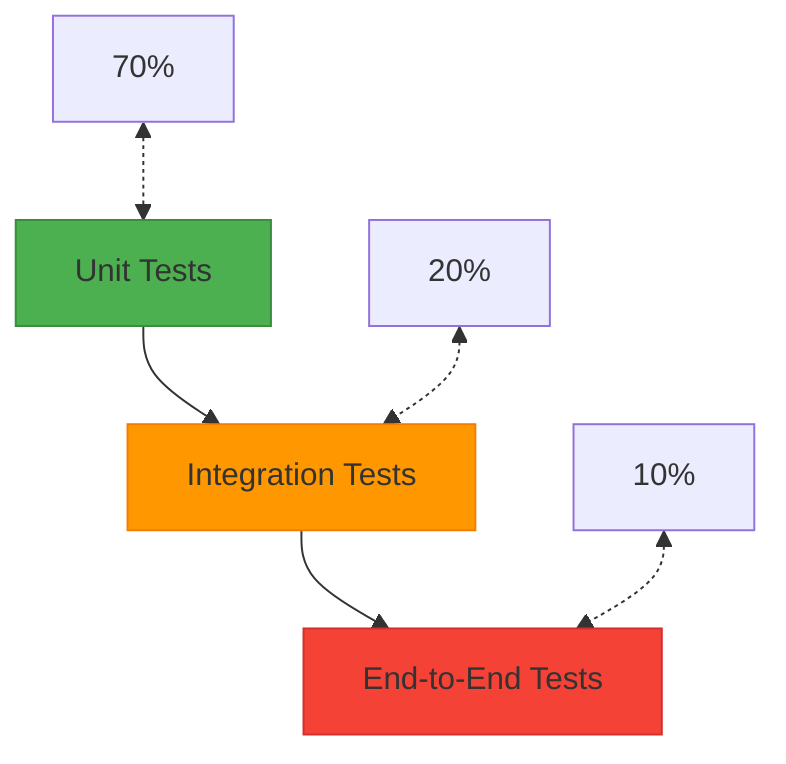

# 📚 Referência Técnica - Testes de Usuário

Este documento fornece referências técnicas importantes para a realização de testes de usuário no sistema ProLine Hub.

## 🧪 Frameworks de Teste

### Cypress
Framework de testes end-to-end para aplicações web modernas.

#### Comandos Básicos
```javascript
// Visitar uma página
cy.visit('/dashboard')

// Encontrar elementos
cy.get('[data-cy=button]')
cy.contains('Salvar')

// Interações
cy.click()
cy.type('texto')
cy.select('opção')

// Asserções
cy.should('be.visible')
cy.expect()
```

#### Boas Práticas
1. **Usar data-cy attributes**
   ```html
   <!-- ✅ Bom -->
   <button data-cy="save-button">Salvar</button>
   
   <!-- ❌ Ruim -->
   <button class="btn btn-primary">Salvar</button>
   ```

2. **Evitar seletores frágeis**
   ```javascript
   // ✅ Bom
   cy.get('[data-cy=save-button]')
   
   // ❌ Ruim
   cy.get('.container > div:nth-child(2) > button')
   ```

3. **Esperas implícitas**
   ```javascript
   // ✅ Bom - Cypress espera automaticamente
   cy.get('[data-cy=save-button]').click()
   
   // ❌ Ruim - Evitar waits fixos
   cy.wait(1000)
   ```

#### Estrutura de Testes
```javascript
describe('Login Flow', () => {
  beforeEach(() => {
    cy.visit('/login')
  })
  
  it('should login with valid credentials', () => {
    cy.get('[data-cy=email-input]').type('user@example.com')
    cy.get('[data-cy=password-input]').type('password123')
    cy.get('[data-cy=login-button]').click()
    
    cy.url().should('include', '/dashboard')
    cy.contains('Bem-vindo').should('be.visible')
  })
  
  it('should show error with invalid credentials', () => {
    cy.get('[data-cy=email-input]').type('invalid@example.com')
    cy.get('[data-cy=password-input]').type('wrongpassword')
    cy.get('[data-cy=login-button]').click()
    
    cy.contains('Credenciais inválidas').should('be.visible')
  })
})
```

### Jest
Framework de testes unitários para JavaScript/TypeScript.

#### Testes Unitários
```typescript
describe('AuthService', () => {
  let authService: AuthService
  
  beforeEach(() => {
    authService = new AuthService()
  })
  
  it('should validate email format', () => {
    const validEmail = 'user@example.com'
    const invalidEmail = 'invalid-email'
    
    expect(authService.validateEmail(validEmail)).toBe(true)
    expect(authService.validateEmail(invalidEmail)).toBe(false)
  })
  
  it('should hash password correctly', async () => {
    const password = 'password123'
    const hashed = await authService.hashPassword(password)
    
    expect(hashed).toBeDefined()
    expect(hashed).not.toBe(password)
  })
})
```

#### Testes de Integração
```typescript
describe('UserService Integration', () => {
  let userService: UserService
  let db: Database
  
  beforeAll(async () => {
    db = new Database()
    userService = new UserService(db)
  })
  
  it('should create user in database', async () => {
    const userData = {
      email: 'test@example.com',
      name: 'Test User'
    }
    
    const user = await userService.createUser(userData)
    
    expect(user.id).toBeDefined()
    expect(user.email).toBe(userData.email)
    
    // Verificar se foi salvo no banco
    const savedUser = await db.findUserByEmail(userData.email)
    expect(savedUser).toBeDefined()
    expect(savedUser.name).toBe(userData.name)
  })
})
```

## 🛠️ Ferramentas de Desenvolvimento

### ESLint
Ferramenta de análise estática de código para identificar padrões problemáticos no código JavaScript/TypeScript.

#### Configuração Recomendada
```json
{
  "extends": [
    "eslint:recommended",
    "@typescript-eslint/recommended",
    "plugin:react/recommended",
    "plugin:react-hooks/recommended"
  ],
  "plugins": ["react", "react-hooks", "@typescript-eslint"],
  "rules": {
    "react/react-in-jsx-scope": "off",
    "react/prop-types": "off",
    "@typescript-eslint/no-unused-vars": "error",
    "no-console": "warn",
    "no-debugger": "error"
  }
}
```

### Prettier
Formatador de código automático que garante consistência de estilo.

#### Configuração Recomendada
```json
{
  "semi": true,
  "trailingComma": "es5",
  "singleQuote": true,
  "printWidth": 80,
  "tabWidth": 2,
  "useTabs": false,
  "bracketSpacing": true,
  "arrowParens": "avoid"
}
```

### Husky e Lint-Staged
Ferramentas para executar verificações antes de commits e pushes.

#### Configuração
```json
// package.json
{
  "husky": {
    "hooks": {
      "pre-commit": "lint-staged",
      "pre-push": "npm test"
    }
  },
  "lint-staged": {
    "*.{js,ts,tsx}": [
      "eslint --fix",
      "prettier --write"
    ]
  }
}
```

## 📊 Métricas de Teste

### Cobertura de Código
Medida que indica a porcentagem de código que é executada durante os testes.

#### Configuração do Jest
```javascript
// jest.config.js
module.exports = {
  collectCoverage: true,
  coverageDirectory: 'coverage',
  coverageReporters: ['text', 'lcov', 'html'],
  collectCoverageFrom: [
    'src/**/*.{js,jsx,ts,tsx}',
    '!src/**/*.d.ts',
    '!src/index.tsx'
  ]
}
```

#### Métricas Alvo
- **Statements**: ≥ 80%
- **Branches**: ≥ 80%
- **Functions**: ≥ 80%
- **Lines**: ≥ 80%

### Performance
Métricas que medem a velocidade e eficiência do sistema.

#### Métricas Principais
- **Tempo de Carregamento**: < 3 segundos
- **Tempo de Resposta da API**: < 500ms
- **Taxa de Sucesso**: > 99%
- **Tempo de Renderização**: < 100ms

#### Monitoramento
```typescript
// Exemplo de medição de performance
const measurePerformance = async (operation: string, fn: () => Promise<any>) => {
  const start = performance.now()
  try {
    const result = await fn()
    const end = performance.now()
    const duration = end - start
    
    console.log(`[PERFORMANCE] ${operation}: ${duration.toFixed(2)}ms`)
    
    // Reportar métricas para sistema de monitoramento
    analytics.track('performance_metric', {
      operation,
      duration,
      timestamp: new Date().toISOString()
    })
    
    return result
  } catch (error) {
    const end = performance.now()
    const duration = end - start
    
    console.error(`[PERFORMANCE ERROR] ${operation}: ${duration.toFixed(2)}ms`, error)
    
    throw error
  }
}
```

## 🔐 Segurança em Testes

### Testes de Autenticação
Verificação de que os mecanismos de autenticação funcionam corretamente.

#### Casos de Teste
1. **Login com credenciais válidas**
2. **Login com credenciais inválidas**
3. **Login com conta inativa**
4. **Acesso a rotas protegidas sem autenticação**
5. **Refresh de tokens expirados**
6. **Logout e invalidação de sessão**

#### Exemplo de Teste
```typescript
describe('Authentication Security', () => {
  it('should reject access to protected routes without token', () => {
    cy.request({
      url: '/api/protected-route',
      failOnStatusCode: false
    }).then((response) => {
      expect(response.status).to.eq(401)
    })
  })
  
  it('should reject invalid tokens', () => {
    cy.request({
      url: '/api/protected-route',
      headers: {
        Authorization: 'Bearer invalid-token'
      },
      failOnStatusCode: false
    }).then((response) => {
      expect(response.status).to.eq(401)
    })
  })
})
```

### Testes de Autorização
Verificação de que usuários só podem acessar recursos para os quais têm permissão.

#### Casos de Teste
1. **Acesso a dados próprios**
2. **Tentativa de acesso a dados de outros usuários**
3. **Operações permitidas por role**
4. **Operações negadas por falta de permissão**
5. **Elevação de privilégios**

#### Exemplo de Teste
```typescript
describe('Authorization Security', () => {
  it('should allow user to access their own data', () => {
    cy.loginAs('client')
    cy.visit('/dashboard/client/vehicles')
    
    // Verificar que apenas veículos do cliente são exibidos
    cy.get('[data-cy=vehicle-item]').each(($el) => {
      cy.wrap($el).should('have.attr', 'data-client-id', Cypress.env('clientId'))
    })
  })
  
  it('should deny access to other users data', () => {
    cy.loginAs('client')
    cy.visit('/dashboard/client/vehicles/other-client-vehicle-id', {
      failOnStatusCode: false
    })
    
    cy.contains('Acesso negado').should('be.visible')
  })
})
```

### Testes de Input Validation
Verificação de que entradas de usuário são validadas adequadamente.

#### Casos de Teste
1. **Campos obrigatórios**
2. **Formatos de dados**
3. **Tamanho de strings**
4. **Valores numéricos**
5. **Injeção de código**
6. **Caracteres especiais**

#### Exemplo de Teste
```typescript
describe('Input Validation', () => {
  it('should validate email format', () => {
    cy.visit('/register')
    cy.get('[data-cy=email-input]').type('invalid-email')
    cy.get('[data-cy=submit-button]').click()
    
    cy.contains('Email inválido').should('be.visible')
  })
  
  it('should validate required fields', () => {
    cy.visit('/register')
    cy.get('[data-cy=submit-button]').click()
    
    cy.contains('Campo obrigatório').should('be.visible')
  })
  
  it('should prevent XSS attacks', () => {
    cy.visit('/register')
    cy.get('[data-cy=name-input]').type('<script>alert("xss")</script>')
    cy.get('[data-cy=submit-button]').click()
    
    // Verificar que script foi sanitizado
    cy.get('[data-cy=name-display]').should('not.contain.html', '<script>')
  })
})
```

## 📱 Testes Responsivos

### Viewports para Teste
```typescript
const viewports = [
  { name: 'mobile-small', width: 320, height: 568 },    // iPhone SE
  { name: 'mobile-medium', width: 375, height: 667 },   // iPhone 8
  { name: 'mobile-large', width: 414, height: 896 },    // iPhone 11 Pro Max
  { name: 'tablet-portrait', width: 768, height: 1024 }, // iPad
  { name: 'tablet-landscape', width: 1024, height: 768 }, // iPad landscape
  { name: 'desktop-small', width: 1366, height: 768 },   // Small laptop
  { name: 'desktop-medium', width: 1920, height: 1080 }, // HD monitor
  { name: 'desktop-large', width: 2560, height: 1440 }   // 2K monitor
]
```

### Testes de Responsividade
```typescript
describe('Responsive Design', () => {
  viewports.forEach((viewport) => {
    it(`should display correctly on ${viewport.name}`, () => {
      cy.viewport(viewport.width, viewport.height)
      cy.visit('/dashboard')
      
      // Verificar elementos responsivos
      cy.get('[data-cy=dashboard-layout]').should('be.visible')
      cy.get('[data-cy=mobile-menu]').should(viewport.width < 768 ? 'be.visible' : 'not.be.visible')
      cy.get('[data-cy=desktop-sidebar]').should(viewport.width >= 768 ? 'be.visible' : 'not.be.visible')
    })
  })
})
```

## 🧪 Estratégias de Teste

### Pirâmide de Testes


### Testes por Camada

#### Camada de Apresentação
- Testes de componentes React
- Testes de interação do usuário
- Testes de acessibilidade
- Testes de responsividade

#### Camada de Negócio
- Testes unitários de serviços
- Testes de validação de dados
- Testes de regras de negócio
- Testes de fluxos de trabalho

#### Camada de Dados
- Testes de integração com banco de dados
- Testes de repositórios
- Testes de migrações
- Testes de políticas de segurança

#### Camada de API
- Testes de endpoints REST
- Testes de autenticação/autorização
- Testes de validação de entrada
- Testes de tratamento de erros

### Frequência de Execução

#### Desenvolvimento Local
- Testes unitários: A cada save
- Testes de componente: A cada mudança significativa
- Testes de integração: Antes de push

#### CI/CD Pipeline
- Testes unitários: Em cada commit
- Testes de componente: Em cada PR
- Testes de integração: Em cada PR merge
- Testes end-to-end: Em deploys para staging

#### Produção
- Testes de smoke: Após cada deploy
- Monitoramento contínuo: 24/7
- Testes de regressão: Semanalmente

## 📈 Relatórios e Métricas

### Dashboard de Qualidade
```typescript
interface QualityMetrics {
  testCoverage: number;        // Cobertura de testes (%)
  codeQuality: number;         // Qualidade do código (0-100)
  securityScore: number;       // Score de segurança (0-100)
  performanceScore: number;    // Score de performance (0-100)
  bugRate: number;             // Taxa de bugs por mil linhas
  deploymentFrequency: number;  // Frequência de deploys (por semana)
  leadTime: number;            // Tempo de entrega (dias)
  meanTimeToRecovery: number;  // Tempo médio de recuperação (horas)
  changeFailureRate: number;   // Taxa de falhas em mudanças (%)
}
```

### Relatórios Automatizados
```typescript
// Exemplo de geração de relatório
const generateQualityReport = async (): Promise<QualityReport> => {
  const testResults = await runAllTests()
  const coverage = await getCodeCoverage()
  const securityScan = await runSecurityScan()
  const performanceMetrics = await getPerformanceMetrics()
  
  return {
    generatedAt: new Date().toISOString(),
    period: 'last_30_days',
    metrics: {
      testCoverage: coverage.percentage,
      codeQuality: testResults.codeQuality.score,
      securityScore: securityScan.score,
      performanceScore: performanceMetrics.score,
      bugRate: testResults.bugRate,
      deploymentFrequency: testResults.deploymentFrequency,
      leadTime: testResults.leadTime,
      meanTimeToRecovery: testResults.meanTimeToRecovery,
      changeFailureRate: testResults.changeFailureRate
    },
    trends: {
      testCoverage: coverage.trend,
      codeQuality: testResults.codeQuality.trend,
      securityScore: securityScan.trend
    },
    recommendations: generateRecommendations(testResults, coverage, securityScan)
  }
}
```

## 🎯 Práticas Recomendadas

### 1. Escrever Testes Descritivos
```typescript
// ✅ Bom - Nome descritivo
it('should display error message when email is invalid', () => {
  // Test implementation
})

// ❌ Ruim - Nome genérico
it('should show error', () => {
  // Test implementation
})
```

### 2. Manter Testes Independentes
```typescript
// ✅ Bom - Teste independente
it('should create user with valid data', () => {
  const userData = generateUniqueUserData()
  createUser(userData)
  // Assertions
})

// ❌ Ruim - Teste dependente de estado anterior
it('should update user after creation', () => {
  // Assumes user was created in previous test
})
```

### 3. Usar Dados de Teste Determinísticos
```typescript
// ✅ Bom - Dados controlados
const testData = {
  email: `test-${Date.now()}@example.com`,
  name: 'Test User'
}

// ❌ Ruim - Dados aleatórios imprevisíveis
const testData = {
  email: generateRandomEmail(),
  name: generateRandomName()
}
```

### 4. Limpar Estado Entre Testes
```typescript
// ✅ Bom - Cleanup adequado
afterEach(async () => {
  await cleanupTestData()
})

// ❌ Ruim - Sem cleanup
// Test data accumulates between tests
```

### 5. Testar Comportamentos, Não Implementações
```typescript
// ✅ Bom - Testa comportamento
it('should display user profile after login', () => {
  login(userCredentials)
  cy.contains('Perfil do Usuário').should('be.visible')
})

// ❌ Ruim - Testa implementação
it('should call fetchUserProfile API', () => {
  // Tests internal implementation details
})
```

## 📞 Suporte

Para dúvidas ou problemas com testes:
- 📧 **Email:** qa-support@proline.com.br
- 📞 **Telefone:** (11) 99999-9995
- 🌐 **Chat:** Acessar via ícone no canto inferior direito

---

**Última Atualização:** 14 de Outubro de 2025  
**Versão:** 1.0